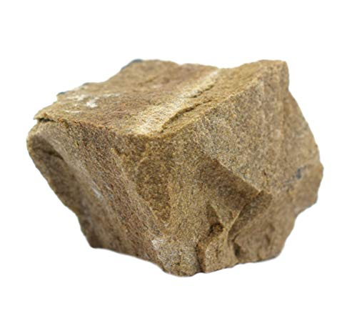
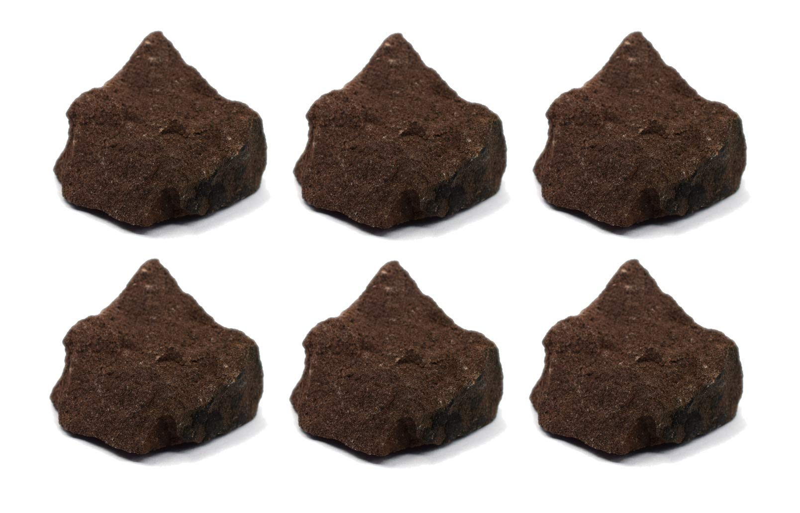
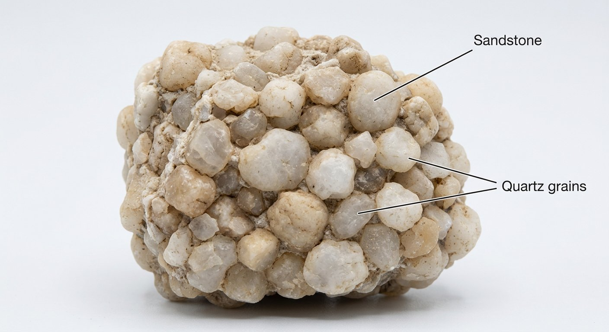
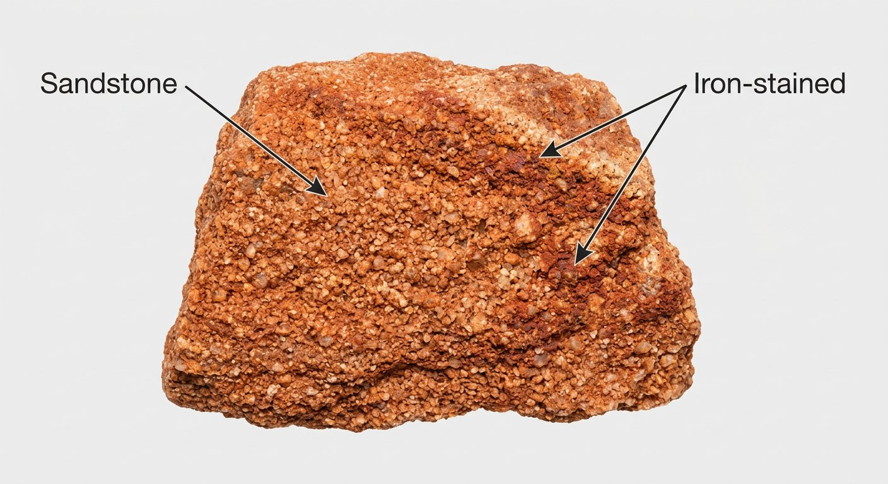

# Sandstone, Grit & Arkose

> **Family:** Sedimentary — clastic · **Grain size:** sand (0.06–2 mm)
> **Varieties:** Quartz arenite (quartz-rich), arkose (feldspar-rich), greywacke/litharenite (rock-fragment-rich), grit (coarse)
> **Quick ID:** Gritty, granular, bedded; sand grains feel like sandpaper; usually no acid fizz.

## At a glance

| Property | Value |
|---|---|
| Colour | Tan, red, brown, white, grey (iron staining) |
| Texture | Clastic, granular, **bedded** |
| Grain size | Sand (0.06–2 mm) |
| Hardness | ~6–7 (quartz grains) |
| Cement | Silica, calcite, or iron oxide |
| Acid | Usually none (calcite-cemented may faintly fizz) |
| Setting | Basins — Benue, Niger Delta, Chad, Sokoto |

## Composition
**Quartz** and **feldspar** grains cemented by **silica, calcite, or iron oxide**.
- **Sandstone (arenite):** quartz-dominated — mature, well-sorted.
- **Arkose:** feldspar-rich (from rapidly weathered granite) — indicates fast erosion, little transport.
- **Greywacke / litharenite:** rock-fragment-rich, poorly sorted.
- **Grit / conglomeratic sandstone:** coarse, pebbly.

On the **QFL diagram**, sandstones are classified by their Quartz–Feldspar–rock-fragment proportions and by textural maturity (sorting, rounding).

## Origin & classification
Sandstone is a **clastic sedimentary rock** — grains of pre-existing rock (mostly quartz, which survives transport best) were deposited by water or wind, buried, and **cemented (lithified)**. Composition records the **source rock** (arkose → granite source) and **transport distance** (quartz arenite → long transport/weathering).

## Texture & sedimentary structures
**Clastic and granular** — visible sand grains; often **porous and permeable**; typically **bedded (layered)**. Sorting and rounding vary with transport distance. Look for **cross-bedding, ripple marks, and graded bedding** — sedimentary structures that reveal the depositional environment.

## Diagnostic field features
- **Gritty** — grains visible and feel like sandpaper.
- Forms in **beds/layers**; often tan, red, brown, or white (iron staining).
- Quartz grains are **hard (won't scratch)**.
- **Calcite-cemented** sandstone may faintly **fizz** with acid.

## Identification tests — step by step
1. **Feel:** gritty — individual sand grains visible and scratchable.
2. **Grain:** quartz grains are hard (a knife won't scratch them).
3. **Acid:** usually no fizz (calcite-cemented may faintly fizz).
4. **Bedding:** layered, with possible cross-bedding/ripples.
5. **Vs granite:** sandstone grains are loose/cemented and layered; granite is interlocking and massive.

## Depositional setting & formation
Sandstone forms where sand accumulates — rivers, deltas, deserts, beaches, and shallow seas. Burial compacts the sand and minerals precipitate in the pores as **cement**, lithifying it into rock. Nigeria's great sandstone bodies (Bima, Benin, etc.) record ancient river, delta, and desert environments.

## Host states / localities
The dominant rock of the basins:
- **Benue Trough** (Bima Sandstone) — **Enugu, Benue, Kogi, Plateau, Cross River**.
- **Niger Delta** (Benin Formation — the freshwater aquifer) — **Delta, Anambra**.
- **Chad** (**Borno**) and **Sokoto** basins.
- Coastal Benin sands across the south.

## Associated minerals & rocks
Quartz, feldspar, iron oxides; fossils uncommon; may carry **uranium** in some sandstones; hosts **groundwater** and **oil/gas**. Associated rocks: shale, siltstone, conglomerate, limestone.

## Economic relevance
- **Building/glass sand** and **construction aggregate**.
- **Aquifer** — the Benin Formation is a key groundwater source across southern Nigeria.
- **Reservoir rock** for petroleum in the Niger Delta.
- **Dimension/facing stone**; source of **silica**.
- Some sandstones host **uranium** and **base-metal** (e.g., copper) deposits.

## Lookalikes & how to distinguish

| Looks like | How to tell it apart |
|---|---|
| **Quartzite** | Quartzite is metamorphic — grains fused/interlocking (sugary); sandstone grains are loose/cemented. |
| **Granite** | Granite is interlocking and massive with feldspar+mica; sandstone is granular, bedded, cemented. |
| **Limestone** | Limestone fizzes with acid; sandstone does not (usually). |
| **Arkose** | Arkose is a feldspar-rich sandstone (from granite) — very gritty, pinkish. |

## Field checklist
- [ ] Gritty, granular (sand grains)?
- [ ] Bedded / layered?
- [ ] Quartz grains hard (knife won't scratch)?
- [ ] No acid fizz (usually)?
- [ ] Sedimentary structures (cross-bedding, ripples)?

## Field tips
- **Gritty, granular, bedded** = sandstone.
- **vs. limestone:** sandstone doesn't (usually) fizz; limestone does.
- **vs. granite:** sandstone grains are loose/cemented and layered; granite is interlocking and massive.
- Note **porosity** — sandstone is a key **aquifer** and **oil reservoir**.
- In the field, look for **cross-bedding** to infer the ancient current direction.

## Facts
- The **Benin Formation** sands of the Niger Delta are Nigeria's most important **freshwater aquifer**.
- The **Bima Sandstone** (Benue Trough) hosts **coal** and groundwater and is a major aquifer.
- Sandstone is the **reservoir rock** for much of Nigeria's petroleum.
- **Quartz** dominates because it is the most durable mineral during transport and weathering.

*Figure II.C.1 — Sandstone: cemented sand grains. Source: [Dreamstime](https://dreamstime.com/photos-images/sedimentary-rock.html).*

*Figure II.C.1b — White sandstone. Source: [Amazon](https://www.amazon.com/White-Sandstone-Sedimentary-Rock-Specimen/dp/B083F4TC39).*

*Figure II.C.1c — Red sandstone. Source: [Amazon](https://www.amazon.com/Eisco-Sandstone-Specimen-Sedimentary-Approx/dp/B01J47ZX88).*

*Figure II.C.1d — Labeled illustration: sandstone quartz grains cemented. Original diagram prepared for this guide.*

*Figure II.C.1e — Labeled illustration: red iron-stained sandstone. Original diagram prepared for this guide.*

## Related
- [Siltstone, Shale & Mudstone](siltstone-shale.md) · [Limestone & Dolomite](limestone.md) · [Conglomerate & Breccia](conglomerate-breccia.md) · [Quartzite](../metamorphic/quartzite-quartz-schist.md) (metamorphosed equivalent) · [Greywacke](greywacke.md)
