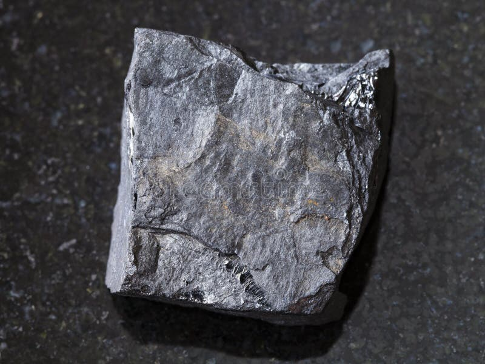

# Siltstone, Shale & Mudstone

> **Family:** Sedimentary — clastic · **Grain size:** silt/clay (<0.06 mm)

## Composition
Very fine **quartz** and **clay minerals**; often with some organic matter
(carbonaceous shale). Chemically mature mudrocks.

## Texture
- **Shale:** very fine-grained and **fissile** — splits readily into thin, flat
  sheets along lamination.
- **Mudstone:** similar grain size but **blocky/massive** (not fissile).
- **Siltstone:** slightly coarser, gritty to smooth.

## Diagnostic field features
- **Splits into thin sheets** (shale) — the giveaway.
- Smooth, soft; **scratched by a knife**; dull luster.
- Often **dark grey/black** when organic-rich.

## Host states / localities
Common in all the basins: **Benue Trough** (e.g. Enugu/Awakpa shales),
**Niger Delta** (the marine **Akata Formation** shale), **Chad**, **Sokoto**:
**Enugu, Benue, Cross River, Delta, Bayelsa, Borno**, and elsewhere.

## Associated minerals
Clay minerals, quartz, organic matter; **fossils** (plant and marine); pyrite
sometimes; may host **uranium** in black shales.

## Economic relevance
- **Source and seal rock for oil & gas** — the Akata shale is the source of much of
  the Niger Delta's petroleum.
- Raw material for **brick, tile, and cement**.
- **Aquitard** (confines groundwater); cap rock for reservoirs.

## Identification notes
- **Very fine + splits into thin sheets** = shale; **blocky** = mudstone.
- **vs. slate:** slate is metamorphic and harder; shale is soft and earthy.
- Dark, carbonaceous shale is worth noting for **uranium** and **oil-source** potential.

*Figure II.C.2 — Shale: very fine-grained, fissile mudrock. Source: [Dreamstime](https://dreamstime.com/photos-images/shale-geology.html).*

## Related
- [Sandstone, Grit & Arkose](sandstone.md) · [Clay & Kaolin](clay-kaolin.md) · [Metasediments](../metamorphic/metasediments.md)
