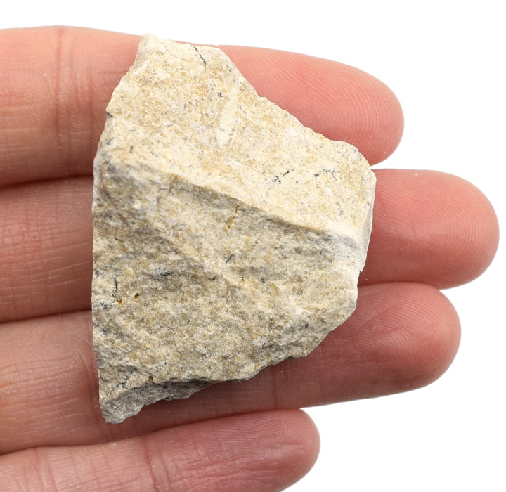
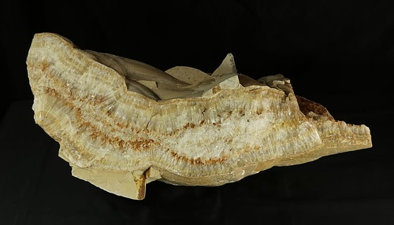
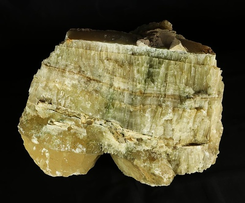
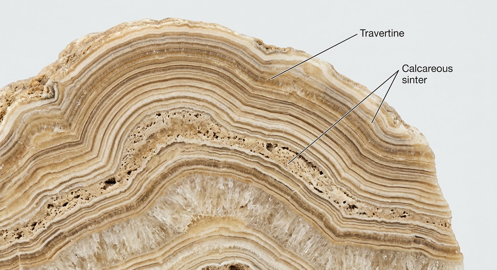
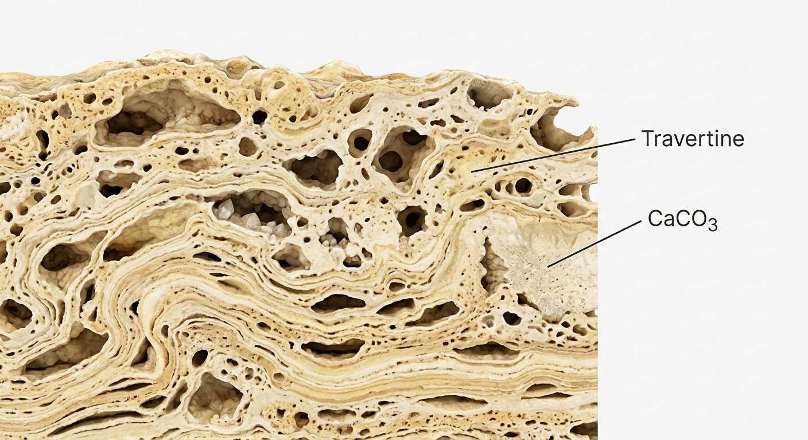

# Travertine (Calcareous Tufa)

> **Family:** Sedimentary — chemical · **Composition:** calcium carbonate (CaCO₃) from spring/cave water
> **Quick ID:** Banded, porous calcite crust that **fizzes** in acid; formed at springs, waterfalls, and caves.

## At a glance

| Property | Value |
|---|---|
| Colour | Cream, white, tan, buff |
| Texture | Porous, **banded/laminated**, cellular |
| Composition | Calcite (CaCO₃) |
| Acid test | **Fizzes** in dilute acid |
| Setting | Springs, waterfalls, caves |
| Nature | Chemically/biologically precipitated at the surface |

## Composition
**Calcium carbonate (CaCO₃)** deposited from **spring, hot-spring, or cave** water — chemically (and often biologically) precipitated calcite. Essentially the same mineral as limestone, but precipitated at the surface from water rather than accumulated as sediment.

## Origin & classification
Travertine is a **chemical (and biochemical) sedimentary rock**. When groundwater rich in dissolved calcium carbonate emerges at a **spring** or drips in a **cave**, the release of CO₂ pressure (and evaporation) causes calcite to precipitate, building banded crusts and formations. It is a **surface precipitate**, not a buried sediment.

## Texture & sedimentary structures
Porous, **banded/laminated**, and cellular; frequently moulded around plants (**tufa**). The banding records successive layers of precipitation; porosity comes from trapped gas and plant moulds. Cave travertine forms **stalactites and stalagmites**.

## Diagnostic field features
- Banded, porous calcite crust; **fizzes** in dilute acid.
- Associated with **springs, waterfalls, and caves**.
- Lightweight, cellular/porous texture.
- Distinctive **banded, layered** appearance.

## Identification tests — step by step
1. **Acid:** fizzes with dilute HCl (it's calcite).
2. **Texture:** banded/laminated, porous/cellular.
3. **Setting:** springs, waterfalls, caves (the key context).
4. **Vs limestone:** travertine is a surface precipitate (banded, porous, at a spring), not a bedded marine sediment.
5. **Vs calcrete:** travertine forms at springs/caves; calcrete is a soil crust in arid zones.

## Depositional setting & formation
Travertine forms where **carbonate-rich water** emerges at springs, cascades over waterfalls, or drips in caves, precipitating calcite as CO₂ degasses and water evaporates. This builds crusts, terraces (e.g., Pamukkale), stalactites, and stalagmites.

## Host states / localities
Localized to **springs and carbonate terrains** — parts of **Plateau** and the carbonate areas of the Basement and sedimentary basins (see [Limestone & Dolomite](limestone.md)). Forms wherever carbonate-rich springs occur.

## Associated minerals & rocks
Limestone, calcite (see [Calcite](../../03-mineral-resources/industrial/calcite.md)). Associated rocks: limestone, dolomite (the carbonate source of the spring water).

## Economic relevance
- **Ornamental/dimension stone** — travertine is a popular building and decorative stone (tiles, facades).
- **Lime** production.
- An indicator of **active carbonate groundwater**.
- Cave travertine (speleothems) is valuable for **paleoclimate** records.

## Lookalikes & how to distinguish

| Looks like | How to tell it apart |
|---|---|
| **Limestone** | Limestone is a bedded marine sediment; travertine is a banded surface precipitate at a spring/cave. |
| **Calcrete** | Calcrete is a nodular arid-zone soil crust; travertine forms at springs/caves and is banded. |
| **Tufa** | Tufa is the porous, plant-moulded variety of travertine (same material). |

## Field checklist
- [ ] Banded, porous calcite crust?
- [ ] Fizzes with acid?
- [ ] At a spring / waterfall / cave?
- [ ] Cream/white/tan colour?
- [ ] Cellular/porous texture?

## Field tips
- Banded, porous CaCO₃ that fizzes in acid; formed at **springs/caves** rather than in beds.
- The **spring/cave setting** is the key distinguishing context.
- Travertine is a beautiful, popular **building/ornamental stone**.
- Cave travertine (**stalactites/stalagmites**) records past climate — don't damage it.

## Facts
- Travertine forms at **springs, waterfalls, and caves** where carbonate-rich water precipitates calcite.
- Famous terraces (e.g., **Pamukkale**, Turkey) are built of travertine.
- Cave travertine forms **stalactites** (hang down) and **stalagmites** (grow up).
- It is the same mineral (calcite) as limestone, just precipitated at the surface.

*Figure II.C.16 — Travertine (calcareous tufa). Source: [Eisco Labs](https://www.eiscolabs.com/products/eisco-travertine-specimen-3cm-in-size).*

*Figure II.C.16b — Travertine (calcareous sinter). Source: [TopGeo](https://www.topgeo.com/pseudo_aragonite_calcareous_sinter.html).*

*Figure II.C.16c — Calcareous sinter (travertine). Source: [TopGeo](https://www.topgeo.com/pseudo_aragonite_calcareous_sinter.html).*

*Figure II.C.16d — Labeled illustration: travertine banded calcareous sinter. Original diagram prepared for this guide.*

*Figure II.C.16e — Labeled illustration: travertine porous carbonate deposit. Original diagram prepared for this guide.*

## Related
- [Limestone & Dolomite](limestone.md) · [Calcite](../../03-mineral-resources/industrial/calcite.md) · [Marble & Calc-silicate](../metamorphic/marble-calc-silicate.md) · [Calcrete & silcrete](calcrete-silcrete.md)
