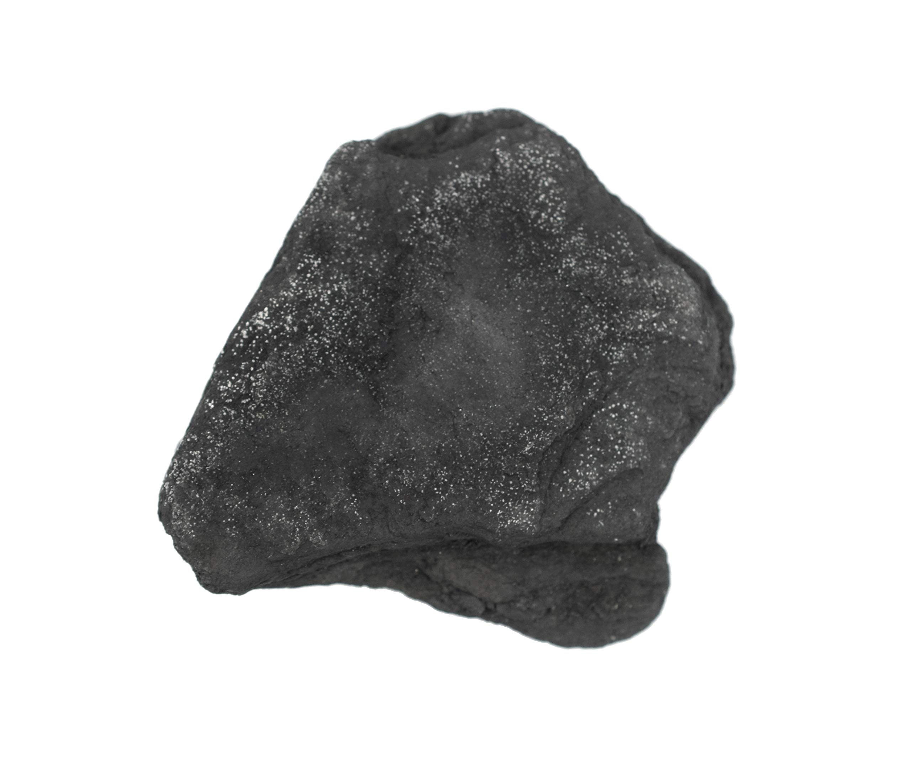
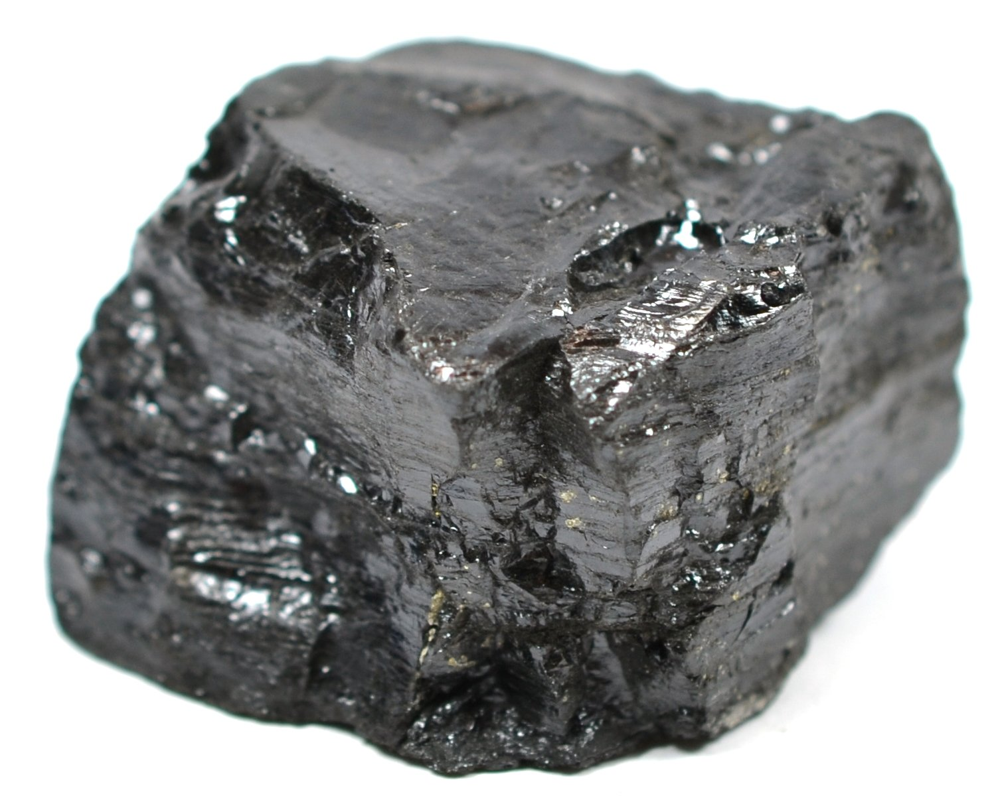

# Coal & Lignite

> **Group:** Energy · **Material:** coal (solid fossil fuel)
> **Quick ID:** Black, **combustible**, **organic** sedimentary rock in bedded **seams**; rank rises peat → lignite → bituminous → anthracite.

## At a glance

| Property | Value |
|---|---|
| Colour | Black to brown (lignite) |
| Combustibility | **Burns** (fossil fuel) |
| Origin | **Organic** (compacted plant material) |
| Texture | Bedded/layered **seams**; fissile |
| Rank | Peat → lignite → bituminous → anthracite |
| Key test | Black + combustible + organic + bedded seams |

## What it is
**Coal** — a combustible sedimentary rock formed from compacted plant material (peat → lignite → bituminous coal → anthracite). A traditional fuel and chemical feedstock.

## Chemistry & mineralogy
**Coal** — a carbon-rich **organic sedimentary rock**, formed from compressed and altered plant matter. Rank (energy content) rises with burial heat: **peat → lignite → bituminous coal → anthracite** (highest carbon/energy).

## Crystal habit
**Bedded / layered seams** — coal occurs in **seams** between sedimentary layers, often fissile (splits along bedding). It is a rock, not a crystalline mineral.

## Physical properties
- **Colour:** black (higher rank) to brown (lignite).
- **Combustibility:** burns readily (fossil fuel).
- **Origin:** organic — from ancient plant material.
- **Texture:** bedded seams, often fissile.

## How to identify in the field
1. **Colour:** black to brown.
2. **Combustibility:** burns (a fossil fuel).
3. **Origin:** organic — lightweight, plant-derived.
4. **Texture:** bedded **seams** in sedimentary sequences.
5. **Context:** "coal measures" (sandstone/shale sequences).

## Lookalikes & how to distinguish

| Looks like | How to tell it apart |
|---|---|
| **Black shale** | Black shale is not combustible and is denser; coal is lighter and burns. |
| **Graphite** | Graphite is greasy and stains; coal is matte and burns more readily. |
| **Oil shale** | Oil shale yields oil on heating; coal burns directly. |

## Occurrence

*Figure III.D.3 — Black coal: combustible organic sedimentary rock. Source: [Dreamstime](https://www.dreamstime.com/photos-images/natural-coal-rocks.html).*

*Figure III.D.3b — Anthracite coal specimen. Source: [Amazon](https://www.amazon.com/Anthracite-Coal-Metamorphic-Rock-Specimen/dp/B08KJK6NML).*

*Figure III.D.3c — Bituminous coal specimen. Source: [Amazon](https://www.amazon.com/Anthracite-Coal-Metamorphic-Rock-Specimen/dp/B08KJK6NML).*

Found in the "coal measures" (see [Coal rock](../../02-rocks-of-nigeria/sedimentary/coal.md)).

## Genesis
**Compaction of plant material** — accumulated plant matter in swamps is buried and altered (peat → coal) over millions of years. Heat and pressure raise the rank from lignite to anthracite.

## States / localities
- **Enugu** — the historic "Coal City," Nigeria's main coal-mining centre.
- **Kogi** (Ogboyaga/Ogboyega), **Nasarawa** (Lafia/Obi), **Benue, Anambra**.
- **Lignite** in the **Chad Basin (Borno)** and southwestern basins.

## Associated minerals & host rocks
Shale, sandstone, clay, pyrite (in seams); hosted by the **"coal measures"** (sandstone/shale sequences) of the Benue Trough (see [Fire clay](../industrial/fire-clay.md) — the underclay beneath coal).

## Mining, uses & market
- **Power generation** and **industry**; historically important at Enugu.
- Source of **coke, tar, and chemicals**; potential **coal-bed methane**.

## Exploration notes
- Coal occurs in the **"coal measures"** (sandstone/shale sequences) of the Benue Trough (see [Coal (rock)](../../02-rocks-of-nigeria/sedimentary/coal.md)).
- Assess **seam thickness, depth, rank, and sulfur/ash** content for viability.
- **Enugu** ("Coal City") is Nigeria's historic coal centre.

## Field checklist
- [ ] Black to brown?
- [ ] Combustible (burns)?
- [ ] Organic (light, plant-derived)?
- [ ] Bedded seams?
- [ ] In sandstone/shale "coal measures"?

## Facts
- Coal forms from compacted **ancient plant material** (organic).
- **Rank** rises peat → lignite → bituminous → **anthracite** (most energy).
- **Enugu** is Nigeria's historic "Coal City."
- Coal can also yield **coal-bed methane** (a gas resource).

## Related
- [Coal (rock)](../../02-rocks-of-nigeria/sedimentary/coal.md) · [The Benue Trough](../../01-general-geology/01-04-sedimentary-basins.md) · [Bitumen](bitumen.md) · [Fire clay](../industrial/fire-clay.md)
