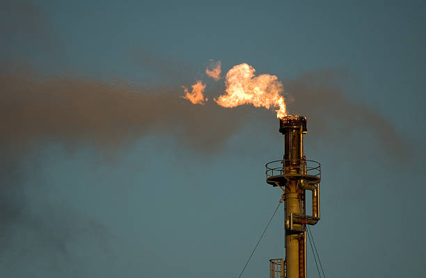

# Natural Gas

> **Group:** Energy · **Material:** natural gas (mostly methane, CH₄)
> **Quick ID:** Gaseous fossil fuel, chiefly **methane**; found **associated** with crude oil or in **non-associated** gas fields; flammable.

## At a glance

| Property | Value |
|---|---|
| Composition | Mostly **methane (CH₄)** + ethane, propane, CO₂ |
| State | Gas (flammable, lighter than air) |
| Occurrence | **Associated** (with oil) or **non-associated** gas fields |
| Key test | Flammable gas; flaring/seeps; reservoir context |

## What it is
**Natural gas** — a gaseous fossil fuel, chiefly **methane**, found either **associated** with crude oil or in **non-associated** gas fields. Nigeria holds some of **Africa's largest gas reserves**.

## Chemistry & mineralogy
**Natural gas** — mostly **methane (CH₄)**, with smaller amounts of ethane, propane, butane, carbon dioxide, and nitrogen. It forms from the same thermal maturation of organic matter that produces oil, and is the lightest, gaseous fraction.

## Crystal habit
Not crystalline — natural gas is a **gas** occupying the pore spaces of reservoir rocks. It is trapped in the same reservoirs and structures as oil.

## Physical properties
- **State:** gas — flammable, lighter than air.
- **Composition:** mostly methane.
- **Behaviour:** associated (dissolved with oil) or non-associated (free gas).

## How to identify in the field
1. **Flammability:** burns (a fuel gas).
2. **Context:** seeps, gas flares, or reservoir drilling.
3. **Association:** with crude oil (associated gas) or alone (non-associated).
4. **Exploration:** seismic + well data (not a hand-specimen mineral).
5. **Significance:** flared gas marks major accumulations.

## Lookalikes & how to distinguish

| Looks like | How to tell it apart |
|---|---|
| **Marsh gas / biogas** | Both are methane; natural gas is a large subsurface accumulation. |
| **LPG (propane/butane)** | LPG liquefies easily; natural gas (methane) stays gaseous. |

## Occurrence

**Gas flare:**

*Figure III.D.2 — Natural gas being flared. Source: [Getty Images](https://www.gettyimages.com/photos/natural-gas-flare).*

## Genesis
Forms by the **thermal maturation of organic matter** in sedimentary basins — the same process that generates oil. **Associated gas** comes out of solution with oil; **non-associated gas** forms independently in gas-prone source rocks.

## States / localities
- **Niger Delta** (associated and non-associated gas) — **Rivers, Bayelsa, Delta, Akwa Ibom, Imo, Cross River**.
- **Chad Basin (Borno)** — significant non-associated gas.
- Exported as **LNG** (Nigeria LNG, Bonny) and via the West African Gas Pipeline.

## Associated minerals & host rocks
Crude oil (associated gas), reservoir sandstones; hosted by the **Niger Delta and Chad Basin** reservoirs (see [Petroleum](petroleum.md), [The Niger Delta Basin](../../01-general-geology/01-04-sedimentary-basins.md)).

## Mining, uses & market
- **Power generation**, **LNG export**, **domestic cooking**, **industry**, and **fertilizer** (ammonia) production.
- A key "transition fuel" and a huge, under-exploited Nigerian resource.

## Exploration notes
- Gas accompanies oil in the Niger Delta; **seismic** and well data delineate reservoirs.
- A national priority is reducing **gas flaring** and capturing gas for power and industry — a major opportunity area.
- Nigeria holds some of **Africa's largest gas reserves**.

## Field checklist
- [ ] Flammable gas?
- [ ] Associated with oil or non-associated?
- [ ] In a Niger Delta / Chad Basin reservoir?
- [ ] Flared / seeping?
- [ ] Delineated by seismic + wells?

## Facts
- Natural gas is mostly **methane (CH₄)** — the cleanest fossil fuel.
- Nigeria holds some of **Africa's largest gas reserves**.
- It is exported as **LNG** from **Bonny** (Nigeria LNG).
- Reducing **gas flaring** is a major national opportunity.

## Related
- [Petroleum](petroleum.md) · [Bitumen](bitumen.md) · [The Niger Delta Basin](../../01-general-geology/01-04-sedimentary-basins.md) · [The Chad Basin](../../04-geological-provinces/04-04-chad-basin.md)
