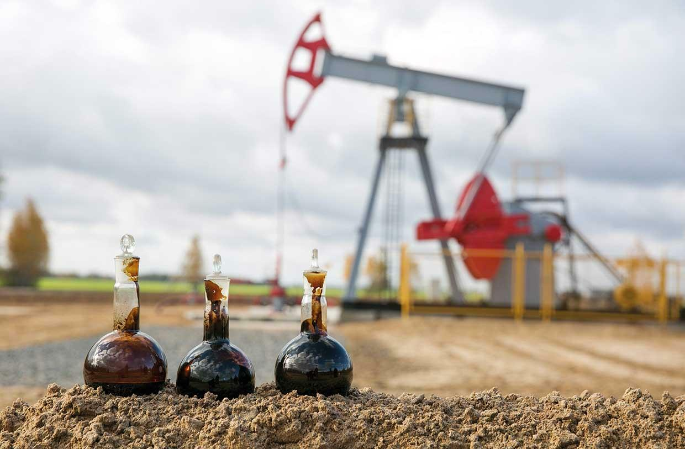

# Petroleum (Crude Oil)

> **Group:** Energy · **Material:** crude oil (liquid hydrocarbon)
> **Quick ID:** Liquid mixture of **hydrocarbons** formed from ancient organic matter buried and heated in sedimentary basins; the engine of Nigeria's economy.

## At a glance

| Property | Value |
|---|---|
| State | Liquid hydrocarbon |
| Origin | Ancient organic matter, buried & heated |
| Main province | **Niger Delta** (Africa's largest oil province) |
| Source rock | Akata Formation (organic-rich shale) |
| Reservoir | Agbada Formation (cyclic sandstones) |
| Trap | Growth faults & rollover anticlines |
| Key test | Oil seeps; reservoir/structural context |

## What it is
**Crude oil** — a liquid mixture of hydrocarbons formed from ancient organic matter buried and heated in sedimentary basins. The **Niger Delta** is Africa's largest oil province and the engine of Nigeria's economy.

## Chemistry & mineralogy
**Crude oil** — a liquid **mixture of hydrocarbons** (chains of carbon and hydrogen) of varying weight, from light gases to heavy oils. It forms from organic matter (plankton/algae) buried and "cooked" in the oil window (~60–120 °C).

## Crystal habit
Not crystalline — crude oil is a **liquid** that occupies the pore spaces of reservoir rocks, trapped by structure and seals.

## Physical properties
- **State:** liquid; oily; flammable.
- **Density:** less dense than water (floats).
- **Colour:** dark brown to black (varies with composition).

## How to identify in the field
1. **Appearance:** oily, dark liquid.
2. **Seeps:** oil seeps/stains at the surface.
3. **Context:** sedimentary basin with the right source-reservoir-seal system.
4. **Exploration:** **geophysics-led** (seismic) + drilling — not a surface hand-specimen exercise.
5. **Structures:** growth faults and anticlines trap the oil.

## Lookalikes & how to distinguish

| Looks like | How to tell it apart |
|---|---|
| **Bitumen** | Bitumen is thick/sticky (semi-solid); crude oil is a free-flowing liquid. |
| **Natural gas** | Gas is gaseous; crude oil is liquid. |
| **Oil shale** | Oil shale is a rock that must be heated to yield oil; crude oil flows directly. |

## Occurrence

**Crude oil samples:**

*Figure III.D.1a — Crude oil samples. Source: [eBay](https://www.ebay.com/itm/276667684222).*

**How it's trapped** (growth-fault/rollover structures of the Niger Delta):

*Figure III.D.1b — Growth-fault structures that trap Niger Delta oil and gas. Source: [Wikipedia](https://en.wikipedia.org/wiki/Delta_Field_(Niger_Delta)).*

## The petroleum system (Niger Delta)
- **Source:** the marine **Akata Formation** shale (organic-rich).
- **Reservoir:** the **Agbada Formation** (cyclic sandstones).
- **Seal & trap:** growth faults and shales forming rollover anticlines.
- **Overburden:** the continental **Benin Formation**.

## States / localities
**Niger Delta & offshore:** **Rivers, Bayelsa, Delta, Akwa Ibom, Cross River, Imo, Ondo**. Nigeria is a top African oil producer and a member of OPEC.

## Associated minerals & host rocks
Natural gas (associated), reservoir sandstones; hosted by the **Niger Delta** petroleum system (see [Natural gas](natural-gas.md), [The Niger Delta Basin](../../01-general-geology/01-04-sedimentary-basins.md)).

## Mining, uses & market
Refined into **petrol, diesel, jet fuel, and petrochemicals** — the country's dominant export earner and a pillar of the economy.

## Exploration notes
- Exploration is **geophysics-led** (seismic reflection) followed by drilling — not a surface hand-specimen exercise.
- Understand the **structural traps** (faults/anticlines) and the **source–reservoir–seal** system (see [The Niger Delta Basin](../../01-general-geology/01-04-sedimentary-basins.md)).
- The **Akata–Agbada–Benin** formations define the Niger Delta petroleum system.

## Field checklist
- [ ] Oily, dark liquid?
- [ ] Oil seeps/stains?
- [ ] Source–reservoir–seal system present?
- [ ] Structural trap (fault/anticline)?
- [ ] Niger Delta / sedimentary basin setting?

## Facts
- The **Niger Delta** is Africa's largest oil province.
- Its petroleum system: **Akata** (source) → **Agbada** (reservoir) → **Benin** (overburden).
- Nigeria is a top African oil producer and an **OPEC** member.
- Oil exploration is **geophysics-led** (seismic), not hand-specimen.

## Related
- [Natural gas](natural-gas.md) · [Bitumen](bitumen.md) · [The Niger Delta Basin](../../01-general-geology/01-04-sedimentary-basins.md) · [Ore deposits 101](../../00-fundamentals/00-07-ore-deposits-101.md)
