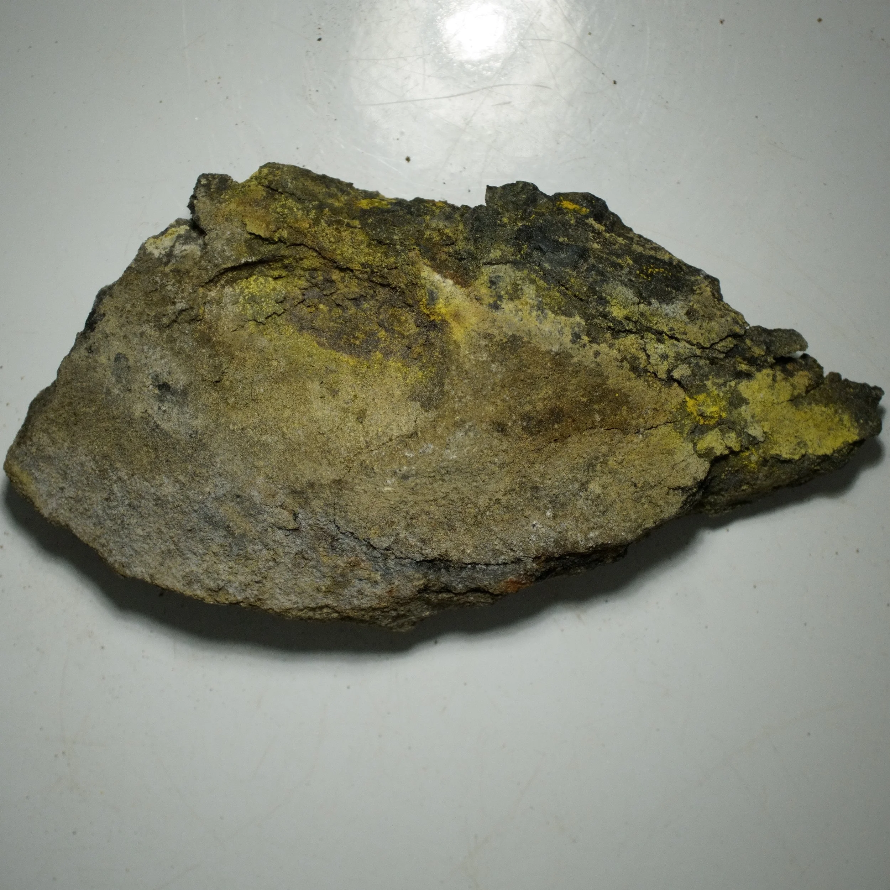
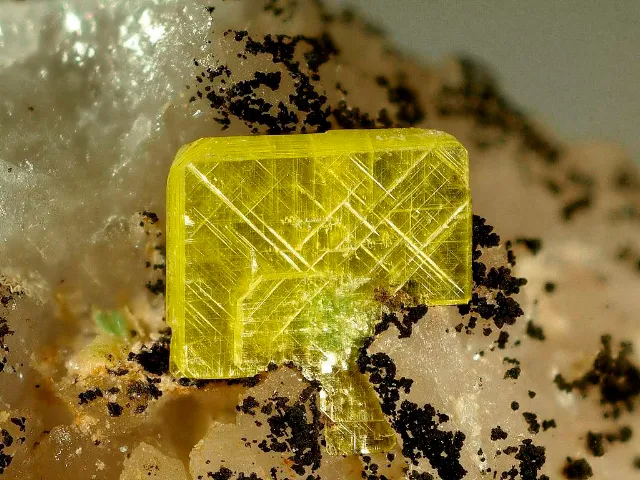
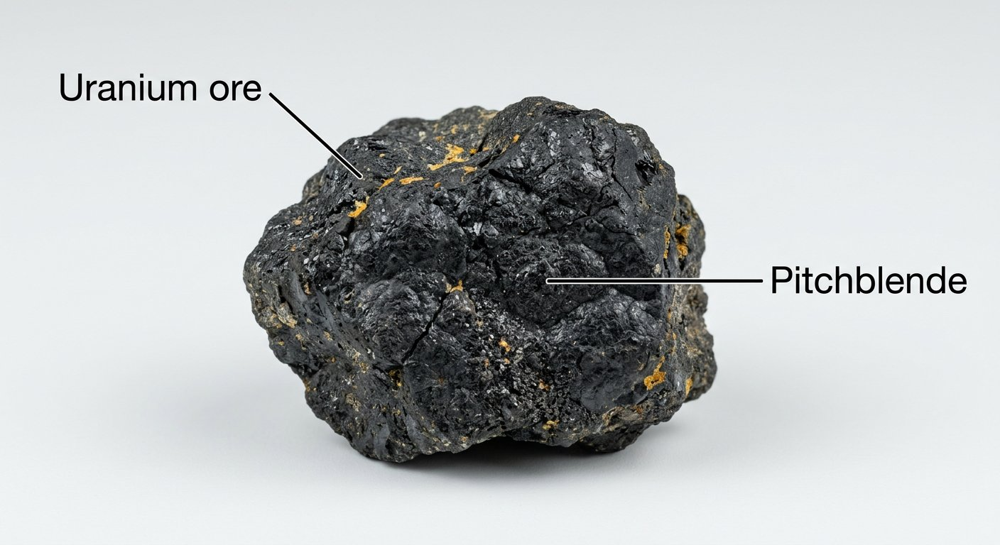
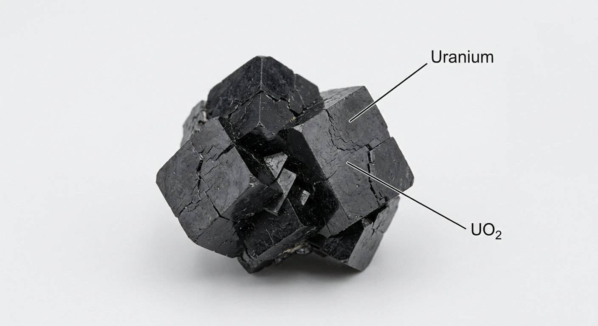

# Uranium (Nuclear Fuel)

> **Group:** Energy · **Mineral:** uraninite / pitchblende (UO₂)
> **Quick ID:** Heavy, **radioactive** metal (chiefly the mineral uraninite/pitchblende); a **Geiger counter** is the definitive field tool.

## At a glance

| Property | Value |
|---|---|
| Key mineral | **Uraninite / pitchblende** (UO₂) |
| Radioactivity | **Radioactive** (Geiger counter definitive) |
| Hardness | 5–6 (pitchblende) |
| Colour | Black (pitchblende); yellow-green secondaries |
| Specific gravity | ~8–10 (very heavy) |
| Key test | Radioactive + yellow-green secondaries |

## What it is
**Uranium** — a heavy, **radioactive** metal (chiefly the mineral **uraninite/pitchblende**) used as fuel for **nuclear power**.

## Chemistry & mineralogy
**Uranium (U)** — a heavy, radioactive actinide metal. It occurs chiefly as **uraninite (UO₂)** and its massive variety **pitchblende**, with bright yellow-green secondary minerals. Uranium decays radioactively (to lead), releasing energy — the basis of nuclear power.

## Crystal habit
Uraninite forms cubic/octahedral crystals; **pitchblende** is massive/botryoidal (pitchy). See the full [Uranium mineral profile](../metallic/uranium.md) for crystal habit and detailed properties.

## Physical properties
- **Radioactive** — the defining property (detected by a Geiger counter).
- **Very heavy** (SG ~8–10).
- **Black** (pitchblende) with a pitchy lustre; yellow-green secondary minerals.

## How to identify in the field
1. **Radioactivity:** a **Geiger counter/scintillometer** is the definitive test.
2. **Weight:** very heavy (SG ~8–10).
3. **Colour:** black (pitchblende); yellow-green secondaries.
4. **Setting:** pegmatites (with columbite/monazite) or certain sandstones.
5. **Safety:** handle with radiation precautions.

## Lookalikes & how to distinguish

| Looks like | How to tell it apart |
|---|---|
| **Other black heavy oxides** | Uranium is confirmed by **radioactivity** (Geiger counter) — the decisive test. |
| **Pitchblende vs coal/bitumen** | Pitchblende is very heavy and radioactive; coal/bitumen are lighter and not. |

## Occurrence

*Figure III.D.5 — Pitchblende (uraninite): radioactive uranium ore. Source: [Fossilera](https://www.fossilera.com/minerals/1-3-uraninite-pitchblende-specimen-uranium-based--2).*

*Figure III.D.5b — Carnotite (uranium-vanadium ore). Source: [AZ Uranium](https://azuranium.com/shop).*

*Figure III.D.5c — Autunite (uranium mineral). Source: [GeologyIn](https://www.geologyin.com/2023/01/radioactive-autunite-crystals.html).*

*Figure III.D.5d — Labeled illustration: pitchblende uranium ore. Original diagram prepared for this guide.*

*Figure III.D.5e — Labeled illustration: uraninite uranium oxide. Original diagram prepared for this guide.*

## Genesis
**Hydrothermal veins, pegmatites, and sandstone-hosted (roll-front) deposits** — see the full [Uranium mineral profile](../metallic/uranium.md). In Nigeria, occurrences are linked to pegmatites and certain sandstones.

## States / localities
Reported occurrences in **Benue, Plateau, Cross River, Bauchi, Kogi, Sokoto, Adamawa**, and in **Younger Granite pegmatites** (associated with columbite/monazite). Nigeria has explored uranium but is not currently a major producer.

## Associated minerals & host rocks
Columbite, monazite, zircon; hosted by **pegmatites and sandstones** (see [Columbite–Tantalite](../metallic/columbite-tantalite.md), [Zircon & Monazite](../metallic/zircon-monazite.md)).

## Mining, uses & market
The fuel for **nuclear reactors** — a high-energy-density, low-carbon power source. Strategically important and tightly regulated. Uranium is also an **energy mineral** in its own right.

## Exploration notes
- **Radiometric surveys** and **Geiger counters** are the primary tools (see the full mineral profile in [Uranium](../metallic/uranium.md)).
- ⚠️ **Radiation safety:** avoid inhaling/ingesting dust; follow strict protocols and regulations.
- Check pegmatites (with columbite/monazite) and certain sandstones.

## Field checklist
- [ ] Geiger counter clicks (radioactive)?
- [ ] Very heavy black mineral?
- [ ] Pitchy (tar-like) lustre?
- [ ] Yellow-green secondary minerals?
- [ ] Pegmatite or sandstone setting?

## Facts
- A **Geiger counter** is the definitive field tool for uranium (radioactivity).
- Uranium is the fuel for **nuclear power** — a low-carbon energy source.
- Bright **yellow-green** secondary minerals signal uranium.
- ⚠️ **Radiation safety** is essential — avoid dust inhalation/ingestion.

## Related
- [Uranium (mineral profile)](../metallic/uranium.md) · [Columbite–Tantalite](../metallic/columbite-tantalite.md) · [Zircon & Monazite](../metallic/zircon-monazite.md) · [The sedimentary basins](../../01-general-geology/01-04-sedimentary-basins.md)
