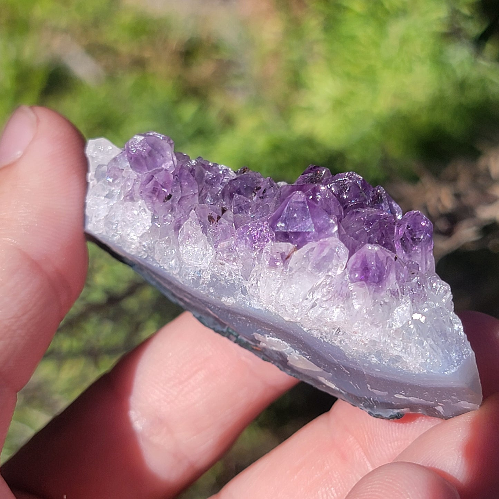
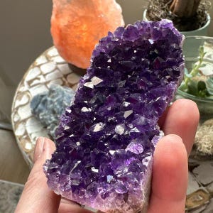
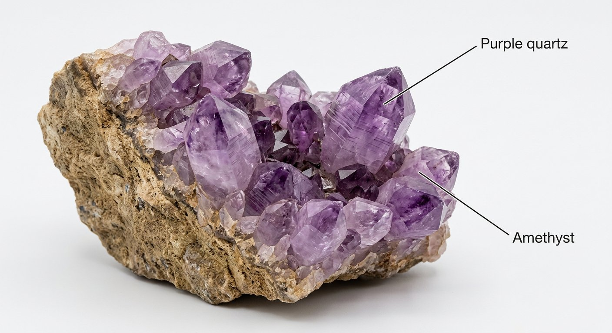
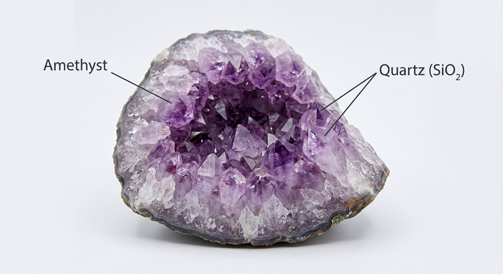

# Amethyst & Rock Crystal (Quartz)

> **Group:** Gemstone / industrial · **Formula:** SiO₂
> **Quick ID:** Hardness 7 (scratches glass/steel), **conchoidal fracture** (shell-like), **no cleavage**, glassy; **hexagonal** crystals with pointed terminations.

## At a glance

| Property | Value |
|---|---|
| Varieties | Amethyst (purple), rock crystal (clear), citrine (yellow), rose (pink), smoky (brown) |
| Hardness | **7** (scratches glass and steel) |
| Fracture | **Conchoidal** (shell-like); no cleavage |
| Lustre | Glassy |
| Habit | Hexagonal prisms, pyramidal terminations; geodes |
| Key test | Hardness 7 + glassy + conchoidal + no cleavage |

## What it is
**Quartz** — silicon dioxide, one of the most common minerals. Its gem varieties:
- **Amethyst** — purple (the most valued quartz gem).
- **Rock crystal** — clear; plus **citrine** (yellow), **rose quartz** (pink), and **smoky quartz** (brown/grey).

## Chemistry & mineralogy
**Quartz** — SiO₂ (silicon dioxide), a tectosilicate. Gem colour comes from trace impurities and irradiation: **amethyst** purple (iron + natural irradiation), **citrine** yellow (iron), **rose** pink (titanium/iron), **smoky** brown (aluminium + irradiation).

## Crystal habit
**Hexagonal prisms** with pyramidal terminations, often in **geodes** (hollow cavities lined with crystals). Amethyst commonly lines geodes and cavities in volcanic/hydrothermal settings.

## Physical properties
- **Hardness 7** — scratches glass and steel.
- **Conchoidal fracture** (shell-like breaks); **no cleavage**; glassy lustre.
- **Hexagonal** crystals, often with pointed pyramidal terminations.

## How to identify in the field
1. **Hardness:** 7 — scratches glass and steel.
2. **Fracture:** conchoidal (shell-like); **no cleavage**.
3. **Lustre:** glassy.
4. **Habit:** hexagonal, six-sided prisms.
5. **Context:** veins, pegmatites, geodes.

## Lookalikes & how to distinguish

| Looks like | How to tell it apart |
|---|---|
| **Fluorite** | Fluorite is softer (4) and cleaves; quartz is harder (7) with no cleavage. |
| **Calcite** | Calcite **fizzes** with acid and is softer (3); quartz does not fizz and is hard (7). |
| **Topaz** | Topaz is harder (8) and has basal cleavage; quartz is 7 with no cleavage. |

## Occurrence

**Pure specimen (amethyst/smoky quartz crystal):**

*Figure III.C.6 — Quartz crystal (amethyst variety). Source: [prettyrock.com](https://prettyrock.com/collections/quartz-specimens).*

*Figure III.C.6b — Amethyst (purple quartz) specimen. Source: [Grumbly Tumbleweed](https://www.grumblytumbleweed.com/products/amethyst-crystal-rock-specimen-purple-quartz-display-sample-from-brazil-39-91-grams).*

*Figure III.C.6c — Amethyst geode cluster. Source: [Etsy](https://www.etsy.com/listing/1222747927/natural-amethyst-geode-cluster-purple).*

*Figure III.C.6d — Labeled illustration: amethyst purple quartz crystals. Original diagram prepared for this guide.*

*Figure III.C.6e — Labeled illustration: amethyst geode purple quartz lining. Original diagram prepared for this guide.*

Found in veins, pegmatites, and geodes across the Basement (see [Quartz, Silica & Glass sand](../industrial/quartz-glass-sand.md)).

## Genesis
**Hydrothermal veins, pegmatites, and geodes** — quartz precipitates from silica-rich fluids in cavities, veins, and pegmatites. Amethyst forms in geodes where iron-bearing fluids crystallize into purple quartz.

## States / localities
Widespread in **veins, pegmatites, and geodes** across the Basement: **Plateau, Kaduna, Oyo, Nasarawa, Kogi**, and more. Amethyst and rock crystal are found in many states.

## Associated minerals & host rocks
Feldspar, mica (pegmatite); calcite, pyrite (geodes/veins); hosted by **veins, pegmatites, and geodes** (see [Pegmatite](../../02-rocks-of-nigeria/igneous/pegmatite.md)).

## Mining, uses & market
- **Gemstone** (amethyst, citrine, rock crystal).
- **Industrial** — piezoelectric crystals (electronics/oscillators), optics, and **silica/glass** production.

## Exploration notes
- **Hardness 7 + glassy + conchoidal fracture + no cleavage** = quartz.
- Look in **vein and pegmatite** settings; amethyst often lines **geodes/cavities**.
- Geodes and vugs are prime amethyst targets.

## Field checklist
- [ ] Hardness 7 (scratches glass)?
- [ ] Conchoidal fracture, no cleavage?
- [ ] Glassy lustre?
- [ ] Hexagonal crystals?
- [ ] Vein / pegmatite / geode setting?

## Facts
- Amethyst's **purple** comes from iron + natural irradiation.
- Quartz has **no cleavage** — it breaks with curved (conchoidal) fracture.
- Amethyst often lines **geodes** (hollow crystal-lined cavities).
- Quartz is **piezoelectric** — used in watches and electronics.

## Related
- [Quartz, Silica & Glass sand](../industrial/quartz-glass-sand.md) · [Corundum](corundum-sapphire-ruby.md) · [Topaz](topaz.md) · [Pegmatite](../../02-rocks-of-nigeria/igneous/pegmatite.md)
