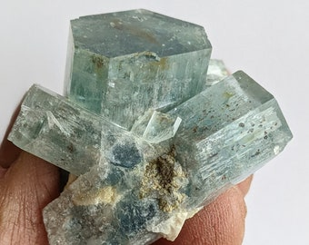

# Beryl — Aquamarine, Morganite & the Beryl Group

> **Group:** Gemstone · **Mineral:** beryl · **Formula:** Be₃Al₂Si₆O₁₈
> **Quick ID:** Hardness 7.5–8, **hexagonal** crystals often large and well-formed, vitreous; **aquamarine** is pale-to-vivid **blue**.

## At a glance

| Property | Value |
|---|---|
| Varieties | Aquamarine (blue), morganite (pink), heliodor (yellow), goshenite (colourless), **emerald** (green) |
| Hardness | 7.5–8 |
| Habit | **Hexagonal** crystals, often large and well-formed |
| Lustre | Vitreous; transparent to translucent |
| Key test | Hardness 7.5–8 + hexagonal + pegmatite |

## What it is
The **beryl group** — a beryllium aluminium silicate with several gem varieties:
- **Aquamarine** — blue to greenish-blue (the most common gem beryl).
- **Morganite** — pink.
- **Heliodor** — yellow. **Goshenite** — colourless.
- **Emerald** — the famous green variety (see [Emerald](emerald.md)).

## Chemistry & mineralogy
**Beryl** — Be₃Al₂Si₆O₁₈, a beryllium aluminium silicate (cyclosilicate). Colour comes from trace elements: aquamarine blue (Fe²⁺), morganite pink (Mn), heliodor yellow (Fe³⁺), emerald green (Cr/V). Beryllium is a strategic metal.

## Crystal habit
**Hexagonal** prisms, often **large and well-formed** (beryl produces some of the largest gem crystals). Crystals can reach metres in pegmatites.

## Physical properties
- **Hardness 7.5–8**; **hexagonal** crystals, often **large and well-formed**.
- Vitreous lustre; transparent to translucent.
- **Aquamarine** is typically pale-to-vivid **blue**.

## How to identify in the field
1. **Hardness:** 7.5–8 (scratches glass).
2. **Habit:** hexagonal prisms, often large.
3. **Lustre:** vitreous; transparent/translucent.
4. **Colour:** aquamarine blue, morganite pink, etc.
5. **Context:** zoned pegmatites.

## Lookalikes & how to distinguish

| Looks like | How to tell it apart |
|---|---|
| **Topaz** | Topaz is harder (8) with basal cleavage; beryl is hexagonal with no basal cleavage. |
| **Apatite** | Apatite is softer (5); beryl is harder (7.5–8). |
| **Tourmaline** | Tourmaline is striated (rounded triangular cross-section); beryl is hexagonal with flat faces. |

## Occurrence

**Pure specimen (aquamarine crystal cluster from a pegmatite):**

*Figure III.C.2 — Aquamarine (blue beryl) crystal cluster. Source: [Etsy](https://etsy.com/listing/655232678/aquamarine-blue-beryl-crystal-pegmatite).*

Found in zoned pegmatites (see [Pegmatite](../../02-rocks-of-nigeria/igneous/pegmatite.md)).

## Genesis
Crystallizes in **zoned rare-element pegmatites** associated with the Younger Granites. Beryl forms in the intermediate zones of zoned pegmatites, alongside columbite, tourmaline, and feldspar.

## States / localities
**Jos Plateau (Plateau)** pegmatites, plus **Kaduna, Nasarawa, and Oyo**. Aquamarine is one of the classic gems of the Nigerian pegmatite fields.

## Associated minerals & host rocks
Columbite–tantalite, tourmaline, feldspar, spodumene, quartz; hosted by **zoned rare-element pegmatites** (see [Tourmaline](tourmaline.md), [Columbite–Tantalite](../metallic/columbite-tantalite.md)).

## Mining, uses & market
- **Gemstones** — aquamarine (jewellery), morganite, heliodor.
- **Beryllium** is a strategic metal (alloys, aerospace, nuclear).

## Exploration notes
- Beryl crystallizes in **zoned rare-element pegmatites** (see [Pegmatite](../../02-rocks-of-nigeria/igneous/pegmatite.md)) alongside **columbite, tourmaline, and feldspar**.
- Large, clear, hexagonal crystals are the prize.
- The **Jos Plateau** pegmatites are the classic Nigerian aquamarine locality.

## Field checklist
- [ ] Hardness 7.5–8?
- [ ] Hexagonal crystals (often large)?
- [ ] Vitreous, transparent?
- [ ] Blue (aquamarine) / pink (morganite)?
- [ ] Zoned pegmatite setting?

## Facts
- **Aquamarine** is the classic Nigerian pegmatite gem (Jos Plateau).
- Beryl produces some of the **largest gem crystals** (up to metres).
- **Emerald** is simply the green (Cr/V) variety of beryl.
- **Beryllium** is a strategic metal used in aerospace and nuclear industries.

## Related
- [Emerald](emerald.md) · [Tourmaline](tourmaline.md) · [Topaz](topaz.md) · [Pegmatite](../../02-rocks-of-nigeria/igneous/pegmatite.md) · [Columbite–Tantalite](../metallic/columbite-tantalite.md)
