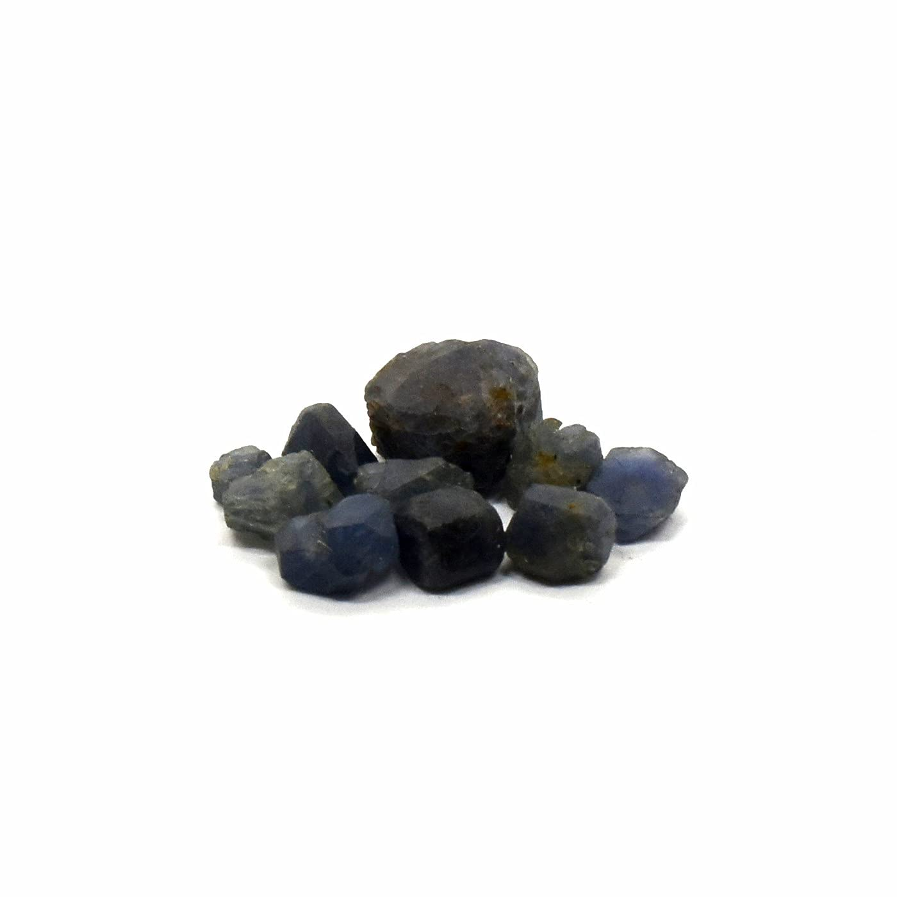

# Corundum — Sapphire & Ruby

> **Group:** Gemstone / abrasive · **Formula:** Al₂O₃
> **Quick ID:** **Hardness 9** (second-hardest mineral — scratches steel easily, is not scratched itself), adamantine to vitreous, no cleavage, heavy; often rounded alluvial grains.

## At a glance

| Property | Value |
|---|---|
| Varieties | **Ruby** (red, Cr); **sapphire** (blue, Fe+Ti); fancy sapphires (non-red) |
| Hardness | **9** (second-hardest mineral) |
| Cleavage | None (tough) |
| Lustre | Adamantine to vitreous |
| Habit | Hexagonal prismatic/barrel; rounded alluvial grains |
| Key test | Hardness 9 + adamantine + heavy |

## What it is
**Corundum** — aluminium oxide. Its gem varieties are among the most valuable:
- **Ruby** — red (coloured by chromium).
- **Sapphire** — blue (iron + titanium); all **non-red** colours are "fancy sapphires" (yellow, pink, green, etc.).

## Chemistry & mineralogy
**Corundum** — Al₂O₃ (aluminium oxide). A very hard, tough oxide. Colour comes from trace elements: **ruby** red (chromium), **sapphire** blue (iron + titanium charge transfer), fancy sapphires various. Emery is a granular abrasive mixture rich in corundum/magnetite.

## Crystal habit
**Hexagonal prismatic or barrel-shaped** crystals, tapering; also in rounded **alluvial grains** (placers). In placers, corundum appears as tough, rounded, heavy grains.

## Physical properties
- **Hardness 9** — the second-hardest mineral (after diamond); scratches almost everything.
- Adamantine to vitreous lustre; no cleavage (tough).
- Heavy; often in rounded alluvial grains.

## How to identify in the field
1. **Hardness:** **9** — scratches a knife/steel easily; not scratched itself.
2. **Lustre:** adamantine to vitreous.
3. **Cleavage:** none — tough.
4. **Weight:** heavy (dense grains in a pan).
5. **Context:** metamorphic rocks and alluvial gravels.

## Lookalikes & how to distinguish

| Looks like | How to tell it apart |
|---|---|
| **Spinel** | Spinel is octahedral, lighter, and softer (8); corundum is 9 and tough. |
| **Garnet** | Garnet is softer (6.5–7.5) and often isometric; corundum is 9 and hexagonal. |
| **Blue glass / other blue stones** | Hardness 9 is decisive — corundum scratches steel; glass and softer gems do not. |

## Occurrence

**Pure specimen (blue sapphire rough):**

*Figure III.C.5 — Blue sapphire (corundum) rough. Source: [Amazon](https://www.amazon.com/Sapphire-Corundum-Sparkling-Gemstone-Specimen/dp/B09DQ6H7KJ).*

Found in metamorphic rocks and alluvial placers (see [Placers & alluvium](../../02-rocks-of-nigeria/sedimentary/placers-alluvium.md)).

## Genesis
Forms in **metamorphic rocks** (marble, gneiss — ruby in marble, sapphire in metamorphic rocks) and concentrates in **alluvial placers**. Corundum is durable and heavy, so it survives weathering and concentrates in rivers.

## States / localities
Sapphire is found in parts of **Kaduna** and **Oyo** (including the Ibadan area), and in **alluvial (placer)** deposits; ruby is rare in Nigeria.

## Associated minerals & host rocks
Spinel, garnet, zircon, magnetite (placers); hosted by **metamorphic rocks and alluvial gravels** (see [Placers & alluvium](../../02-rocks-of-nigeria/sedimentary/placers-alluvium.md)).

## Mining, uses & market
- **Gemstones** — ruby and sapphire are "precious" gems of the highest value.
- **Abrasive** (emery) and synthetic **scratch-resistant watch crystals**.

## Exploration notes
- **Hardness 9** is the giveaway (scratches a knife/steel easily; not scratched itself).
- In Nigeria, look in **metamorphic rocks and alluvial gravels** (see [Placers & alluvium](../../02-rocks-of-nigeria/sedimentary/placers-alluvium.md)).
- Pan alluvial gravels for tough, heavy, rounded grains.

## Field checklist
- [ ] Hardness 9 (scratches steel, not scratched)?
- [ ] Adamantine to vitreous lustre?
- [ ] No cleavage, tough?
- [ ] Heavy, rounded alluvial grain?
- [ ] Red (ruby) or blue (sapphire)?

## Facts
- Corundum is **hardness 9** — the second-hardest mineral (after diamond).
- **Ruby** is red (chromium); **sapphire** is blue (and all non-red colours).
- **Emery** (an abrasive) is granular corundum-rich rock.
- Nigerian sapphire occurs in **Kaduna and Oyo** placers; ruby is rare.

## Related
- [Emerald](emerald.md) · [Amethyst & Quartz](amethyst-quartz.md) · [Placers & alluvium](../../02-rocks-of-nigeria/sedimentary/placers-alluvium.md) · [Diamond](diamond.md)
