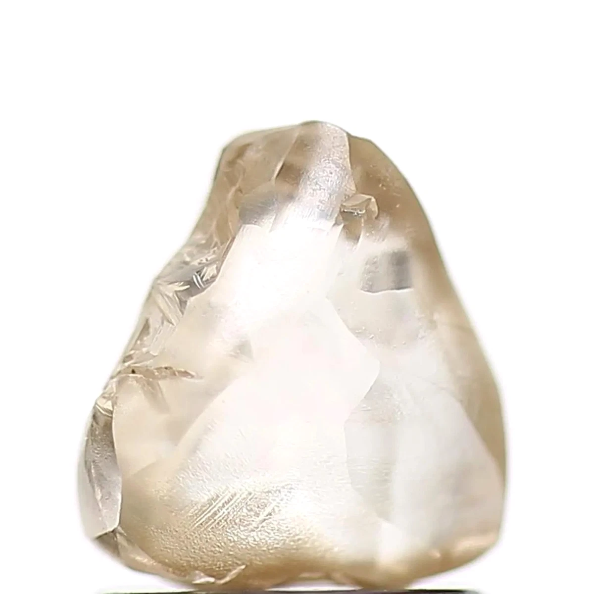

# Diamond (C) — *a "watch" mineral for Nigeria*

## Chemistry & mineralogy
**Carbon (C)**, cubic — the **hardest mineral** (Mohs 10). A high-pressure polymorph of
graphite (see [Graphite](../industrial/graphite.md)).

## Crystal habit
Octahedral and cubic crystals; rounded in alluvial ("placer") settings.

## Physical properties & how to test
- **Hardness:** 10 — scratches everything.
- **Lustre:** **adamantine** (brilliant); high dispersion ("fire").
- **Signature:** conducts heat (feels cold); often transparent to coloured.

## Occurrence
**Rough diamond (illustrative — *not* from Nigeria)**

*Figure III.C.10 — Rough natural diamond crystal (illustrative). Source: [eBay](https://www.ebay.com/b/Diamond-Rough-Loose-Natural-Diamonds/262026/bn_1521585).*

## Genesis
Primary diamonds form in **kimberlite and lamproite pipes** at mantle depths; secondary
diamonds concentrate in **alluvial placers**. Both require very specific conditions.

## ⚠️ Status in Nigeria
**Nigeria has no commercially proven diamond deposit.** Only **trace/unconfirmed**
occurrences have been reported (notably **Plateau and Bauchi**). Diamonds appear on the
NGSA list as a **"watch"/potential** mineral, not a producing one — Nigeria imports all
its diamonds.

## Uses & market
- **Uses:** gemstones; industrial abrasives, cutting and drilling tools.
- **Market:** the highest-value gemstone by weight.

## Exploration notes (educational)
- Diamonds require **kimberlite/lamproite** hosts; exploration focuses on **indicator
  minerals** — **garnet (pyrope/G9), ilmenite, chromite, and chrome diopside**
  (see [Garnet](garnet.md), [Chromite](../metallic/chromite.md)).
- Nigeria's known kimberlites have so far proven **barren** — hence no commercial mine.
- Panning for indicator minerals is the first, cheapest exploration step.

## Related
- [Garnet](garnet.md) · [Chromite](../metallic/chromite.md) · [Graphite](../industrial/graphite.md) · [Ore deposits 101](../../00-fundamentals/00-07-ore-deposits-101.md)
