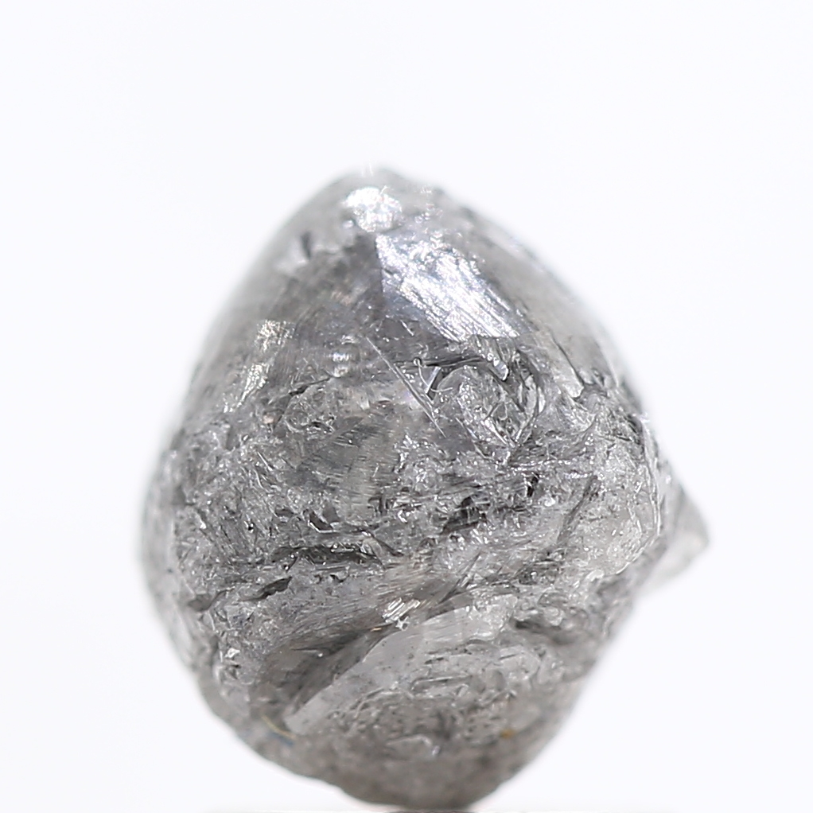
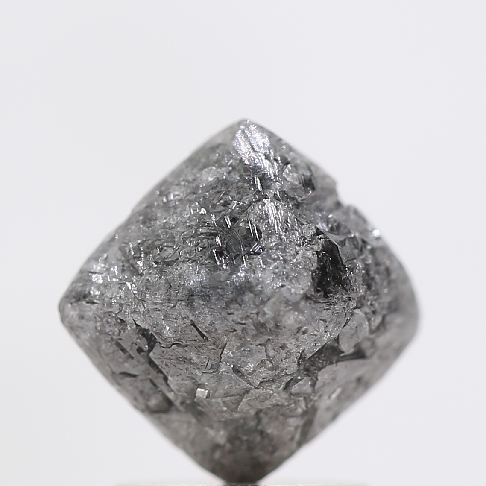

# Diamond (C) — *a "watch" mineral for Nigeria*

> **Group:** Gemstone / industrial abrasive · **Formula:** C (cubic)
> **Quick ID:** **Hardness 10** (hardest mineral — scratches everything), **adamantine** lustre, high dispersion ("fire"); conducts heat (feels cold to the touch).

## At a glance

| Property | Value |
|---|---|
| Hardness | **10** (hardest mineral) |
| Lustre | **Adamantine** (brilliant); high dispersion ("fire") |
| Habit | Octahedral/cubic crystals; rounded in placers |
| Signature | Conducts heat (feels cold); transparent to coloured |
| Key test | Hardness 10 + adamantine + conducts heat |

## Chemistry & mineralogy
**Carbon (C)**, cubic — the **hardest mineral** (Mohs 10). A high-pressure polymorph of graphite (see [Graphite](../industrial/graphite.md)). Diamonds form only under extreme pressure deep in the mantle.

## Crystal habit
Octahedral and cubic crystals; rounded in alluvial ("placer") settings. Rough diamonds often show rounded, resinous-looking octahedra.

## Physical properties
- **Hardness:** 10 — scratches everything.
- **Lustre:** **adamantine** (brilliant); high dispersion ("fire").
- **Signature:** conducts heat (feels cold); often transparent to coloured.

## How to identify in the field
1. **Hardness:** 10 — scratches everything (nothing scratches it).
2. **Lustre:** adamantine, brilliant; high "fire" (dispersion).
3. **Heat:** conducts heat — feels cold to the touch.
4. **Context:** kimberlite/lamproite pipes or alluvial placers.
5. **Indicator minerals:** pyrope garnet, ilmenite, chromite, chrome diopside.

## Lookalikes & how to distinguish

| Looks like | How to tell it apart |
|---|---|
| **Quartz** | Quartz is 7 and glassy; diamond is 10 and adamantine. |
| **Cubic zirconia / moissanite** | Synthetic simulants need thermal/conductivity testers; diamond conducts heat strongly. |
| **Zircon** | Zircon is 7.5; diamond is 10 and much more brilliant. |

## Occurrence

**Rough diamond (illustrative — *not* from Nigeria)**

*Figure III.C.10 — Rough natural diamond crystal (illustrative). Source: [eBay](https://www.ebay.com/b/Diamond-Rough-Loose-Natural-Diamonds/262026/bn_1521585).*

*Figure III.C.10b — Rough diamond (octahedral crystal). Source: [Shree Diamond Mfg](https://www.shreediamondmfg.com/blogs/our-blog/what-is-rough-uncut-and-raw-diamond).*

*Figure III.C.10c — Rough diamond crystal. Source: [Shree Diamond Mfg](https://www.shreediamondmfg.com/blogs/our-blog/what-is-rough-uncut-and-raw-diamond).*

## Genesis
Primary diamonds form in **kimberlite and lamproite pipes** at mantle depths; secondary diamonds concentrate in **alluvial placers**. Both require very specific conditions.

## ⚠️ Status in Nigeria
**Nigeria has no commercially proven diamond deposit.** Only **trace/unconfirmed** occurrences have been reported (notably **Plateau and Bauchi**). Diamonds appear on the NGSA list as a **"watch"/potential** mineral, not a producing one — Nigeria imports all its diamonds.

## States / localities
No commercial diamond deposits. Trace/unconfirmed reports: **Plateau, Bauchi**. Nigeria imports all its diamonds.

## Associated minerals & host rocks
**Indicator minerals** — pyrope garnet, ilmenite, chromite, chrome diopside; hosted by **kimberlite and lamproite pipes** (see [Garnet](garnet.md), [Chromite](../metallic/chromite.md)).

## Mining, uses & market
- **Uses:** gemstones; industrial abrasives, cutting and drilling tools.
- **Market:** the highest-value gemstone by weight.

## Exploration notes (educational)
- Diamonds require **kimberlite/lamproite** hosts; exploration focuses on **indicator minerals** — **garnet (pyrope/G9), ilmenite, chromite, and chrome diopside** (see [Garnet](garnet.md), [Chromite](../metallic/chromite.md)).
- Nigeria's known kimberlites have so far proven **barren** — hence no commercial mine.
- Panning for indicator minerals is the first, cheapest exploration step.

## Field checklist
- [ ] Hardness 10 (scratches everything)?
- [ ] Adamantine lustre / high fire?
- [ ] Conducts heat (feels cold)?
- [ ] Octahedral / placer grain?
- [ ] With kimberlite indicator minerals?

## Facts
- Diamond is the **hardest mineral** (Mohs 10).
- It forms in **kimberlite/lamproite** pipes deep in the mantle.
- **Nigeria has NO commercially proven diamond** — it's a "watch"/potential mineral.
- Diamond exploration uses **indicator minerals** (pyrope garnet, ilmenite, chromite).

## Related
- [Garnet](garnet.md) · [Chromite](../metallic/chromite.md) · [Graphite](../industrial/graphite.md) · [Ore deposits 101](../../00-fundamentals/00-07-ore-deposits-101.md)
