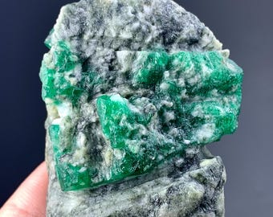
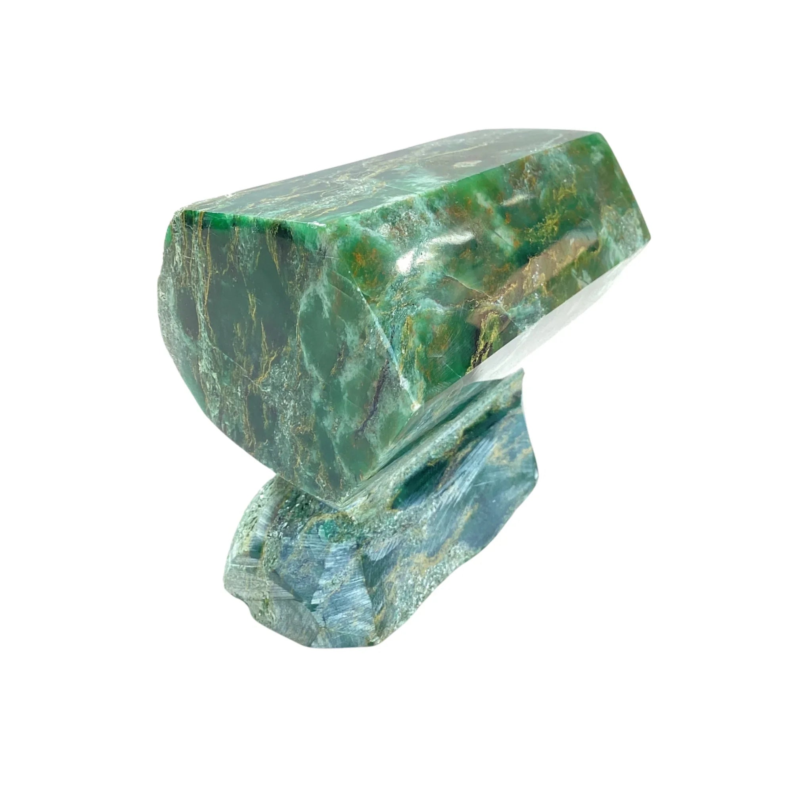

# Emerald

> **Group:** Gemstone · **Mineral:** beryl (green variety) · **Formula:** Be₃Al₂Si₆O₁₈
> **Quick ID:** Hardness 7.5–8, **green** (coloured by Cr/V), **hexagonal prismatic** crystals; usually has **inclusions** ("jardin"); in pegmatite or mica schist.

## At a glance

| Property | Value |
|---|---|
| Colour | **Green** (Cr and/or V) |
| Hardness | 7.5–8 |
| Habit | **Hexagonal prismatic** crystals |
| Inclusions | Usually has inclusions ("**jardin**"); flawless is very rare |
| Lustre | Vitreous; translucent |
| Key test | Green beryl + hexagonal + inclusions |

## What it is
**Emerald** — the **green variety of beryl**, coloured by traces of **chromium and/or vanadium**. One of the four "precious" gemstones (with diamond, ruby, sapphire) and one of Nigeria's best-known gems.

## Chemistry & mineralogy
**Beryl** — Be₃Al₂Si₆O₁₈, but **green** from traces of **chromium and/or vanadium**. The same chemistry as aquamarine (blue) — only the trace colouring agent differs. Emerald is a variety of beryl (see [Beryl / Aquamarine](beryl-aquamarine.md)).

## Crystal habit
**Hexagonal prismatic** crystals. Emeralds typically show characteristic **inclusions** (called the "**jardin**," French for "garden") — internal fractures, crystals, and fluid pockets. Flawless emeralds are extremely rare.

## Physical properties
- **Hardness 7.5–8.**
- **Green** (the prized colour); **hexagonal prismatic** crystals.
- Usually has **inclusions** (called the "jardin") — flawless emeralds are very rare.
- Vitreous lustre; translucent.

## How to identify in the field
1. **Colour:** distinctly **green** (vivid green is most valued).
2. **Hardness:** 7.5–8.
3. **Habit:** hexagonal prismatic crystals.
4. **Inclusions:** usually has internal "jardin" inclusions.
5. **Context:** pegmatites and mica schist.

## Lookalikes & how to distinguish

| Looks like | How to tell it apart |
|---|---|
| **Fuchsite (green mica)** | Fuchsite is soft, flaky, and green throughout; emerald is hard (7.5–8) and crystalline. |
| **Green tourmaline (verdelite)** | Tourmaline is striated with a rounded triangular section; emerald is hexagonal. |
| **Peridot** | Peridot is softer (6.5–7) and a yellow-green; emerald is bluish-green and harder. |

## Occurrence

**Pure specimen (crystal):**

*Figure III.C.1a — Emerald crystal. Source: [Etsy](https://www.etsy.com/listing/1203248225/654-carat-green-emerald-crystal-specimen).*

**In rock / matrix** (emerald in fuchsite):

*Figure III.C.1b — Emerald in its rock matrix (green emerald in fuchsite). Source: [BMS Houston](https://bmshouston.com/products/emerald-in-fuchsite-rock-matrix).*

## Genesis
Forms in **pegmatites and mica schist** — beryllium-bearing fluids interact with chromium/vanadium-bearing rocks to crystallize green emerald. Nigerian emeralds occur in pegmatites and schist on the Jos Plateau.

## States / localities
The **Jos Plateau (Plateau State)** is Nigeria's emerald heartland; also reported in parts of **Kaduna** and **Oyo**. Nigerian emeralds are mined artisanally and sold internationally.

## Associated minerals & host rocks
Aquamarine, tourmaline, fuchsite, quartz, feldspar; hosted by **pegmatites and mica schist** (see [Mica schist & Phyllite](../../02-rocks-of-nigeria/metamorphic/mica-schist-phyllite.md), [Pegmatite](../../02-rocks-of-nigeria/igneous/pegmatite.md)).

## Mining, uses & market
A **high-value gemstone** for fine jewellery. Value is driven by **colour** (vivid green), **clarity**, and **size** — top stones rival the world's best. Nigerian emeralds are mined artisanally and exported.

## Exploration notes
- Look in **pegmatites and mica schist** (see [Pegmatite](../../02-rocks-of-nigeria/igneous/pegmatite.md), [Mica schist](../../02-rocks-of-nigeria/metamorphic/mica-schist-phyllite.md)).
- Green beryl crystals in matrix are the target; often with **aquamarine** and **tourmaline**.
- The **Jos Plateau** is Nigeria's emerald heartland.

## Field checklist
- [ ] Green (vivid green best)?
- [ ] Hardness 7.5–8?
- [ ] Hexagonal prismatic crystal?
- [ ] Inclusions ("jardin")?
- [ ] Pegmatite / mica schist setting?

## Facts
- Emerald is the **green variety of beryl** (coloured by Cr/V).
- Its internal inclusions are called the "**jardin**" (garden) — most emeralds have them.
- It is one of the four **"precious"** gemstones (with diamond, ruby, sapphire).
- The **Jos Plateau** is Nigeria's emerald heartland.

## Related
- [Beryl / Aquamarine](beryl-aquamarine.md) · [Tourmaline](tourmaline.md) · [Topaz](topaz.md) · [Pegmatite](../../02-rocks-of-nigeria/igneous/pegmatite.md) · [Mica schist & Phyllite](../../02-rocks-of-nigeria/metamorphic/mica-schist-phyllite.md)
