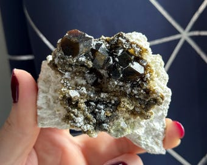
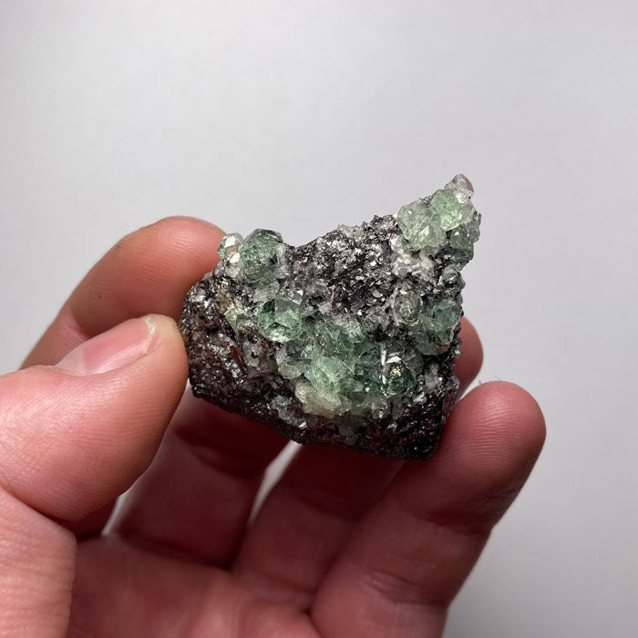
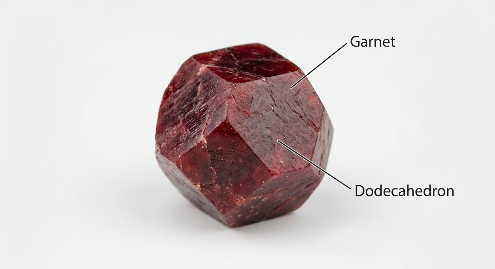
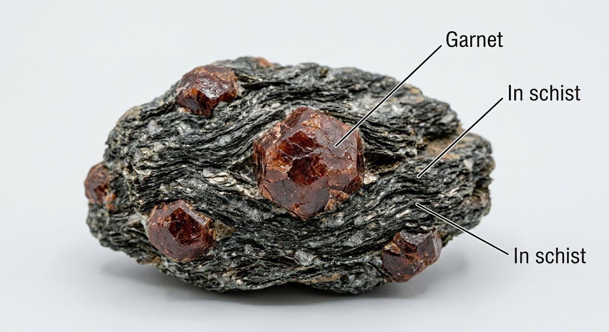

# Garnet

> **Group:** Gemstone / abrasive · **Mineral:** garnet group (nesosilicates)
> **Quick ID:** Hardness 6.5–7.5, resinous, **dodecahedral (12-sided) or rounded** crystals, **isotropic**, no cleavage; commonly **red to orange-brown**.

## At a glance

| Property | Value |
|---|---|
| Species | Almandine & pyrope (red), spessartine (orange), grossular (hessonite, tsavorite), andradite (demantoid) |
| Hardness | 6.5–7.5 |
| Habit | **Dodecahedral (12-sided)** / trapezohedral / rounded |
| Lustre | Resinous |
| Optics | **Isotropic** (same in all directions) |
| Cleavage | None |
| Key test | Rounded 12-sided crystals + resinous + isotropic |

## What it is
The **garnet group** — a family of silicate minerals with several gem/industrial species: **almandine** (red), **pyrope** (red), **spessartine** (orange), **grossular** (incl. brown-orange "hessonite" and green "tsavorite"), and **andradite** (incl. green demantoid).

## Chemistry & mineralogy
Garnets are **nesosilicates** with the general formula X₃Y₂(SiO₄)₃, where X and Y vary — giving the different species. Almandine (Fe), pyrope (Mg), spessartine (Mn), grossular (Ca), andradite (Ca+Fe). The variety of chemistry gives a range of colours.

## Crystal habit
**Dodecahedral (12-sided)** or trapezohedral crystals, often **rounded**; also granular/massive. The rounded 12-sided habit is the classic garnet form.

## Physical properties
- **Hardness 6.5–7.5**; typically **resinous** lustre.
- Often forms **dodecahedral (12-sided)** or rounded crystals.
- **Isotropic** (behaves the same in all directions optically); no cleavage.
- Commonly **red to orange-brown**, but many colours exist.

## How to identify in the field
1. **Habit:** rounded, 12-sided (dodecahedral) crystals.
2. **Lustre:** resinous (greasy/glassy).
3. **Hardness:** 6.5–7.5.
4. **Optics:** isotropic (single refraction — unlike doubly-refracting gems).
5. **Colour:** commonly red to orange-brown.

## Lookalikes & how to distinguish

| Looks like | How to tell it apart |
|---|---|
| **Spinel** | Spinel is octahedral (8-sided) and lighter; garnet is dodecahedral (12-sided). |
| **Zircon** | Zircon is harder (7.5), adamantine, and tetragonal; garnet is resinous and dodecahedral. |
| **Corundum** | Corundum is much harder (9) and tough; garnet is 6.5–7.5. |

## Occurrence

**Specimen (andradite garnet crystals on matrix):**

*Figure III.C.7 — Garnet crystals on matrix. Source: [Etsy](https://etsy.com/listing/1291376678/rare-garnet-raw-garnet-specimen-with).*

*Figure III.C.7b — Andradite garnet cluster. Source: [Etsy](https://etsy.com/listing/1291376678/rare-garnet-raw-garnet-specimen-with).*

*Figure III.C.7c — Green garnet (grossular) specimen. Source: [Mineral Mike](https://www.mineralmike.com/collections/garnet).*

*Figure III.C.7d — Labeled illustration: garnet dodecahedral crystal. Original diagram prepared for this guide.*

*Figure III.C.7e — Labeled illustration: garnet crystals in schist. Original diagram prepared for this guide.*

Found in metamorphic rocks (see [Marble rock](../../02-rocks-of-nigeria/metamorphic/marble-calc-silicate.md)).

## Genesis
**Metamorphic** — garnets grow in **schist, marble, and contact (skarn) zones** during regional and contact metamorphism. Garnet is a common index mineral in metamorphic rocks.

## States / localities
In **metamorphic rocks** — schist, marble, and skarn — across the Basement: **Jos (Plateau), Kaduna, Oyo, Kwara, Kogi**, and elsewhere.

## Associated minerals & host rocks
Mica, quartz, calcite, pyroxene; hosted by **schist, marble, and skarn** (see [Mica schist & Phyllite](../../02-rocks-of-nigeria/metamorphic/mica-schist-phyllite.md), [Marble](../../02-rocks-of-nigeria/metamorphic/marble-calc-silicate.md), [Skarn](../../02-rocks-of-nigeria/metamorphic/skarn.md)).

## Mining, uses & market
- **Gemstone** (almandine, pyrope, spessartine, grossular, demantoid).
- **Abrasive** — garnet sandpaper/blasting media and **water-jet cutting**.

## Exploration notes
- Look in **schist, marble, and contact (skarn) zones** (see [Mica schist](../../02-rocks-of-nigeria/metamorphic/mica-schist-phyllite.md), [Marble](../../02-rocks-of-nigeria/metamorphic/marble-calc-silicate.md)).
- Rounded 12-sided crystals + resinous lustre are the giveaway.
- **Pyrope garnet** is also a key **diamond indicator mineral**.

## Field checklist
- [ ] Rounded 12-sided (dodecahedral) crystals?
- [ ] Resinous lustre?
- [ ] Hardness 6.5–7.5?
- [ ] Isotropic (single refraction)?
- [ ] Schist / marble / skarn setting?

## Facts
- Garnet's classic habit is the **rounded 12-sided (dodecahedral)** crystal.
- It is **isotropic** — optically the same in all directions (unusual for gems).
- **Pyrope garnet** is a key **diamond indicator mineral**.
- Garnet is a major **abrasive** (sandpaper, blasting, water-jet cutting).

## Related
- [Corundum](corundum-sapphire-ruby.md) · [Kyanite](kyanite.md) · [Marble (rock)](../../02-rocks-of-nigeria/metamorphic/marble-calc-silicate.md) · [Skarn](../../02-rocks-of-nigeria/metamorphic/skarn.md) · [Diamond](diamond.md)
