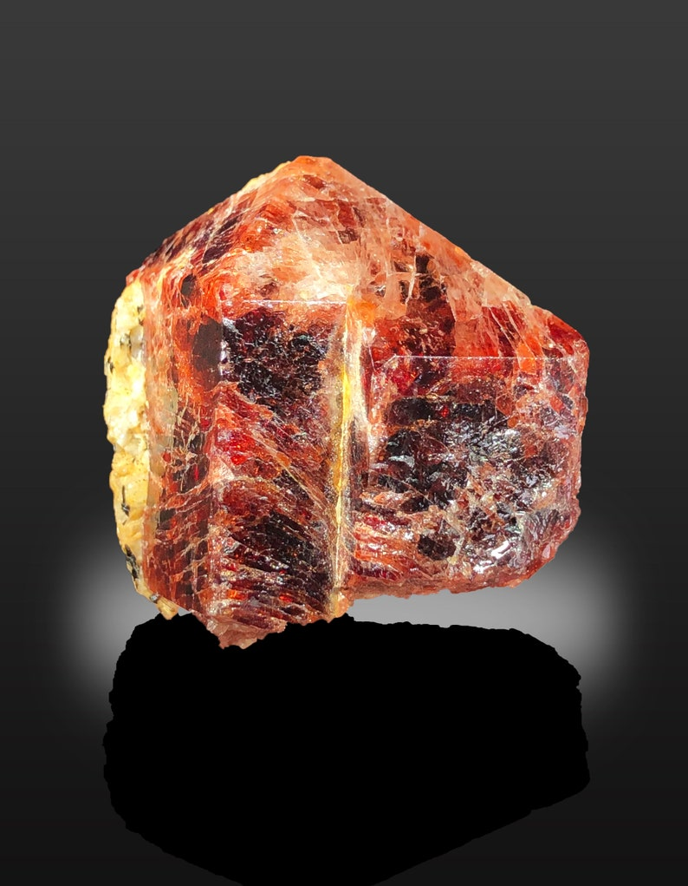
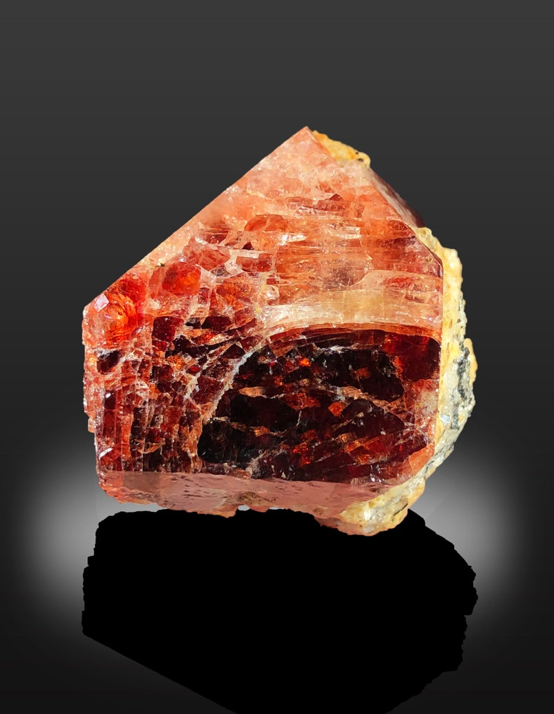
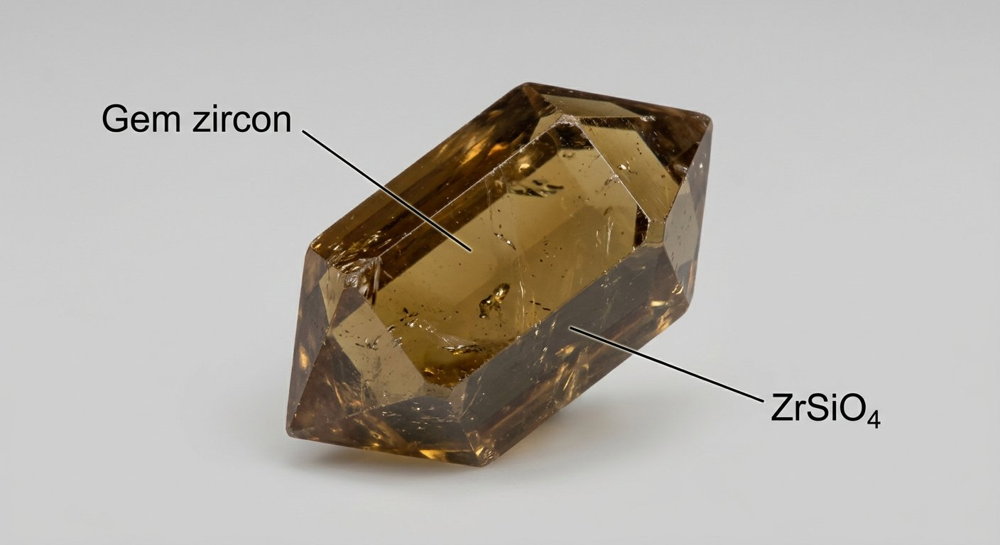
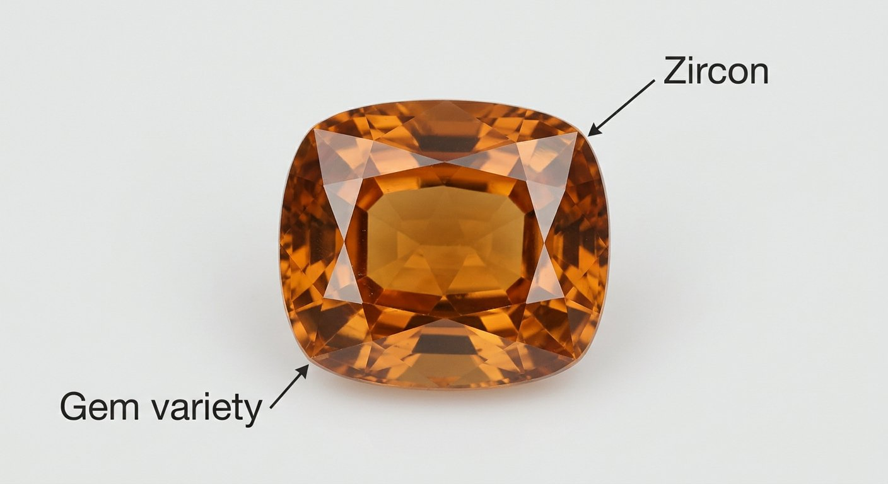

# Gem Zircon

> **Group:** Gemstone / industrial · **Formula:** ZrSiO₄
> **Quick ID:** Hardness 7.5 (scratches quartz), **adamantine** (diamond-like) lustre, **high dispersion** ("fire"), heavy; tetragonal prisms with pyramidal ends.

## At a glance

| Property | Value |
|---|---|
| Colours | Blue (heat-treated), colourless, red "hyacinth," others |
| Hardness | **7.5** (scratches quartz) |
| Lustre | **Adamantine** (diamond-like) |
| Dispersion | High — strong sparkle/"fire" |
| Habit | Tetragonal prisms with pyramidal ends |
| Key test | Hardness 7.5 + adamantine + high fire + heavy |

## What it is
**Zircon** — zirconium silicate — used both as a **gemstone** (noted for its brilliance and "fire") and as an industrial mineral. Gem colours include **blue** (heat-treated), colourless (a diamond substitute), and reddish "**hyacinth**."

## Chemistry & mineralogy
**Zircon** — ZrSiO₄ (zirconium silicate), a nesosilicate. It often contains traces of hafnium, rare earths, and (in some crystals) uranium/thorium. Colourless/blue zircon has long been a diamond substitute.

## Crystal habit
**Tetragonal prisms with pyramidal ends** — the classic "zircon" shape. Also occurs as rounded grains in heavy-mineral sands.

## Physical properties
- **Hardness 7.5** (scratches quartz); **adamantine** (diamond-like) lustre.
- **High dispersion** — strong sparkle/fire.
- Heavy; tetragonal prismatic crystals with pyramidal ends.

## How to identify in the field
1. **Hardness:** 7.5 (scratches quartz, not topaz).
2. **Lustre:** adamantine (diamond-like).
3. **Dispersion:** high "fire" (strong sparkle).
4. **Weight:** heavy (dense).
5. **Habit:** tetragonal prisms with pyramidal ends.

## Lookalikes & how to distinguish

| Looks like | How to tell it apart |
|---|---|
| **Diamond** | Diamond is harder (10) with greater brilliance; zircon is 7.5 with strong (but lesser) fire. |
| **Corundum** | Corundum is harder (9) and tougher; zircon is 7.5 and more brittle. |
| **Topaz** | Topaz has perfect basal cleavage; zircon does not. |

## Occurrence

**Pure specimen (crystal):**

*Figure III.C.8 — Zircon crystal. Source: [eBay](https://www.ebay.com/itm/205307778447).*

*Figure III.C.8b — Zircon gem crystal (Pakistan). Source: [Etsy](https://www.etsy.com/in-en/listing/1403801549/red-zircon-crystal-specimen-raw-gemstone).*

*Figure III.C.8c — Zircon gem crystal. Source: [Etsy](https://www.etsy.com/in-en/listing/1403801549/red-zircon-crystal-specimen-raw-gemstone).*

*Figure III.C.8d — Labeled illustration: gem zircon tetragonal crystal. Original diagram prepared for this guide.*

*Figure III.C.8e — Labeled illustration: zircon gemstone (faceted). Original diagram prepared for this guide.*

Found in heavy-mineral sands and pegmatites (see [Zircon & Monazite](../metallic/zircon-monazite.md)).

## Genesis
**Heavy-mineral (placer) concentration** in beach/river sands; zircon also crystallizes in **granites/pegmatites**. Being dense and durable, zircon survives weathering and concentrates in sands.

## States / localities
Concentrated in **heavy-mineral beach and river sands** (**Lagos, Ondo, Delta, Rivers, Akwa Ibom**) and in **pegmatites** (**Plateau, Nasarawa, Kaduna, Oyo**).

## Associated minerals & host rocks
Ilmenite, rutile, monazite (sands); columbite–tantalite, beryl, feldspar (pegmatites); hosted by **beach/river sands and pegmatites** (see [Placers & alluvium](../../02-rocks-of-nigeria/sedimentary/placers-alluvium.md)).

## Mining, uses & market
- **Gemstone** (colourless, blue, hyacinth) — a traditional (December) birthstone.
- **Industrial zircon** — ceramics, refractories, foundry sands, zirconium chemicals.

## Exploration notes
- Recovered as a **by-product of heavy-mineral (beach/river) sands** and from pegmatites (see [Placers & alluvium](../../02-rocks-of-nigeria/sedimentary/placers-alluvium.md), [Zircon & Monazite](../metallic/zircon-monazite.md)).
- High hardness (7.5) + adamantine lustre + heavy = zircon.
- Colourless/blue gem zircon is recovered from Nigerian beach sands.

## Field checklist
- [ ] Hardness 7.5?
- [ ] Adamantine lustre / high fire?
- [ ] Heavy?
- [ ] Tetragonal prism with pyramidal ends?
- [ ] Beach/river sand or pegmatite?

## Facts
- Zircon has brilliant "**fire**" (high dispersion) — a diamond substitute.
- It is a traditional **December birthstone**.
- It is recovered from Nigerian **beach sands** and **pegmatites**.
- "**Hyacinth**" is the reddish gem variety of zircon.

## Related
- [Zircon & Monazite](../metallic/zircon-monazite.md) · [Corundum](corundum-sapphire-ruby.md) · [Placers & alluvium](../../02-rocks-of-nigeria/sedimentary/placers-alluvium.md) · [Topaz](topaz.md)
