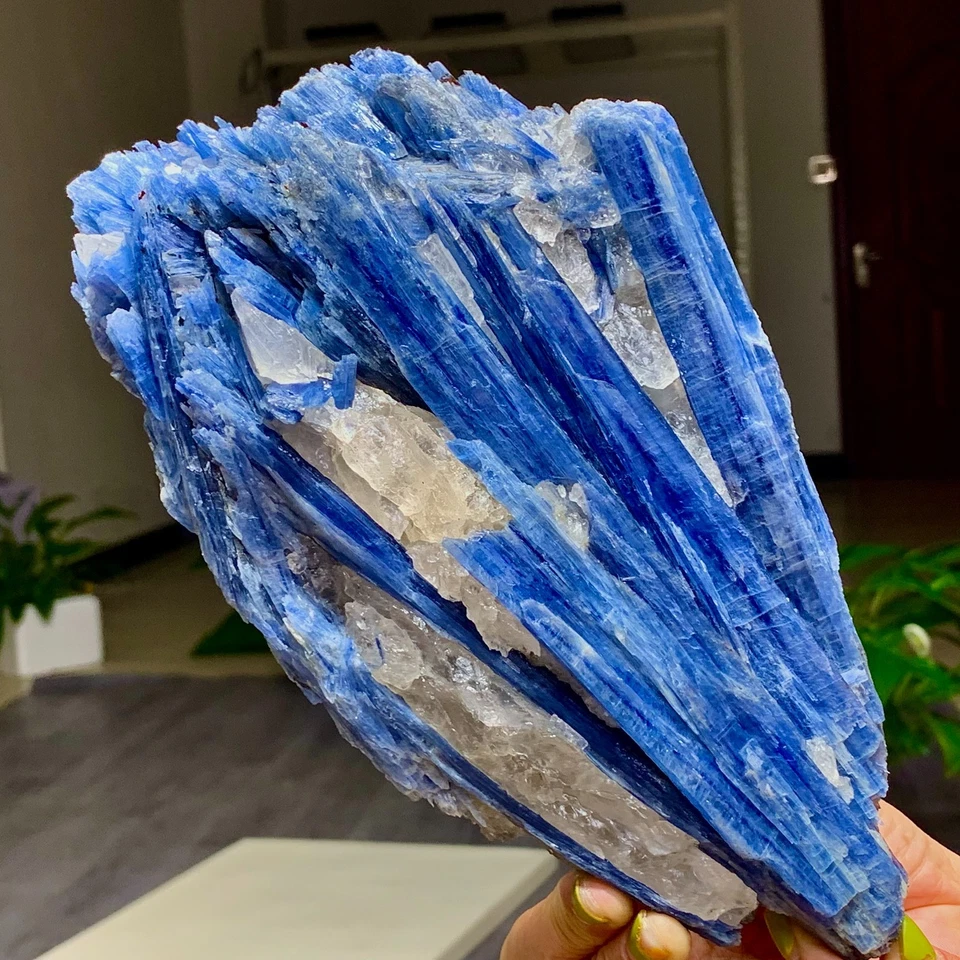

# Kyanite

> **Group:** Industrial / gemstone · **Formula:** Al₂SiO₅ (Al-silicate polymorph)
> **Quick ID:** **Bladed, elongated** crystals; **variable (anisotropic) hardness** — about **4.5 one way, 6.5–7 across** the blade (a neat diagnostic test); blue, vitreous to pearly.

## At a glance

| Property | Value |
|---|---|
| Colour | Blue (sometimes green/white) |
| Habit | **Blade-like, elongated** crystals |
| Hardness | **Variable: ~4.5 along, 6.5–7 across** the blade |
| Cleavage | Perfect (one direction) |
| Lustre | Vitreous to pearly |
| Key test | Bladed blue + variable hardness (scratch test) |

## What it is
**Kyanite** — an aluminium silicate (a polymorph of andalusite and sillimanite), typically **blue and bladed**. Used industrially as a **refractory** and, when fine, as a collector's gem.

## Chemistry & mineralogy
**Kyanite** — Al₂SiO₅, an aluminium silicate. It is a **polymorph** of andalusite and sillimanite (same chemistry, different structure/formation). Kyanite forms at high pressure (medium-high grade metamorphism).

## Crystal habit
**Blade-like, elongated** crystals — a distinctive habit. Kyanite forms long, flattened blue blades, often in foliated masses in schist.

## Physical properties
- **Blade-like, elongated** crystals — a distinctive habit.
- **Variable (anisotropic) hardness** — about **4.5 one way and 6.5–7 across** the blade (a neat diagnostic test!).
- Blue (sometimes green/white); vitreous to pearly; perfect cleavage.

## How to identify in the field
1. **Habit:** bladed, elongated blue crystals.
2. **Hardness test:** scratch **along** vs **across** the blade — it feels **softer one way (4.5), harder across (6.5–7)** — the giveaway.
3. **Cleavage:** perfect (one direction).
4. **Lustre:** vitreous to pearly.
5. **Context:** medium-high-grade metamorphic rocks.

## Lookalikes & how to distinguish

| Looks like | How to tell it apart |
|---|---|
| **Sillimanite** | Sillimanite is fibrous/silky; kyanite is bladed with variable hardness. |
| **Andalusite** | Andalusite forms blocky/prismatic crystals; kyanite is bladed with variable hardness. |
| **Hornblende** | Hornblende is darker green/black with different cleavage; kyanite is blue-bladed. |

## Occurrence

**Pure specimen (blue kyanite with quartz):**

*Figure III.C.9 — Blue kyanite blades with quartz. Source: [eBay](https://www.ebay.com/b/Kyanite-In-Crystal-Mineral-Display-Specimens/3225/bn_7022998980).*

Found in metamorphic rocks (see [Mica schist & Phyllite](../../02-rocks-of-nigeria/metamorphic/mica-schist-phyllite.md)).

## Genesis
**Medium-to-high-grade regional metamorphism** of alumina-rich rocks — kyanite is a characteristic mineral of the **kyanite zone** of metamorphism, forming in schist and gneiss.

## States / localities
In **medium-to-high-grade metamorphic rocks** (schist, gneiss) of the Basement: **Jos (Plateau), Kaduna, Oyo, Kwara, Kogi**, and elsewhere.

## Associated minerals & host rocks
Garnet, staurolite, sillimanite, quartz, mica; hosted by **schist and gneiss** (see [Mica schist & Phyllite](../../02-rocks-of-nigeria/metamorphic/mica-schist-phyllite.md), [Banded gneiss](../../02-rocks-of-nigeria/metamorphic/banded-gneiss.md)).

## Mining, uses & market
- **Refractories** (high-temperature furnace linings), **ceramics**.
- **Gemstone** — fine blue kyanite is a collector's stone.

## Exploration notes
- **Bladed blue crystals** with a **scratch test that gives different hardnesses** along vs. across the blade = kyanite.
- Look in **schist and gneiss** (see [Mica schist](../../02-rocks-of-nigeria/metamorphic/mica-schist-phyllite.md), [Gneiss](../../02-rocks-of-nigeria/metamorphic/banded-gneiss.md)).
- Assay **Al₂O₃** for refractory grade.

## Field checklist
- [ ] Bladed, elongated blue crystals?
- [ ] Variable hardness (softer along, harder across the blade)?
- [ ] Perfect cleavage?
- [ ] Vitreous to pearly?
- [ ] Schist / gneiss setting?

## Facts
- Kyanite has **variable hardness** — 4.5 along the blade, 6.5–7 across (a unique test!).
- It is a **polymorph** of andalusite and sillimanite (all Al₂SiO₅).
- Kyanite marks the **medium-high-grade** metamorphic zone.
- It is used as a **refractory** (furnace linings) and a collector's gem.

## Related
- [Garnet](garnet.md) · [Mica schist](../../02-rocks-of-nigeria/metamorphic/mica-schist-phyllite.md) · [Banded gneiss](../../02-rocks-of-nigeria/metamorphic/banded-gneiss.md) · [Sillimanite](../industrial/sillimanite.md)
