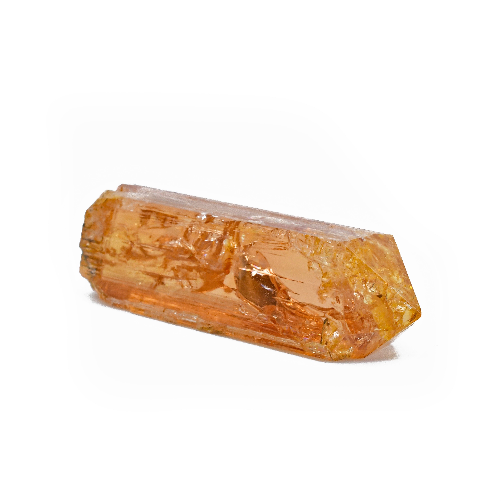
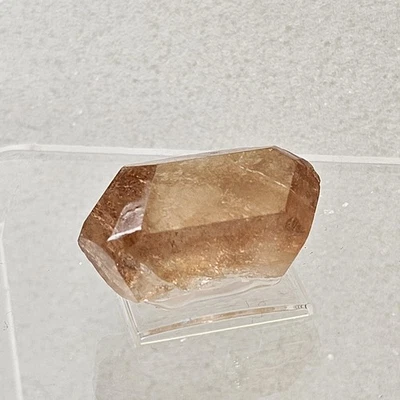
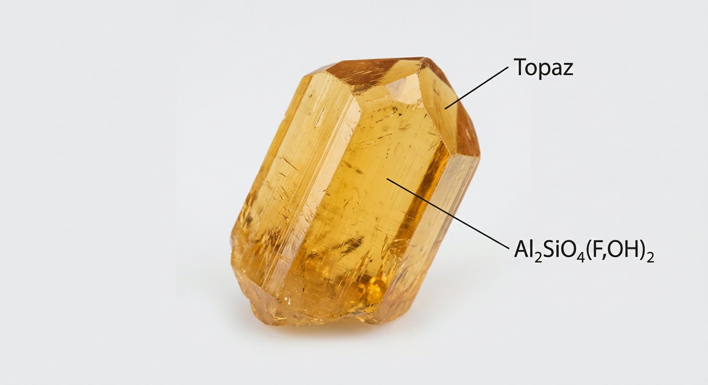
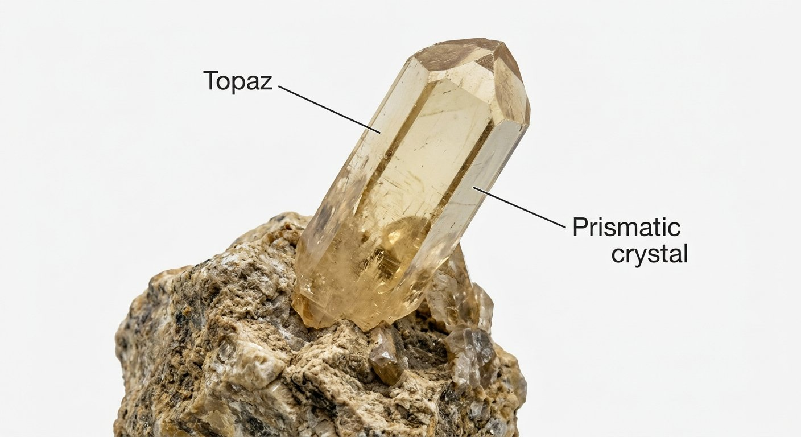

# Topaz

> **Group:** Gemstone · **Formula:** Al₂SiO₄(F,OH)₂
> **Quick ID:** Hardness **8** (one of the harder gems), vitreous, with **perfect basal cleavage** (cleaves in one direction — must be cut with care); imperial yellow-orange or blue.

## At a glance

| Property | Value |
|---|---|
| Colours | **Imperial topaz** (yellow-orange), blue (often irradiated), colourless, pink |
| Hardness | **8** |
| Cleavage | **Perfect basal** (one direction) |
| Lustre | Vitreous; transparent to translucent |
| Key test | Hardness 8 + perfect basal cleavage |

## What it is
**Topaz** — a fluorine-bearing silicate, valued as a gemstone. Colours include the prized **imperial topaz** (yellow-orange), **blue** (often produced by irradiation), plus colourless and pink.

## Chemistry & mineralogy
**Topaz** — Al₂SiO₄(F,OH)₂, a fluorine-bearing nesosilicate. Colour comes from trace elements and defects; much blue topaz is produced by **irradiation and heat treatment** of colourless/pale topaz.

## Crystal habit
**Prismatic** crystals, often large and well-formed, with **perfect basal cleavage**. Topaz crystals can be very large in pegmatites.

## Physical properties
- **Hardness 8** — one of the harder gems.
- **Perfect basal cleavage** — it cleaves in one direction, so it must be cut with care.
- Vitreous lustre; transparent to translucent.

## How to identify in the field
1. **Hardness:** 8 (harder than quartz).
2. **Cleavage:** **perfect basal** (cleaves in one direction — unlike quartz).
3. **Lustre:** vitreous; transparent/translucent.
4. **Colour:** imperial yellow-orange, blue, colourless, pink.
5. **Context:** pegmatites and greisens around granites.

## Lookalikes & how to distinguish

| Looks like | How to tell it apart |
|---|---|
| **Quartz** | Quartz has no cleavage; topaz has perfect basal cleavage (and is harder, 8 vs 7). |
| **Beryl / aquamarine** | Beryl is hexagonal with no basal cleavage; topaz has perfect basal cleavage. |
| **Citrine** | Citrine (quartz) has no cleavage; topaz cleaves and is harder. |

## Occurrence

**Pure specimen (crystal):**

*Figure III.C.4 — Topaz crystal. Source: [Pinterest](https://www.pinterest.com/mineralminers/topaz-crystals-mineral-specimens/).*

*Figure III.C.4b — Imperial topaz (Brazil). Source: [Crystalarium](https://www.crystalarium.com/products/imperial-topaz-69-ct-natural-gem-crystal-specimen-brazil).*

*Figure III.C.4c — Imperial topaz crystal. Source: [eBay](https://www.ebay.com/b/Topaz-Crystal/3226/bn_7023336033).*

*Figure III.C.4d — Labeled illustration: topaz orthorhombic crystal. Original diagram prepared for this guide.*

*Figure III.C.4e — Labeled illustration: topaz prismatic gem crystal. Original diagram prepared for this guide.*

Found in pegmatites and greisens (see [Pegmatite](../../02-rocks-of-nigeria/igneous/pegmatite.md)).

## Genesis
Forms in the **late stages of granite/pegmatite systems** — in **pegmatites and greisens** (fluorine-rich alteration zones) around granites. Topaz marks fluorine-rich, late magmatic fluids.

## States / localities
**Jos Plateau (Plateau)** and other granitic/pegmatitic areas — topaz occurs in the late stages of granite/pegmatite systems.

## Associated minerals & host rocks
Beryl, tourmaline, feldspar, cassiterite, quartz; hosted by **pegmatites and greisens** around granites (see [Beryl / Aquamarine](beryl-aquamarine.md), [Tourmaline](tourmaline.md)).

## Mining, uses & market
- **Gemstone** for jewellery; imperial (orange) and blue are the most valuable.
- Defined as a standard **hardness-8** mineral on the Mohs scale.

## Exploration notes
- Look in **pegmatites and greisens** around granites (see [Pegmatite](../../02-rocks-of-nigeria/igneous/pegmatite.md)).
- Despite its hardness (8), topaz **cleaves easily** — handle crystals carefully.
- Imperial topaz and clear crystals are the prize.

## Field checklist
- [ ] Hardness 8?
- [ ] Perfect basal cleavage?
- [ ] Vitreous, transparent?
- [ ] Imperial orange / blue?
- [ ] Pegmatite / greisen setting?

## Facts
- Topaz is **hardness 8** — it defines that point on the Mohs scale.
- It has **perfect basal cleavage** — so it can split despite being hard.
- **Imperial topaz** (yellow-orange) is the most prized colour.
- Much blue topaz is **irradiated** (colourless topaz treated to blue).

## Related
- [Emerald](emerald.md) · [Beryl / Aquamarine](beryl-aquamarine.md) · [Amethyst & Quartz](amethyst-quartz.md) · [Pegmatite](../../02-rocks-of-nigeria/igneous/pegmatite.md) · [Tourmaline](tourmaline.md)
