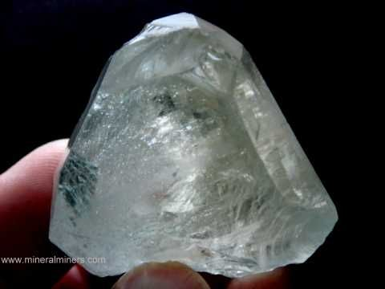

# Topaz

> **Group:** Gemstone · **Formula:** Al₂SiO₄(F,OH)₂

## What it is
**Topaz** — a fluorine-bearing silicate, valued as a gemstone. Colors include the
 prized **imperial topaz** (yellow-orange), **blue** (often produced by irradiation),
plus colorless and pink.

## Properties & how to recognize
- **Hardness 8** — one of the harder gems.
- **Perfect basal cleavage** — it cleaves in one direction, so it must be cut with care.
- Vitreous luster; transparent to translucent.

## Occurrence

**Pure specimen (crystal):**

*Figure III.C.4 — Topaz crystal. Source: [Pinterest](https://www.pinterest.com/mineralminers/topaz-crystals-mineral-specimens/).*

## Where in Nigeria (states)
**Jos Plateau (Plateau)** and other granitic/pegmatitic areas — topaz occurs in the
late stages of granite/pegmatite systems.

## Uses & value
- **Gemstone** for jewelry; imperial (orange) and blue are the most valuable.
- Defined as a standard **hardness-8** mineral on the Mohs scale.

## Exploration / notes
- Look in **pegmatites and greisens** around granites (see
  [Pegmatite](../../02-rocks-of-nigeria/igneous/pegmatite.md)).
- Despite its hardness (8), topaz **cleaves easily** — handle crystals carefully.

## Related
- [Emerald](emerald.md) · [Beryl / Aquamarine](beryl-aquamarine.md) · [Amethyst & Quartz](amethyst-quartz.md)
