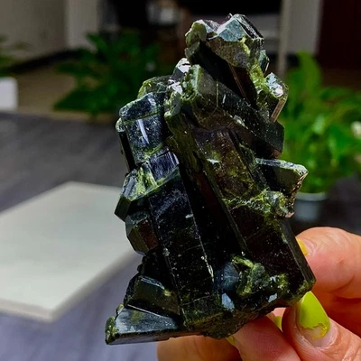
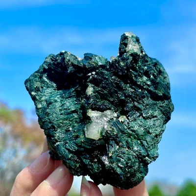

# Tourmaline

> **Group:** Gemstone · **Mineral:** tourmaline (complex borosilicate)
> **Quick ID:** Hardness 7–7.5, **striated, triangular/prismatic** crystals (a key ID feature); many colours; **piezoelectric**; vitreous.

## At a glance

| Property | Value |
|---|---|
| Varieties | **Schorl** (black), **elbaite** (verdelite green, rubellite pink/red, indicolite blue, watermelon) |
| Hardness | 7–7.5 |
| Habit | **Striated, triangular/prismatic** crystals (key ID) |
| Lustre | Vitreous; transparent to opaque (schorl opaque) |
| Signature | **Piezoelectric** (charge under pressure) and pyroelectric |
| Key test | Striated triangular prism + hardness 7–7.5 |

## What it is
**Tourmaline** — a complex boron silicate that occurs in **many colours**:
- **Schorl** — black (the most common, and a useful indicator in pegmatites).
- **Elbaite** group — green (*verdelite*), pink/red (*rubellite*), blue (*indicolite*), and bicoloured "**watermelon**" tourmaline (the gem prize).

## Chemistry & mineralogy
**Tourmaline** — a complex **borosilicate** (cyclosilicate) with a highly variable chemistry, which gives its wide colour range. Schorl (iron-rich, black) is common; the elbaite group (lithium/aluminium-bearing) gives the gem colours.

## Crystal habit
**Striated, triangular/prismatic** crystals — the long, three-sided, lengthwise-striated prism is the classic tourmaline form and the key ID feature. Cross-sections are rounded triangles.

## Physical properties
- **Hardness 7–7.5**; **striated, triangular/prismatic** crystals (a key ID feature).
- **Piezoelectric** (generates charge under pressure) and pyroelectric.
- Vitreous lustre; transparent to opaque (black schorl is opaque).

## How to identify in the field
1. **Habit:** **striated triangular prism** (rounded triangular cross-section).
2. **Hardness:** 7–7.5.
3. **Colour:** black (schorl), green, pink, blue, or watermelon.
4. **Piezoelectric:** attracts dust when pressured/heated (a fun test).
5. **Context:** pegmatites (and some metamorphic rocks).

## Lookalikes & how to distinguish

| Looks like | How to tell it apart |
|---|---|
| **Hornblende** | Hornblende is darker green/black, softer (5–6), with different cleavage; tourmaline is 7–7.5 and striated. |
| **Beryl** | Beryl is hexagonal with flat faces; tourmaline is striated with a rounded triangular section. |
| **Pyroxene** | Pyroxene has a squarer (4-sided) section; tourmaline is triangular and striated. |

## Occurrence

**Pure specimen (green tourmaline crystal):**

*Figure III.C.3 — Green tourmaline crystal. Source: [eBay](https://www.ebay.com/b/Tourmaline-Crystal/3226/bn_55193417).*

*Figure III.C.3b — Green tourmaline (elbaite) crystal. Source: [eBay](https://www.ebay.com/b/Tourmaline-Crystal/3226/bn_55193417).*

*Figure III.C.3c — Tourmaline (schorl) specimen. Source: [eBay](https://www.ebay.com/b/Tourmaline-Specimen/3221/bn_7023262556).*

**In rock:** black **schorl** is common in Nigerian **pegmatites** — see the pegmatite specimen in [Pegmatite](../../02-rocks-of-nigeria/igneous/pegmatite.md).

## Genesis
Crystallizes mainly in **pegmatites** (and some metamorphic rocks). Black **schorl** is a common accessory in pegmatites; the gemmy **elbaite** varieties form in the zoned, element-rich parts of rare-element pegmatites.

## States / localities
**Jos Plateau (Plateau)** pegmatites, plus **Nasarawa, Oyo, and Kaduna**.

## Associated minerals & host rocks
Beryl, columbite–tantalite, feldspar, quartz, lepidolite; hosted by **zoned rare-element pegmatites** (see [Beryl / Aquamarine](beryl-aquamarine.md), [Emerald](emerald.md), [Columbite–Tantalite](../metallic/columbite-tantalite.md)).

## Mining, uses & market
- **Gemstone** — vividly coloured elbaite (rubellite, indicolite, watermelon) is prized.
- **Industrial** — piezoelectric applications.

## Exploration notes
- The **striated triangular prism** is unmistakable.
- **Black schorl** flags fertile pegmatites; look nearby for gemmy elbaite, beryl, and columbite.
- The **Jos Plateau** pegmatites are the classic Nigerian tourmaline locality.

## Field checklist
- [ ] Striated triangular prism?
- [ ] Hardness 7–7.5?
- [ ] Black (schorl) or gem colour?
- [ ] Piezoelectric (attracts dust)?
- [ ] Pegmatite setting?

## Facts
- Tourmaline's **striated triangular** prism is the giveaway.
- It comes in **many colours** — including bicoloured "**watermelon**."
- It is **piezoelectric** (generates charge under pressure).
- **Black schorl** flags fertile (gem-bearing) pegmatites.

## Related
- [Beryl / Aquamarine](beryl-aquamarine.md) · [Emerald](emerald.md) · [Pegmatite](../../02-rocks-of-nigeria/igneous/pegmatite.md) · [Columbite–Tantalite](../metallic/columbite-tantalite.md) · [Topaz](topaz.md)
