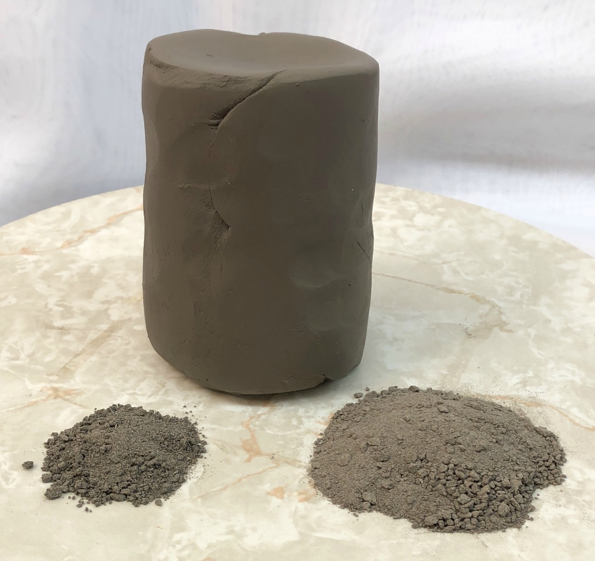
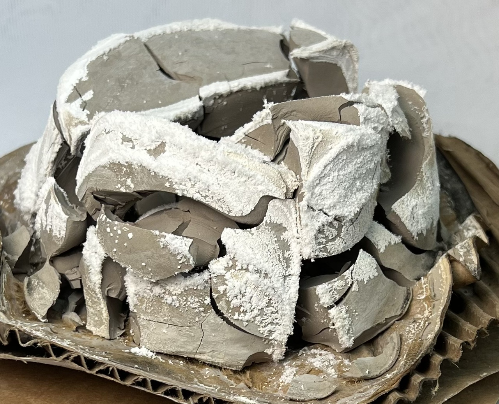
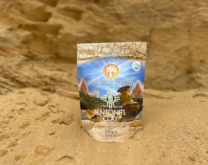
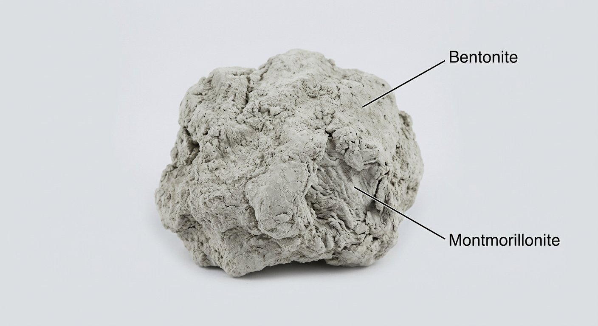
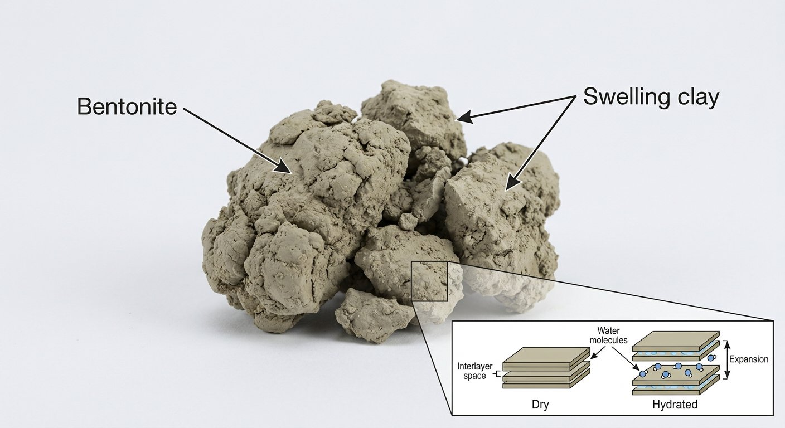

# Bentonite

> **Group:** Industrial / non-metallic · **Mineral:** montmorillonite (smectite clay)
> **Quick ID:** **Swells greatly in water** into a slippery gel; grey/green/cream, soapy, very fine and plastic.

## At a glance

| Property | Value |
|---|---|
| Colour | Grey, green, or cream |
| Feel | Soapy; very fine-grained and plastic |
| Key test | **Swells greatly in water** → slippery gel |
| Absorption | Very high |
| Genesis | Altered volcanic ash |

## What it is
**Bentonite** — a clay dominated by **montmorillonite**, famous for its ability to **swell greatly when wet**. Usually formed from altered **volcanic ash**.

## Chemistry & mineralogy
**Montmorillonite** — a **smectite** (expanding 2:1 layer) clay, (Na,Ca)(Al,Mg)₆(Si₄O₁₀)₃(OH)₆·nH₂O. Its layered structure lets water molecules enter between layers, causing the dramatic **swelling** that defines bentonite.

## Crystal habit
Montmorillonite crystals are **microscopic**; bentonite is identified by its bulk **swelling** and gel behaviour, not visible crystals. It occurs as soft, earthy masses.

## Physical properties
- **Swells in water** and forms a slippery gel — the key diagnostic property.
- Grey, green, or cream; soapy feel; high absorption capacity.
- Very fine-grained and plastic.

## How to identify in the field
1. **Swelling test:** add water — bentonite **swells greatly** and forms a slippery gel.
2. **Feel:** soapy, very fine, plastic.
3. **Colour:** grey, green, or cream.
4. **Context:** altered volcanic ash deposits.
5. **Absorption:** very high (absorbs many times its weight in water).

## Lookalikes & how to distinguish

| Looks like | How to tell it apart |
|---|---|
| **Kaolin** | Kaolin does **not** swell in water; bentonite swells dramatically. |
| **Common clay** | Common clay swells little; bentonite swells greatly into a gel. |
| **Talc** | Talc is soapy but does not swell into a gel; bentonite does. |

## Occurrence

*Figure III.B.13 — Bentonite: swelling (montmorillonite) clay. Source: [Digitalfire](https://digitalfire.com/material/bentonite).*

*Figure III.B.3c — Bentonite clay (raw lump). Source: [Digitalfire](https://digitalfire.com/material/bentonite).*

*Figure III.B.3d — Bentonite clay powder. Source: [Etsy](https://www.etsy.com/listing/764435847/betonite-clay-powdercalcium-bentonite).*

*Figure III.B.3e — Labeled illustration: bentonite swelling clay (montmorillonite). Original diagram prepared for this guide.*

*Figure III.B.3f — Labeled illustration: bentonite earthy clay texture. Original diagram prepared for this guide.*

Derived from altered **volcanic ash** (see [Clay & Kaolin rock](../../02-rocks-of-nigeria/sedimentary/clay-kaolin.md)).

## Genesis
Forms by the alteration (**bentonitization**) of **volcanic ash** — volcanic glass alters to montmorillonite. Bentonite marks ancient volcanic ash layers altered in marine or lacustrine settings.

## States / localities
Derived from altered **volcanic ash**; reported in **Borno (Biu/Chad areas)** and other volcanic/ash-bearing settings.

## Associated minerals & host rocks
Montmorillonite, volcanic glass, cristobalite, clay; hosted by **altered volcanic ash (bentonite) deposits** (see [Clay (brick/pottery)](clay.md)).

## Mining, uses & market
- **Drilling mud** (oil/gas wells) — the main use.
- **Foundry sand** binder, **iron-ore pelletizing**, **cat litter**, **sealants**, and **waterproofing**.
- High **swelling (sodium) bentonite** is the most valuable type.

## Exploration notes
- The **swelling test** (add water and watch it expand) confirms bentonite.
- High **swelling (sodium) bentonite** is the most valuable type.
- Target altered **volcanic ash** horizons.

## Field checklist
- [ ] Swells greatly in water → slippery gel?
- [ ] Soapy, very fine, plastic?
- [ ] Grey/green/cream?
- [ ] High absorption?
- [ ] From altered volcanic ash?

## Facts
- Bentonite **swells greatly** in water — its signature property.
- It is the main ingredient in **oil/gas drilling mud**.
- Bentonite forms from altered **volcanic ash**.
- **Sodium bentonite** (high-swelling) is the most valuable grade.

## Related
- [Clay (brick/pottery)](clay.md) · [Kaolin](kaolin.md) · [Bentonite & clay (rock)](../../02-rocks-of-nigeria/sedimentary/clay-kaolin.md) · [The Chad Basin](../../01-general-geology/01-04-sedimentary-basins.md)
