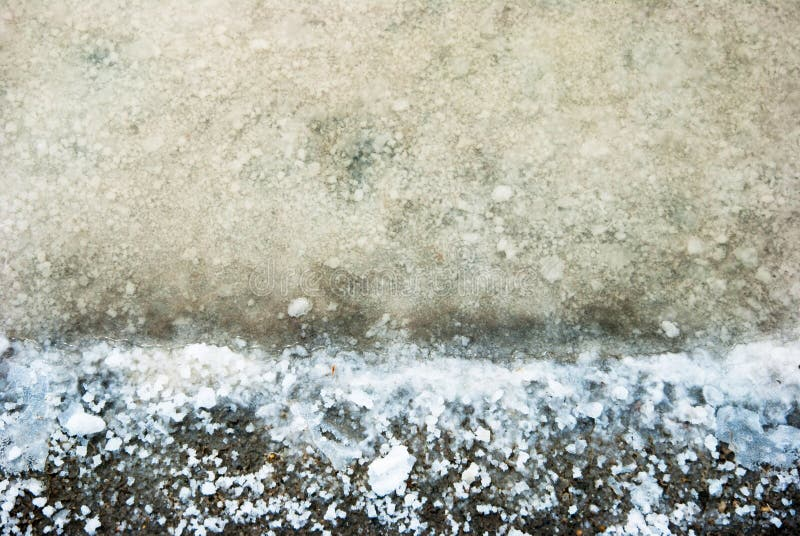
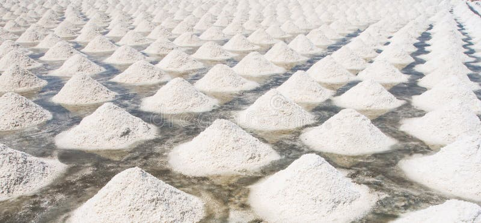

# Brine (Saline Water)

> **Group:** Industrial / non-metallic · **Material:** concentrated salt water (NaCl + K, Mg, Li, Br, carbonates)
> **Quick ID:** A dense **saline liquid**; leaves **salt/evaporite crusts** on evaporation; high dissolved-salt content.

## At a glance

| Property | Value |
|---|---|
| Form | **Liquid** (saline water) |
| Composition | NaCl + K, Mg, Li, Br, carbonates |
| Signature | Leaves salt/evaporite crusts on evaporation |
| Setting | Saline lakes, groundwater, formation waters |
| Key test | Saline water + evaporite crusts |

## Chemistry & mineralogy
Concentrated **salt water** — a solution of dissolved salts: chiefly **NaCl**, plus **potassium, magnesium, lithium, bromine, and carbonates**. Not a single mineral but a workable liquid resource. Brine can be a source of valuable trace elements (lithium, bromine).

## Habit / form
A **liquid** — saline lakes, groundwater, and formation waters associated with salt deposits; harvested by solar evaporation. Brine is pumped or naturally surfaces in salt springs.

## Physical properties
- **Form:** dense, saline water.
- **Signature:** high dissolved-salt content; leaves salt/evaporite crusts on evaporation (see [Salt](salt.md), [Trona](trona.md)).

## How to identify in the field
1. **Taste:** salty water.
2. **Crusts:** leaves white salt/evaporite crusts on evaporation.
3. **Setting:** saline lakes, salt springs, evaporite basins.
4. **Density:** denser than freshwater.
5. **Association:** with salt/halite deposits.

## Lookalikes & how to distinguish

| Looks like | How to tell it apart |
|---|---|
| **Freshwater** | Freshwater is not salty and leaves no salt crust; brine is saline and leaves crusts. |
| **Solid salt (halite)** | Halite is a solid; brine is a liquid that evaporates to salt. |

## Occurrence

**In the field**

*Figure III.B.32 — Brine drying in an evaporation pond beside salt mounds (illustrative). Source: [Getty Images](https://gettyimages.com/photos/evaporation-ponds).*

*Figure III.B.32b — Brine: salt crystals in an evaporation pond. Source: [Dreamstime](https://www.dreamstime.com/evaporation-pond-used-production-salt-sunnyvale-south-san-francisco-bay-area-california-tolerant-micro-algae-survive-image179580691).*

*Figure III.B.32c — Brine: salt evaporation pond. Source: [Dreamstime](https://www.dreamstime.com/evaporation-pond-used-production-salt-sunnyvale-south-san-francisco-bay-area-california-tolerant-micro-algae-survive-image179580691).*

## Genesis
**Evaporite lakes** (notably **Lake Chad**) and saline groundwater/formation waters associated with salt deposits (see [Salt](salt.md)). Brine forms as water evaporates and concentrates salts.

## States / localities
**Ebonyi, Benue, Nasarawa, Cross River** — salt springs/brines; and **Borno/Yobe** (Lake Chad brine province).

## Associated minerals & host rocks
Halite (salt), trona, gypsum; hosted by **saline lakes, salt springs, and evaporite basins** (see [Salt](salt.md), [Trona](trona.md), [The Chad Basin](../../04-geological-provinces/04-04-chad-basin.md)).

## Mining, uses & market
- **Uses:** **salt production** (solar evaporation), chlor-alkali chemicals, **oilfield drilling fluid**, water treatment, and extraction of **lithium, bromine, and magnesium**.
- **Market:** salt and specialty chemicals; an emerging **lithium-from-brine** interest.

## Exploration notes
- Sample and **assay dissolved ions** (Na, K, Mg, Li, Br, Cl, carbonate).
- Associated with evaporite basins and salt lakes; often co-located with [Salt](salt.md) and [Trona](trona.md).
- Rising **lithium-from-brine** interest makes brines increasingly valuable.

## Field checklist
- [ ] Saline (salty) liquid?
- [ ] Leaves salt crusts on evaporation?
- [ ] Saline lake / salt spring setting?
- [ ] Associated with salt/halite?
- [ ] Assayed for Li, Br, K, Mg?

## Facts
- Brine is **liquid salt water** — concentrated by evaporation.
- It is harvested by **solar evaporation** in ponds.
- **Lake Chad** is Nigeria's main brine province.
- Brines are an emerging source of **lithium, bromine, and magnesium**.

## Related
- [Salt (halite)](salt.md) · [Trona](trona.md) · [Lithium](../metallic/lithium.md) · [Chad Basin](../../04-geological-provinces/04-04-chad-basin.md) · [State-by-state table](../../04-geological-provinces/04-09-state-by-state-table.md)
