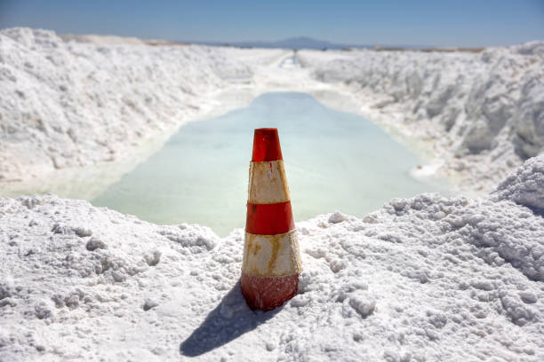

# Brine (Saline Water)

## Chemistry & mineralogy
Concentrated **salt water** — a solution of dissolved salts: chiefly **NaCl**, plus
**potassium, magnesium, lithium, bromine, and carbonates**. Not a single mineral but a
workable liquid resource.

## Habit / form
A **liquid** — saline lakes, groundwater, and formation waters associated with salt
deposits; harvested by solar evaporation.

## Physical properties & how to test
- **Form:** dense, saline water.
- **Signature:** high dissolved-salt content; leaves salt/evaporite crusts on
  evaporation (see [Salt](salt.md), [Trona](trona.md)).

## Occurrence
**In the field**

*Figure III.B.32 — Brine drying in an evaporation pond beside salt mounds (illustrative). Source: [Getty Images](https://gettyimages.com/photos/evaporation-ponds).*

## Genesis
**Evaporite lakes** (notably **Lake Chad**) and saline groundwater/formation waters
associated with salt deposits (see [Salt](salt.md)).

## States / localities
**Ebonyi, Benue, Nasarawa, Cross River** — salt springs/brines; and **Borno/Yobe**
(Lake Chad brine province).

## Mining, uses & market
- **Uses:** **salt production** (solar evaporation), chlor-alkali chemicals,
  **oilfield drilling fluid**, water treatment, and extraction of **lithium, bromine,
  and magnesium**.
- **Market:** salt and specialty chemicals; an emerging **lithium-from-brine** interest.

## Exploration notes
- Sample and **assay dissolved ions** (Na, K, Mg, Li, Br, Cl, carbonate).
- Associated with evaporite basins and salt lakes; often co-located with
  [Salt](salt.md) and [Trona](trona.md).

## Related
- [Salt (halite)](salt.md) · [Trona](trona.md) · [Lithium](../metallic/lithium.md) · [Chad Basin](../../04-geological-provinces/04-04-chad-basin.md) · [State-by-state table](../../04-geological-provinces/04-09-state-by-state-table.md)
