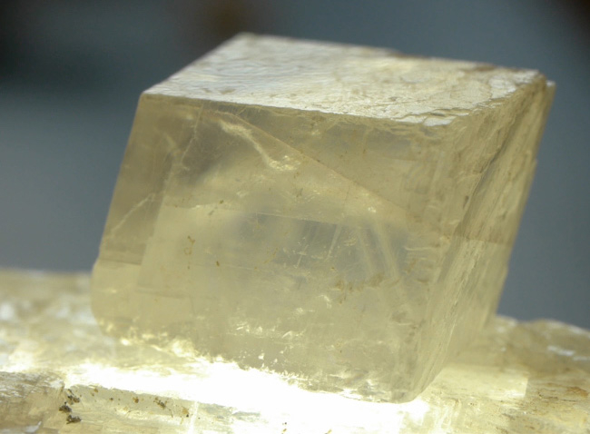

# Calcite (CaCO₃)

> **Group:** Industrial / non-metallic (carbonate) · **Formula:** CaCO₃
> **Quick ID:** Hardness 3, perfect **rhombohedral** cleavage (3 directions), **fizzes vigorously** in dilute HCl; clear "Iceland spar" shows double refraction.

## At a glance

| Property | Value |
|---|---|
| Colour | Colourless to white, many tints |
| Hardness | 3 (scratched by a steel knife) |
| Cleavage | Perfect **rhombohedral** (3 directions) |
| Lustre | Vitreous |
| Acid test | **Fizzes vigorously** in dilute HCl |
| Key test | Vigorous fizz + rhombohedral cleavage |

## Chemistry & mineralogy
**Calcium carbonate, CaCO₃** — the mineral that makes up **limestone** and **marble**, and one of the most common minerals on Earth. Calcite is the main mineral of the carbonate group.

## Crystal habit
**Rhombohedral** and scalenohedral crystals, massive, fibrous, or stalactitic. Clear calcite ("**Iceland spar**") was used in early optics.

## Physical properties
- **Hardness:** 3 — easily scratched by a steel knife.
- **Cleavage:** perfect **rhombohedral** (three directions).
- **Lustre:** vitreous; colourless to white, with many tints.
- **Signature:** **fizzes vigorously** in dilute hydrochloric acid (HCl); shows double refraction in clear "Iceland spar."

## How to identify in the field
1. **Acid:** fizzes **vigorously** in dilute HCl.
2. **Cleavage:** perfect **rhombohedral** (breaks into angled blocks, not cubes).
3. **Hardness:** 3 (scratched by a knife).
4. **Lustre:** vitreous; often transparent/translucent.
5. **Context:** limestone, marble, or hydrothermal veins.

## Lookalikes & how to distinguish

| Looks like | How to tell it apart |
|---|---|
| **Dolomite** | Dolomite fizzes only **weakly** in cold acid; calcite fizzes vigorously. |
| **Quartz** | Quartz is harder (7) and does **not** fizz; calcite is soft (3) and fizzes. |
| **Gypsum** | Gypsum is softer (2) and does **not** fizz; calcite fizzes vigorously. |

## Occurrence

**Pure / hand specimen**

*Figure III.B.24 — Calcite crystal showing cleavage planes. Source: [JoVE](https://www.jove.com/v/10007/mineral-crystals-unit-cells-lattices-and-cleavage-planes).*

**In rock / ore**

*Figure III.B.25 — Limestone: the rock composed of calcite. Source: see [Limestone](limestone.md).*

## Genesis
Sedimentary (limestone, chalk), biogenic (shells), hydrothermal veins, and metamorphic (marble). Very widespread — calcite forms in almost every geological setting.

## States / localities
**Ogun, Kogi, Cross River, Edo** — everywhere limestone/marble occurs.

## Associated minerals & host rocks
Quartz, dolomite, galena, sphalerite (veins); hosted by **limestone, marble, and hydrothermal veins** (see [Limestone](limestone.md), [Marble](marble.md)).

## Mining, uses & market
- **Uses:** **cement & lime**, agricultural soil conditioner, **filler** (paper, plastics, paint), optical (Iceland spar), flux.
- **Market:** bulk industrial mineral; high-purity/whiteness commands a premium.

## Exploration notes
- Confirm by the **vigorous acid fizz** + rhombohedral cleavage (see [Hand-specimen tests](../../05-field-identification/05-02-hand-specimen-tests.md)).
- Distinguish from **dolomite**, which fizzes only weakly (powder/hot acid) (see [Dolomite](dolomite.md)).
- Assay **CaO** content and impurities for cement/industrial grade.

## Field checklist
- [ ] Fizzes vigorously with acid?
- [ ] Perfect rhombohedral cleavage?
- [ ] Hardness 3?
- [ ] Vitreous, often translucent?
- [ ] In limestone/marble/vein?

## Facts
- Calcite **fizzes vigorously** with acid — a defining mineral test.
- Its **rhombohedral cleavage** (3 directions) is diagnostic.
- Calcite makes up **limestone and marble** — the most common carbonate.
- Clear calcite ("**Iceland spar**") shows **double refraction** (used in early optics).

## Related
- [Limestone](limestone.md) · [Dolomite](dolomite.md) · [Marble](marble.md) · [State-by-state table](../../04-geological-provinces/04-09-state-by-state-table.md)
