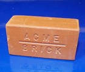
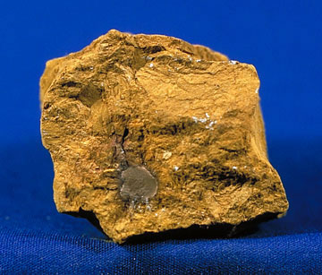
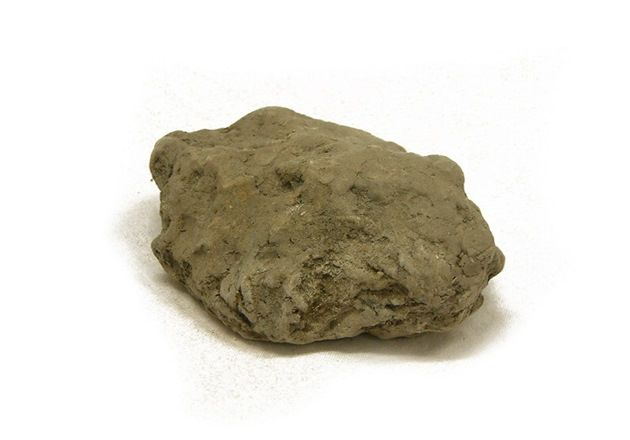
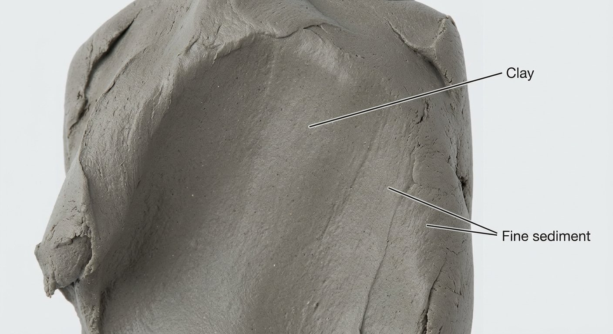
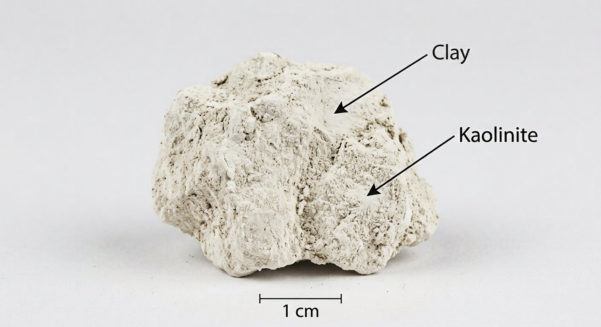

# Clay (Brick & Pottery)

> **Group:** Industrial / non-metallic · **Minerals:** mixed clay minerals (kaolinite, illite, smectite)
> **Quick ID:** **Plastic and sticky when wet**; shrinks and hardens when **fired**; grey/yellow to red/brown (iron content); earthy texture.

## At a glance

| Property | Value |
|---|---|
| Colour | Grey/yellow to red/brown (iron content) |
| Texture | Earthy; plastic and sticky when wet |
| Plasticity | Plastic when wet; shrinks & hardens when fired |
| Key test | Plastic when wet + shrinks when fired + earthy |

## What it is
Common **clay** — a mix of clay minerals (kaolinite, illite, smectite), silt, and sometimes iron oxides. Less pure than kaolin, but abundant and essential for bricks and pottery.

## Chemistry & mineralogy
A mixture of **clay minerals** — kaolinite, illite, smectite (montmorillonite) — plus silt (quartz), and sometimes iron oxides and organic matter. The clay minerals are hydrous aluminium phyllosilicates; the mix determines plasticity and firing behaviour.

## Crystal habit
**Earthy / massive** — clay minerals are microscopic; clay is identified by its bulk behaviour (plasticity, shrinkage on firing), not by visible crystals.

## Physical properties
- **Plasticity:** plastic and sticky when wet; shrinks and hardens when dried and **fired**.
- **Colour:** grey/yellow to red/brown (iron content).
- **Texture:** earthy; may smell "clayey" when damp.

## How to identify in the field
1. **Plasticity:** forms a plastic, sticky paste with water.
2. **Firing:** shrinks and hardens irreversibly when fired (brick-like).
3. **Colour:** grey/yellow to red-brown (iron-rich).
4. **Texture:** earthy, fine-grained.
5. **Context:** alluvial, residual, or marine sediments.

## Lookalikes & how to distinguish

| Looks like | How to tell it apart |
|---|---|
| **Kaolin** | Kaolin is white, fine, and soapy; common clay is coloured and less pure. |
| **Marl** | Marl **fizzes** (calcareous); pure clay does not. |
| **Silt / sand** | Silt and sand are gritty and not plastic; clay is smooth and plastic. |

## Occurrence

*Figure III.B.4 — Red brick clay (fired). Source: [eBay](https://www.ebay.com/shop/red-clay-bricks?_nkw=red+clay+bricks).*

*Figure III.B.4b — Clay (kaolinite-rich) lump. Source: [LibreTexts](https://geo.libretexts.org/Courses/Coalinga_College/GEOL_001:_Intro_to_Physical_Geology/03:_Minerals/3.05:_Identifying_Minerals).*

*Figure III.B.4c — Clay: grey-brown lump. Source: [MyLearning](https://www.mylearning.org/stories/investigating-rocks-and-fossils/types-of-sedimentary-rock).*

*Figure III.B.4d — Labeled illustration: gray plastic clay (fine sediment). Original diagram prepared for this guide.*

*Figure III.B.4e — Labeled illustration: white kaolinitic clay. Original diagram prepared for this guide.*

Widespread (see [Clay & Kaolin rock](../../02-rocks-of-nigeria/sedimentary/clay-kaolin.md)).

## Genesis
**Weathering and sedimentation** — clay forms by weathering of feldspar-rich rocks and accumulates in alluvial, residual, and marine settings. Iron staining (red clays) comes from oxidized iron.

## States / localities
Widespread — suitable clay underlies **most states**, supporting a huge brick, tile, and pottery industry nationwide.

## Associated minerals & host rocks
Kaolinite, illite, smectite, quartz silt, iron oxides, organic matter; hosted by **alluvial, residual, and marine sediments** (see [Kaolin](kaolin.md) — the purer form).

## Mining, uses & market
- **Bricks, tiles, blocks, and pottery** — the backbone of local construction.
- **Cement** raw material; **earthenware**.
- Abundant and low-cost, but essential to the construction industry.

## Exploration notes
- Test **plasticity** and **firing behavior** (shrinkage, colour after firing).
- Red clays are iron-rich; paler clays are better for finer ceramics.
- Distinguished from **kaolin** by colour (usually not white) and higher impurities.

## Field checklist
- [ ] Plastic and sticky when wet?
- [ ] Shrinks and hardens when fired?
- [ ] Earthy texture?
- [ ] Grey/yellow to red-brown?
- [ ] No acid fizz?

## Facts
- Clay is **plastic when wet** and hardens permanently when **fired**.
- Its colour (red, brown, yellow) comes from **iron** content.
- It is the backbone of the **brick, tile, and pottery** industry.
- Clay underlies **most Nigerian states** — abundant and accessible.

## Related
- [Kaolin](kaolin.md) · [Clay & Kaolin (rock)](../../02-rocks-of-nigeria/sedimentary/clay-kaolin.md) · [Marl](marl.md) · [Laterite & Ferricrete](../../02-rocks-of-nigeria/sedimentary/laterite-ferricrete.md)
