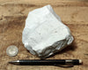

# Diatomite (Diatomaceous Earth)

> **Group:** Industrial / non-metallic · **Material:** silica from diatoms

## What it is
**Diatomite** — a soft, lightweight rock made of the fossilized silica shells of
**diatoms** (microscopic algae). Also called **diatomaceous earth**.

## Properties & how to recognize
- **Very light and porous** — feels chalky and floats readily.
- White to pale tan/cream; **absorbs water** like a sponge.
- Sooots the fingers (fine silica); very low density.

## Occurrence

*Figure III.B.11 — Diatomite: light, porous siliceous rock. Source: [Geological Specimen Supply](https://geologicalspecimensupply.com/products/diatomite-teaching-hand-specimen-of-lacustrine-diatomite).*

## Where in Nigeria (states)
Forms in **lakes and lagoons**; reported in the **Chad Basin (Borno)** and other
lacustrine settings.

## Uses
- **Filtration** (water, beer, swimming pools), **insulation**, and **absorbents**.
- Mild **abrasive** (polishes, toothpaste), **filler**, and **insecticide**.

## Exploration / notes
- Its **extreme lightness and chalky feel** are unmistakable.
- Assess **purity and porosity** for filtration uses.

## Related
- [Clay (brick/pottery)](clay.md) · [The Chad Basin](../../01-general-geology/01-04-sedimentary-basins.md)
