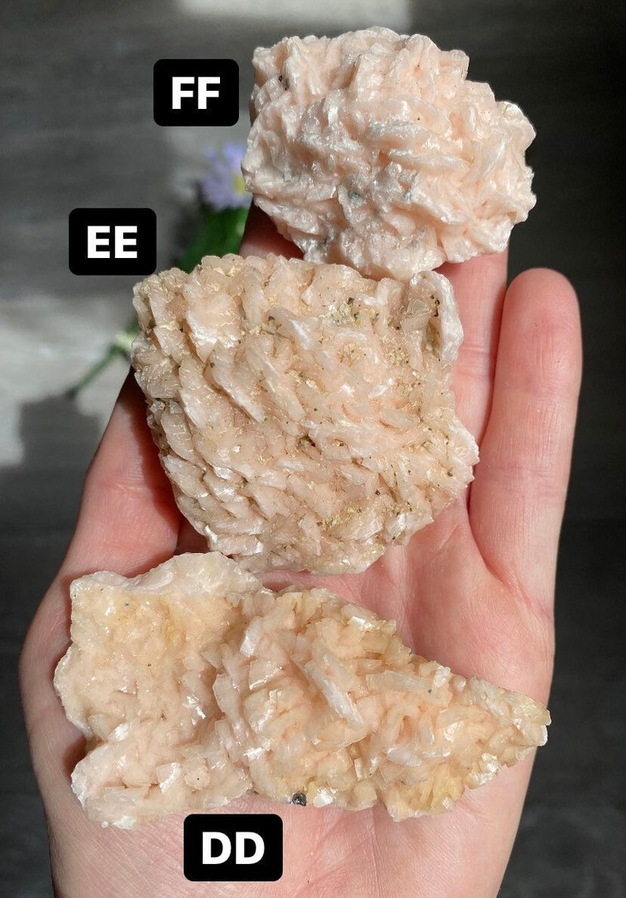
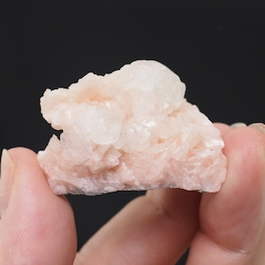
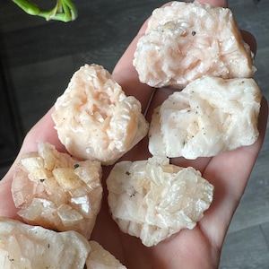
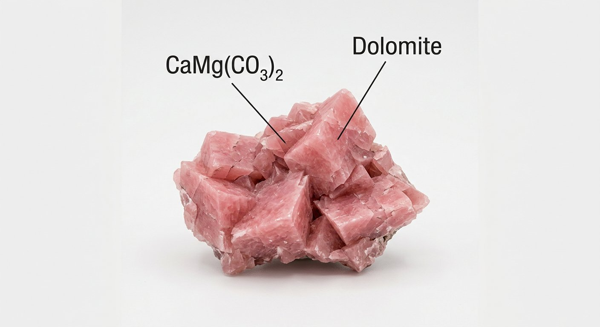
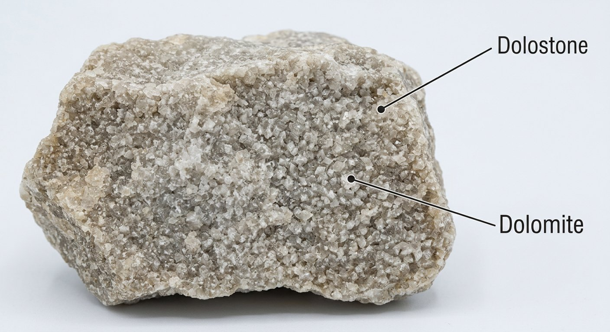

# Dolomite (CaMg(CO₃)₂)

> **Group:** Industrial / non-metallic (carbonate) · **Formula:** CaMg(CO₃)₂
> **Quick ID:** Rhombohedral crystals with **curved faces**, hardness 3½–4; **fizzes only weakly** in cold dilute HCl (vigorously only when powdered/warm) — the key test vs calcite.

## At a glance

| Property | Value |
|---|---|
| Colour | White, pink, or grey |
| Hardness | 3½–4 (harder than calcite) |
| Cleavage | Perfect **rhombohedral** (curved faces) |
| Lustre | Vitreous to pearly |
| Acid test | **Fizzes only weakly** in cold HCl |
| Key test | Weak cold fizz + curved rhombs |

## Chemistry & mineralogy
**Calcium magnesium carbonate, CaMg(CO₃)₂** — closely related to calcite but with magnesium. The rock form is **dolostone** (dolomitic limestone). Dolomite is a source of both calcium and magnesium.

## Crystal habit
**Rhombohedral** crystals (typically with **curved faces** — a giveaway), or massive beds. The curved (saddle-shaped) rhombs are distinctive.

## Physical properties
- **Hardness:** 3½–4 (harder than calcite).
- **Cleavage:** perfect rhombohedral.
- **Lustre:** vitreous to pearly; white, pink, or grey.
- **Signature:** **fizzes only weakly** in cold dilute HCl (vigorously only when powdered or in warm acid) — the key test separating it from calcite.

## How to identify in the field
1. **Acid:** fizzes only **weakly** in cold dilute HCl (calcite fizzes vigorously).
2. **Cleavage:** perfect **rhombohedral** with **curved** faces.
3. **Hardness:** 3½–4 (slightly harder than calcite).
4. **Lustre:** vitreous to pearly; white, pink, or grey.
5. **Context:** dolomitic limestone/marble beds.

## Lookalikes & how to distinguish

| Looks like | How to tell it apart |
|---|---|
| **Calcite** | Calcite fizzes **vigorously** in cold acid with flat rhombs; dolomite fizzes weakly with curved rhombs. |
| **Magnesite** | Magnesite fizzes only in hot acid and is heavier; dolomite fizzes weakly in cold acid. |
| **Limestone** | Limestone fizzes vigorously; dolomite (dolostone) fizzes weakly. |

## Occurrence

**Pure / hand specimen**

*Figure III.B.26 — Pink dolomite crystals. Source: [Etsy](https://www.etsy.com/listing/1195453685/pink-dolomite-raw-crystal-natural).*

**In rock / ore**

*Figure III.B.27 — Dolomitic limestone (dolostone). Source: see [Limestone](limestone.md).*

*Figure III.B.27b — Dolomite (with calcite) crystal. Source: [Etsy](https://etsy.com/ca-fr/market/dolomite_crystal).*

*Figure III.B.27c — Pink dolomite crystal. Source: [Etsy](https://www.etsy.com/market/dolomite_crystal).*

*Figure III.B.27d — Labeled illustration: dolomite rhombohedral crystals. Original diagram prepared for this guide.*

*Figure III.B.27e — Labeled illustration: dolomite rock (sugary texture). Original diagram prepared for this guide.*

## Genesis
Mainly by **dolomitization** of limestone (Mg-rich fluids replacing calcite), plus hydrothermal and evaporite-associated origins. Dolomitization often improves porosity, making dolostone an important reservoir rock.

## States / localities
**Kogi, Oyo, Niger, FCT** — dolomitic limestone beds and marble-hosted dolomite.

## Associated minerals & host rocks
Calcite, quartz, talc, serpentine; hosted by **dolomitic limestone and marble** (see [Marble](marble.md), [Limestone](limestone.md)).

## Mining, uses & market
- **Uses:** cement, **refractories** (dead-burned dolomite), glass/ceramics, **agricultural Mg** supplement, metallurgical flux, ornamental stone.
- **Market:** refractory-grade and agricultural dolomite are most valuable.

## Exploration notes
- Distinguish from calcite by the **weak cold-acid fizz** and curved rhombs.
- Assay **MgO / CaO** ratio; assess bed thickness and purity.
- Associated with [Limestone](limestone.md), [Marble](marble.md), and [Calcite](calcite.md).

## Field checklist
- [ ] Fizzes only weakly in cold acid?
- [ ] Rhombohedral cleavage with curved faces?
- [ ] Hardness 3½–4?
- [ ] White/pink/grey, vitreous-pearly?
- [ ] Dolomitic limestone / marble setting?

## Facts
- Dolomite **fizzes weakly** in cold acid — the key test vs vigorously-fizzing calcite.
- Its rhombohedral crystals often have **curved (saddle) faces**.
- It supplies **magnesium** for agriculture and refractories.
- **Dolomitization** of limestone often creates valuable reservoir porosity.

## Related
- [Calcite](calcite.md) · [Limestone](limestone.md) · [Marble](marble.md) · [Hand-specimen tests](../../05-field-identification/05-02-hand-specimen-tests.md)
