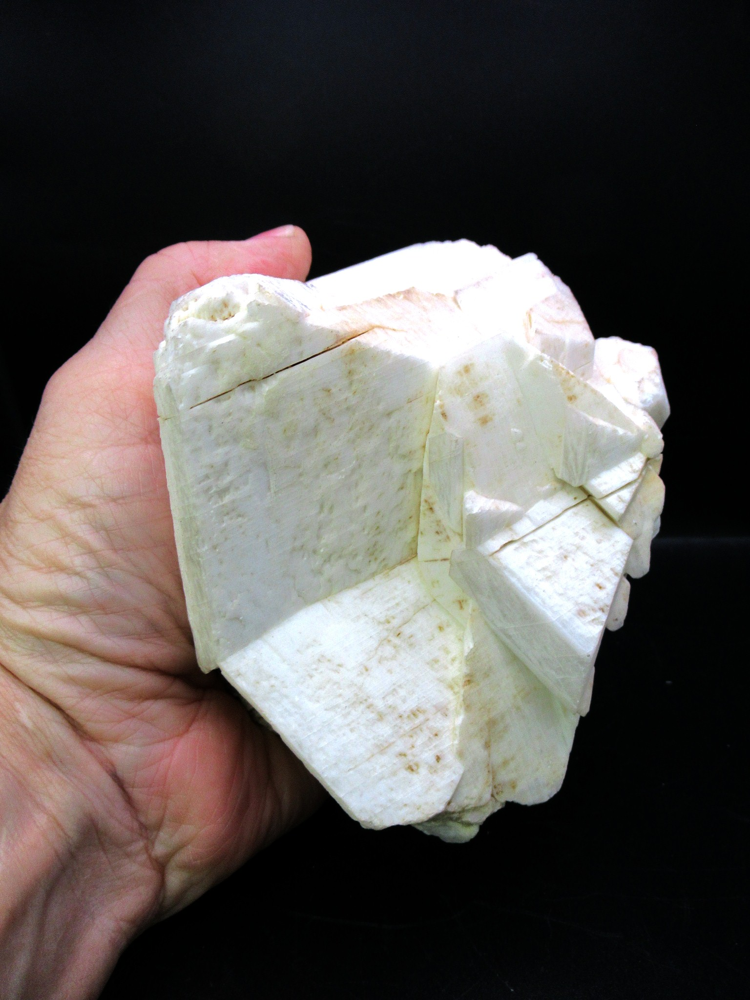

# Feldspar

> **Group:** Industrial / non-metallic · **Minerals:** K-feldspar (orthoclase/microcline) & plagioclase (Na–Ca)
> **Quick ID:** Hardness 6 (scratches glass), **two cleavages at ~90°** (right angles), white/pink/grey, vitreous; weathers to clay (kaolin).

## At a glance

| Property | Value |
|---|---|
| Colour | White, pink, or grey |
| Hardness | 6 (scratches glass) |
| Cleavage | **Two cleavages at ~90°** (diagnostic) |
| Lustre | Vitreous; often porcelain-like |
| Key test | Two right-angle cleavages + hardness 6 |

## What it is
The **feldspar group** — the most abundant minerals in Earth's crust. Main types: **orthoclase/microcline** (K-feldspar) and **plagioclase** (Na–Ca feldspar). A major constituent of **granites and pegmatites**.

## Chemistry & mineralogy
**Feldspars** are **tectosilicate** (framework) aluminosilicates:
- **K-feldspar** (orthoclase, microcline) — KAlSi₃O₈.
- **Plagioclase** — a NaAlSi₃O₈ (albite) to CaAl₂Si₂O₈ (anorthite) series.

Feldspars make up ~60% of the Earth's crust — they are the most abundant mineral group.

## Crystal habit
**Prismatic to tabular** crystals (in pegmatites, can be large), or **anhedral** (shapeless) grains in granite. Plagioclase often shows fine parallel **striations** on cleavage faces (twinning).

## Physical properties
- **Hardness 6** (scratches glass).
- **Two cleavages at ~90°** (right angles) — a diagnostic feature.
- White, pink, or grey; vitreous; often with a **porcelain-like** lustre.
- Weathers to **clay (kaolin)** — a useful field clue.

## How to identify in the field
1. **Cleavage:** **two cleavages at right angles** (~90°) — the giveaway (quartz has none).
2. **Hardness:** 6 (scratches glass).
3. **Colour:** white, pink (K-feldspar), or grey (plagioclase).
4. **Lustre:** vitreous to porcelain-like.
5. **Context:** in granite/pegmatite; weathered to clay.

## Lookalikes & how to distinguish

| Looks like | How to tell it apart |
|---|---|
| **Quartz** | Quartz has **no cleavage** and is harder (7); feldspar has two right-angle cleavages. |
| **Calcite** | Calcite **fizzes** with acid and has 3 cleavages; feldspar does not fizz and has 2 cleavages. |
| **Plagioclase vs K-feldspar** | Plagioclase is grey with fine striations; K-feldspar is often pink. |

## Occurrence

*Figure III.B.5 — Feldspar (orthoclase) crystal. Source: [Prehistoric Fossils](https://prehistoricfossils.com/product/feldspar-or-orthoclase-natural-mineral-from-brazil-1/).*

A major constituent of granites and pegmatites (see [Granite (dimension)](granite.md), [Pegmatite](../../02-rocks-of-nigeria/igneous/pegmatite.md)).

## Genesis
Feldspars crystallize from **igneous (granite/pegmatite)** and **metamorphic** rocks. They are the first major minerals to crystallize from magma and dominate the crust. Weathering alters them to clay minerals.

## States / localities
Recovered from **granites and pegmatites** across the Basement and Younger Granites: **Plateau, Kaduna, Oyo, Kwara, Kogi, Nasarawa, Ondo**, and elsewhere.

## Associated minerals & host rocks
Quartz, mica, amphibole, pyroxene; hosted by **granite and pegmatite** (see [Kaolin](kaolin.md) — the weathered product).

## Mining, uses & market
- **GLASS** and **CERAMICS** (glazes, bodies) — the main uses.
- **Filler** in paint, rubber, plastics; **abrasives**.
- Common as a **by-product** of granite/pegmatite quarrying.

## Exploration notes
- Separate feldspar from **quartz** (no cleavage) by its **two right-angle cleavages**.
- Common as a **by-product** of granite/pegmatite quarrying.
- Weathered (kaolinized) feldspar marks good **kaolin** potential.

## Field checklist
- [ ] Two cleavages at ~90°?
- [ ] Hardness 6 (scratches glass)?
- [ ] White/pink/grey, vitreous?
- [ ] In granite/pegmatite?
- [ ] Weathering to clay?

## Facts
- Feldspars are the **most abundant minerals** in Earth's crust (~60%).
- The **two right-angle cleavages** are the diagnostic field test.
- Feldspar is essential for **glass and ceramics**.
- Weathered feldspar becomes **kaolin** (china clay).

## Related
- [Granite (dimension)](granite.md) · [Kaolin](kaolin.md) · [Pegmatite](../../02-rocks-of-nigeria/igneous/pegmatite.md) · [Mica](mica.md)
