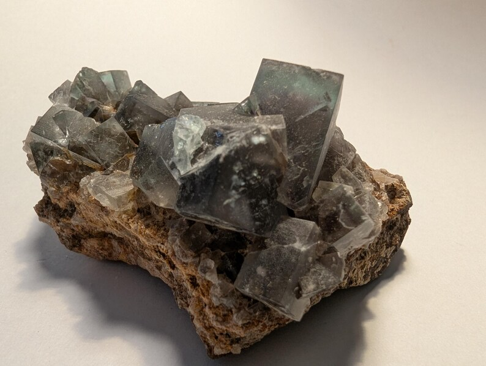
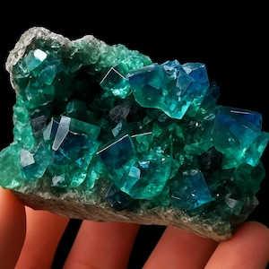
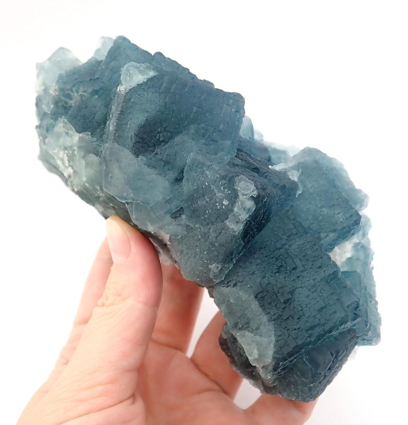
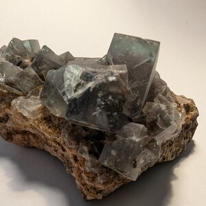

# Fluorite (Fluorspar)

> **Group:** Industrial / non-metallic (halide) · **Formula:** CaF₂
> **Quick ID:** Hardness 4, **perfect octahedral cleavage**, cubic crystals; **purple, green, blue, or yellow**; many **fluoresce** under UV light (hence "fluorite").

## At a glance

| Property | Value |
|---|---|
| Colour | Purple, green, blue, yellow, colourless |
| Hardness | 4 (scratched by a knife) |
| Cleavage | **Perfect octahedral** |
| Lustre | Vitreous |
| Signature | Many **fluoresce** under UV light |
| Key test | Hardness 4 + perfect cleavage + UV fluorescence |

## Chemistry & mineralogy
**Calcium fluoride, CaF₂.** A halide mineral used chiefly as a metallurgical flux. Fluorite is the main ore of **fluorine** and the source of hydrofluoric acid.

## Crystal habit
Cubic and octahedral crystals, cleavable masses, and banded aggregates; often well-formed cubes. Cubic purple/green crystals are classic and collectable.

## Physical properties
- **Hardness:** 4 — **cleaves perfectly** (octahedral cleavage); can be scratched by a knife.
- **Lustre:** vitreous; colours range from **purple, green, blue, yellow** to colourless.
- **Signature:** many specimens **fluoresce** under ultraviolet light (hence "fluorite").
- **Heft:** moderate; no acid reaction.

## How to identify in the field
1. **Hardness:** 4 — scratched by a knife (softer than quartz).
2. **Cleavage:** perfect **octahedral** (breaks into octahedra).
3. **Colour:** purple, green, blue, or yellow (often banded).
4. **Fluorescence:** glows under UV light (a UV lamp confirms it).
5. **Context:** hydrothermal veins in limestone.

## Lookalikes & how to distinguish

| Looks like | How to tell it apart |
|---|---|
| **Calcite** | Calcite **fizzes** with acid; fluorite does not. |
| **Apatite** | Apatite is harder (5) and less perfectly cleaving; fluorite is softer (4). |
| **Quartz** | Quartz is much harder (7) with no cleavage; fluorite is soft (4) and cleaves perfectly. |

## Occurrence

**Pure / hand specimen**

*Figure III.B.14 — Fluorite crystal cluster (Weardale, UK). Source: [Etsy](https://www.etsy.com/listing/1037386893/fluorite-crystal-mineral-specimen).*

**In rock / ore**

*Figure III.B.15 — Fluorite crystals set in a grey matrix. Source: [Etsy](https://www.etsy.com/uk/market/fluorite_specimen).*

*Figure III.B.15b — Fluorite crystal (Xia Yang Mine, China). Source: [Etsy](https://www.etsy.com/listing/879028005/fluorite-crystal-mineral-specimen-from).*

*Figure III.B.15c — Fluorite (Weardale, UK). Source: [Etsy](https://www.etsy.com/listing/1037386893/fluorite-crystal-mineral-specimen).*

## Genesis
**Low–medium-temperature hydrothermal veins**, typically in limestone/dolomite hosts; also a gangue mineral in some Pb–Zn and tin deposits. Fluorite is deposited from fluorine-rich hydrothermal fluids.

## States / localities
**Plateau, Taraba** — reported hydrothermal vein occurrences; Nigeria's fluorspar is minor and largely undeveloped.

## Associated minerals & host rocks
Galena, barite, cassiterite, calcite, quartz; hosted by **hydrothermal veins in limestone/dolomite** (see [Galena & Sphalerite](../metallic/galena-sphalerite.md), [Barite](../metallic/barite.md)).

## Mining, uses & market
- **Uses:** steel flux, **hydrofluoric acid (HF)**, ceramics & glass, optics, fluoridated toothpaste.
- **Market:** fluorspar (acid-grade & metallurgical-grade); a strategic industrial mineral.

## Exploration notes
- Look for **cubic purple/green crystals** in hydrothermal veins, often with galena, barite, or cassiterite (see [Galena & Sphalerite](../metallic/galena-sphalerite.md), [Barite](../metallic/barite.md)).
- Test hardness (4) + perfect cleavage; check UV fluorescence.
- Sample and assay CaF₂ (fluorine) content and grade.

## Field checklist
- [ ] Hardness 4 (scratched by a knife)?
- [ ] Perfect octahedral cleavage?
- [ ] Purple/green/blue/yellow?
- [ ] Fluoresces under UV?
- [ ] Hydrothermal vein in limestone?

## Facts
- Fluorite **fluoresces** under UV light — the mineral that gave fluorescence its name.
- It is **hardness 4** with perfect octahedral cleavage.
- It is used to make **hydrofluoric acid (HF)** and as a **steel flux**.
- Its vivid purple/green cubes are prized by mineral collectors.

## Related
- [Galena & Sphalerite](../metallic/galena-sphalerite.md) · [Barite](../metallic/barite.md) · [Cassiterite](../metallic/cassiterite.md) · [Hand-specimen tests](../../05-field-identification/05-02-hand-specimen-tests.md)
