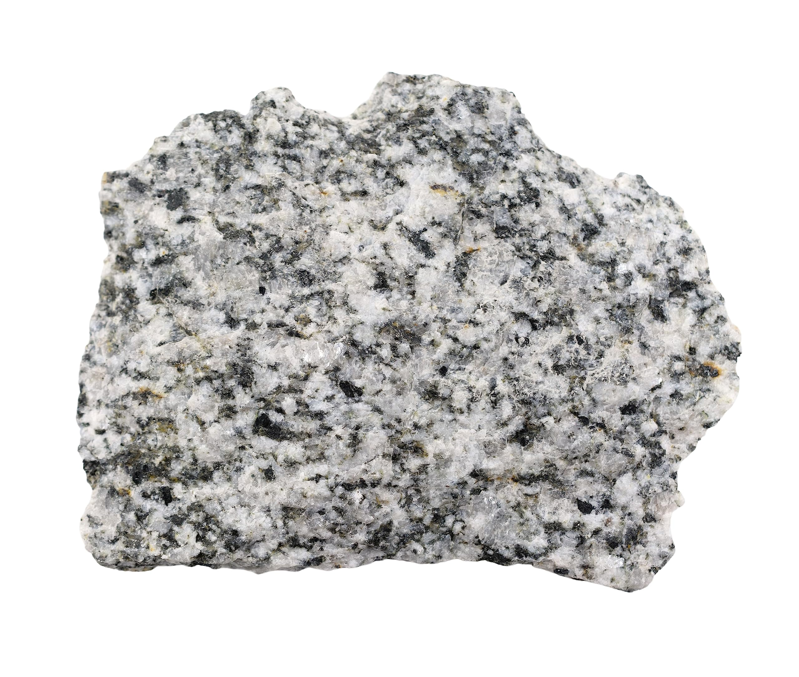
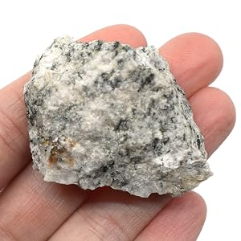
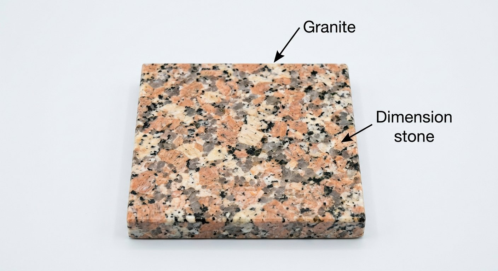
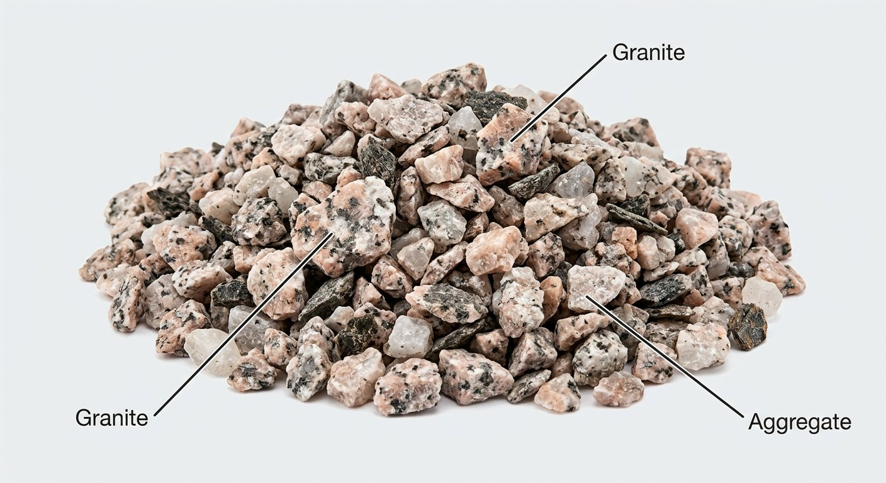

# Granite (Dimension & Ornamental Stone)

> **Group:** Industrial / non-metallic · **Material:** granite (igneous rock)
> **Quick ID:** Hard, durable, **massive** (no foliation — that would be gneiss); interlocking quartz (grey), feldspar (pink/white), mica (black); takes a high polish.

## At a glance

| Property | Value |
|---|---|
| Texture | Interlocking crystals; massive (no foliation) |
| Minerals | Quartz (grey), feldspar (pink/white), mica (black) |
| Hardness | Hard and durable; resists weathering |
| Finish | Takes a high polish |
| Key test | Massive + interlocking crystals + polish |

## What it is
**Granite** used as **dimension/ornamental stone** — one of Nigeria's biggest quarrying industries. Hard, durable, and attractive, it is cut into blocks, tiles, and slabs.

## Chemistry & mineralogy
**Granite** — a coarse-grained **igneous (plutonic)** rock of **quartz** (SiO₂), **feldspar** (K-feldspar and plagioclase), and **mica** (biotite/muscovite). Its interlocking crystal texture makes it hard, strong, and polishable.

## Crystal habit
**Interlocking** crystals (phaneritic texture) — quartz, feldspar, and mica grains interlock with no alignment. The lack of foliation distinguishes granite from gneiss.

## Physical properties
- **Hard, durable, massive** (no foliation/banding — that would be gneiss).
- Interlocking crystals of quartz (grey), feldspar (pink/white), and mica (black).
- Takes a high **polish**; resists weathering.

## How to identify in the field
1. **Texture:** interlocking crystals of quartz, feldspar, mica.
2. **Massiveness:** no foliation/banding (that would be gneiss).
3. **Hardness:** hard and durable; resists weathering.
4. **Polish:** takes a high polish.
5. **Context:** plutonic igneous bodies.

## Lookalikes & how to distinguish

| Looks like | How to tell it apart |
|---|---|
| **Gneiss** | Gneiss is **banded/foliated**; granite is massive and unbanded. |
| **Charnockite** | Charnockite contains **hypersthene** (a greenish pyroxene); granite does not. |
| **Syenite** | Syenite has little/no quartz; granite has abundant quartz. |

## Occurrence

*Figure III.B.8 — Granite: durable ornamental/dimension stone. Source: [Amazon EISCO](https://www.amazon.com/Pink-Granite-Igneous-Rock-Specimen/dp/B083TJ9694).*

*Figure III.B.8b — Porphyritic granite hand sample. Source: [Amazon](https://www.amazon.com/Pink-Granite-Igneous-Rock-Specimen/dp/B083TJ9694).*

*Figure III.B.8c — Granite hand specimen. Source: [Amazon](https://www.amazon.com/Pink-Granite-Igneous-Rock-Specimen/dp/B083TJ9694).*

*Figure III.B.8d — Labeled illustration: polished granite dimension stone. Original diagram prepared for this guide.*

*Figure III.B.8e — Labeled illustration: crushed granite aggregate. Original diagram prepared for this guide.*

Quarried from granite plutons (see [Granite rock](../../02-rocks-of-nigeria/igneous/granite.md)).

## Genesis
**Plutonic igneous** — granite crystallizes slowly underground from magma, forming large, interlocking crystals. Granite batholiths and plutons are the dimension-stone source.

## States / localities
Quarried nationwide: **FCT (Abuja), Ogun, Oyo, Ondo, Ekiti, Osun, Kwara, Plateau, Kaduna, Kano**, and more. FCT/Abuja is a major quarrying hub.

## Associated minerals & host rocks
Quartz, feldspar, mica, pegmatite; hosted by **granite plutons/batholiths** (see [Feldspar](feldspar.md), [Mica](mica.md)).

## Mining, uses & market
- **Dimension & ornamental stone** — tiles, countertops, monuments, cladding.
- **Construction aggregate**, road metal, and **kerbstones**.
- One of Nigeria's biggest quarrying industries.

## Exploration notes
- Assess **colour, grain size, uniformity, and durability** (these set the price).
- Distinguish from **gneiss** (banded) and **charnockite** (contains hypersthene).
- Seek massive, unfractured bodies with good block yield.

## Field checklist
- [ ] Interlocking quartz + feldspar + mica?
- [ ] Massive, no foliation?
- [ ] Hard, durable?
- [ ] Takes a polish?
- [ ] Plutonic igneous body?

## Facts
- Granite is **massive** (no banding) — that would make it gneiss.
- **FCT/Abuja** is a major Nigerian granite-quarrying hub.
- It takes a high **polish** — prized for countertops and monuments.
- Granite's interlocking quartz, feldspar, and mica make it hard and durable.

## Related
- [Granite (rock)](../../02-rocks-of-nigeria/igneous/granite.md) · [Marble](marble.md) · [Charnockite](../../02-rocks-of-nigeria/igneous/charnockite.md) · [Dimension stone](dimension-stone.md)
