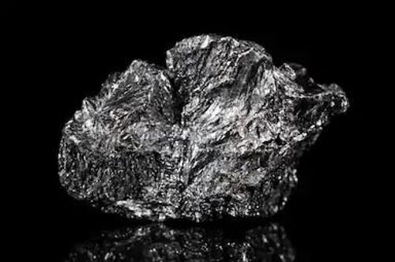
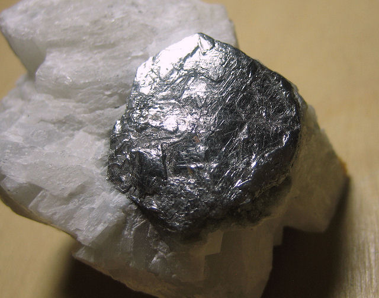

# Graphite (Carbon)

## Chemistry & mineralogy
**Carbon (C)**, hexagonal — a native element mineral. The stable high-grade form of
carbon (vs diamond). Fixed-carbon content defines grade.

## Crystal habit
**Foliated / scaly** (flake graphite), massive, or earthy (amorphous graphite).

## Physical properties & how to test
- **Hardness:** very soft (1–2); **greasy** to the touch.
- **Lustre:** metallic to earthy; grey-black.
- **Signature:** **stains paper and fingers grey/black** (this is why it's "lead" in pencils).
- **Conducts electricity** (unusual for a non-metal).

## Occurrence
**Pure / hand specimen**

*Figure III.B.16 — Graphite with metallic lustre. Source: [InfoSeekersHub](https://infoseekershub.com/minerals-with-metallic-luster).*

**In rock / ore**

*Figure III.B.17 — Dark grey graphite on quartz. Source: [Cochise College geology](https://geology.cochise.edu/mineral-type/graphite/).*

## Genesis
Metamorphism of **carbonaceous sediments** (graphite schist/gneiss), hydrothermal
deposits, and rarely igneous sources. Often concentrated in schist belts.

## States / localities
**Kaduna, Niger, Plateau, Kogi** — reported in carbonaceous metasediments; a
**battery-graphite** interest area (emerging).

## Mining, uses & market
- **Uses:** **Li-ion batteries** (fast-growing), pencils, lubricants, refractories,
  electrodes, brake linings.
- **Market:** flake graphite commands a premium; demand surging with EVs.

## Exploration notes
- Target **graphite schist/gneiss** and carbonaceous metasediments in the schist belts
  (see [Mica schist & Phyllite](../../02-rocks-of-nigeria/metamorphic/mica-schist-phyllite.md)).
- Confirm by softness, greasy feel, and grey streak; **assay fixed carbon** for grade.
- Distinguish from **molybdenite** (bluish) and **mica** (elastic sheets).

## Related
- [Mica schist & Phyllite](../../02-rocks-of-nigeria/metamorphic/mica-schist-phyllite.md) · [Mica](../industrial/mica.md) · [Metamorphic rocks](../../02-rocks-of-nigeria/README.md) · [State-by-state table](../../04-geological-provinces/04-09-state-by-state-table.md)
