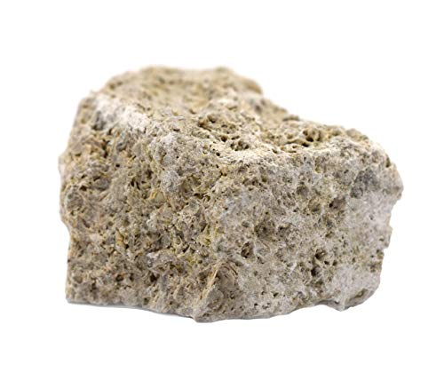
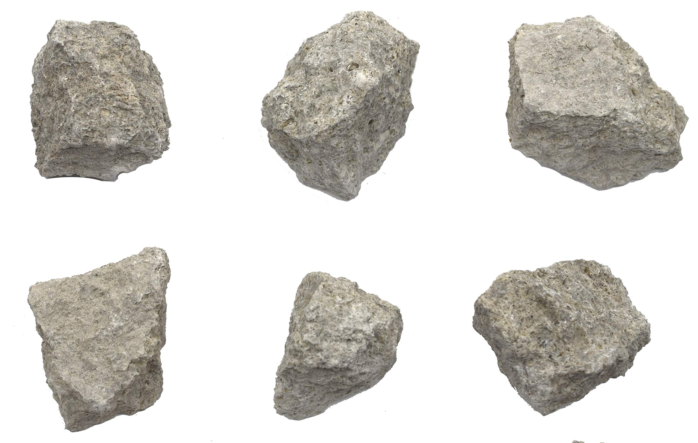
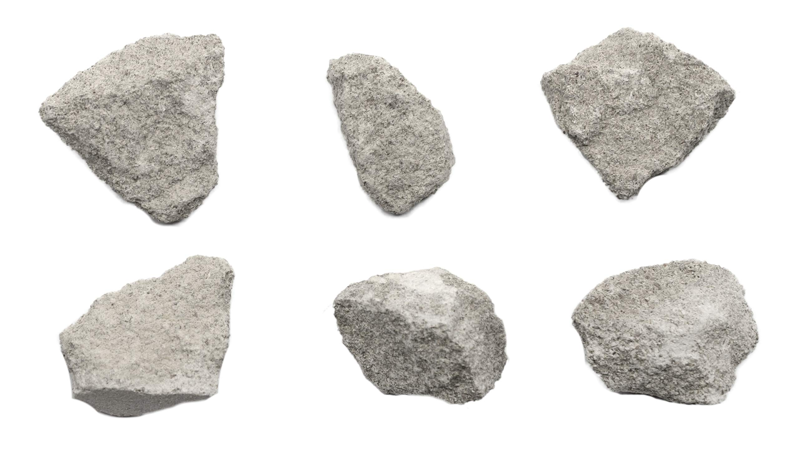
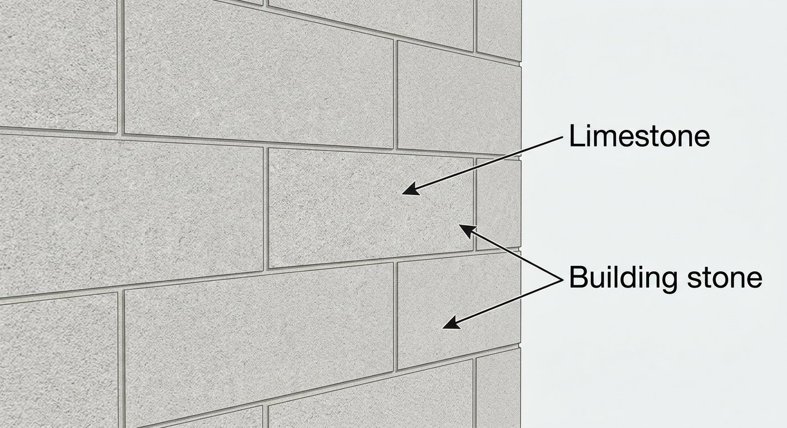
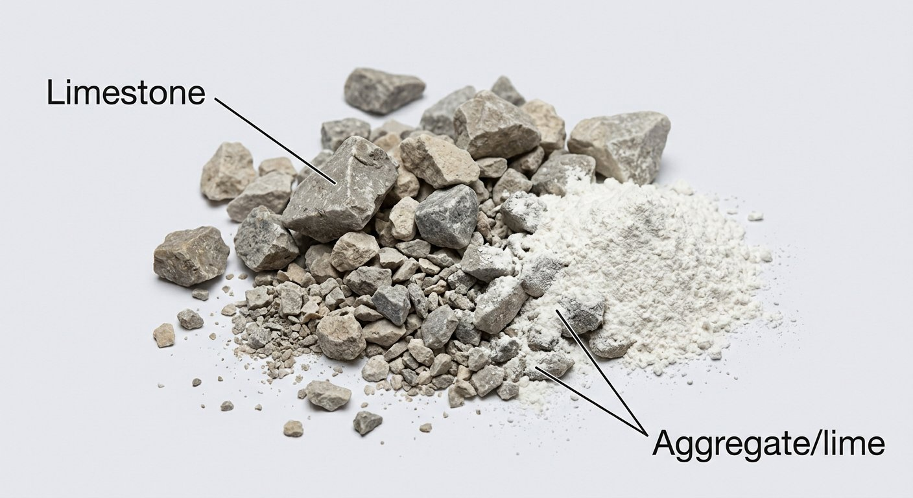

# Limestone (Cement)

> **Group:** Industrial / non-metallic · **Material:** calcite (CaCO₃)
> **Quick ID:** **Fizzes vigorously** with dilute HCl; soft (~3), light grey/white; often full of **fossils** (shells, corals).

## At a glance

| Property | Value |
|---|---|
| Colour | Light grey to white |
| Acid test | **Fizzes vigorously** with dilute HCl |
| Hardness | ~3 (scratched by a steel knife) |
| Fossils | Often fossiliferous (shells, corals) |
| Texture | Crystalline to granular/fossiliferous |
| Key test | Vigorous fizz + soft + fossils |

## What it is
A **sedimentary rock** of **calcite** (calcium carbonate), formed from shells, corals, and chemical precipitates. Nigeria's most important industrial rock — the basis of the cement industry.

## Chemistry & mineralogy
**Calcite** — CaCO₃ (calcium carbonate). Limestone is mostly calcite, sometimes with **dolomite**, chert, clay, and sand impurities. **Marble** is metamorphosed limestone. Purity (CaO content) determines cement-grade quality.

## Crystal habit
Limestone is a **rock** — massive, bedded, granular, or fossiliferous. The **calcite** mineral within it forms rhombohedral crystals, veins, and fossil shells.

## Physical properties
- **Fizzes vigorously** with dilute hydrochloric acid (the key test).
- **Soft** — scratched by a steel knife (hardness ~3).
- Usually **light grey/white**; may contain **fossils** (shells, corals).

## How to identify in the field
1. **Acid:** fizzes **vigorously** with dilute HCl (the defining test).
2. **Hardness:** soft (~3) — scratched by a knife.
3. **Colour:** light grey/white.
4. **Fossils:** often contains shells, corals, or other fossils.
5. **Context:** thick sedimentary beds.

## Lookalikes & how to distinguish

| Looks like | How to tell it apart |
|---|---|
| **Dolomite** | Dolomite fizzes only **weakly** in cold acid; limestone fizzes vigorously. |
| **Marl** | Marl fizzes only partially and is muddy; limestone fizzes throughout. |
| **Gypsum** | Gypsum does **not** fizz; limestone fizzes vigorously. |

## Occurrence

*Figure III.B.1 — Fossiliferous limestone (the cement raw material). Source: [Amazon](https://www.amazon.com/Fossiliferous-Limestone-Sedimentary-Rock-Specimen/dp/B083TCRF28).*

*Figure III.B.1b — Fossiliferous limestone specimen. Source: [Amazon](https://www.amazon.com/Eisco-Limestone-Specimen-Sedimentary-Approx/dp/B01K2WI6JM).*

*Figure III.B.1c — Oolitic limestone specimen. Source: [Amazon](https://www.amazon.com/Eisco-Limestone-Specimen-Sedimentary-Approx/dp/B01K2WI6JM).*

*Figure III.B.1d — Labeled illustration: limestone building blocks. Original diagram prepared for this guide.*

*Figure III.B.1e — Labeled illustration: crushed limestone aggregate/lime. Original diagram prepared for this guide.*

Found in sedimentary basins (see [Limestone rock](../../02-rocks-of-nigeria/sedimentary/limestone.md)).

## Genesis
**Biogenic and chemical sedimentary** — formed from shells, corals, and chemical precipitates in shallow seas and lakes. Limestone accumulates in warm, shallow marine environments and in sedimentary basins.

## States / localities
Major cement-grade deposits: **Ewekoro & Shagamu (Ogun), Nkalagu (Enugu), Gboko (Benue), Igalamela (Kogi), Calabar (Cross River), Sokoto, Maiduguri (Borno)**. Numerous cement plants (e.g. Dangote, Lafarge, BUA) are built on these.

## Associated minerals & host rocks
Calcite, dolomite, chert, clay, fossils; associated with **lead–zinc** mineralization (see [Galena & Sphalerite](../metallic/galena-sphalerite.md)) and hosted in sedimentary basins (see [The Benue Trough](../../01-general-geology/01-04-sedimentary-basins.md)).

## Mining, uses & market
- **CEMENT** — the dominant use; foundation of the construction industry.
- **Lime**, **flux** (steelmaking), **aggregate**, **building stone**.
- Nigeria's most important industrial rock — the backbone of construction.

## Exploration notes
- Confirm with the **acid-fizz test**; assess **purity (CaO content)** and **thickness** for cement.
- Often associated with **lead–zinc** mineralization (see [Galena & Sphalerite](../metallic/galena-sphalerite.md)).
- Higher CaO and lower impurities (Mg, silica, iron) = better cement grade.

## Field checklist
- [ ] Fizzes vigorously with acid?
- [ ] Soft (~3)?
- [ ] Light grey/white?
- [ ] Fossils present?
- [ ] Thick sedimentary bed?

## Facts
- Limestone **fizzes vigorously** with acid — the defining field test.
- It is Nigeria's **most important industrial rock** (the cement raw material).
- Major deposits feed cement plants at **Ewekoro, Nkalagu, Gboko** and more.
- Many limestones are full of **fossils** (shells, corals).

## Related
- [Limestone (rock)](../../02-rocks-of-nigeria/sedimentary/limestone.md) · [Marble](marble.md) (metamorphosed equivalent) · [Calcite](calcite.md) · [Dolomite](dolomite.md) · [Galena & Sphalerite](../metallic/galena-sphalerite.md)
