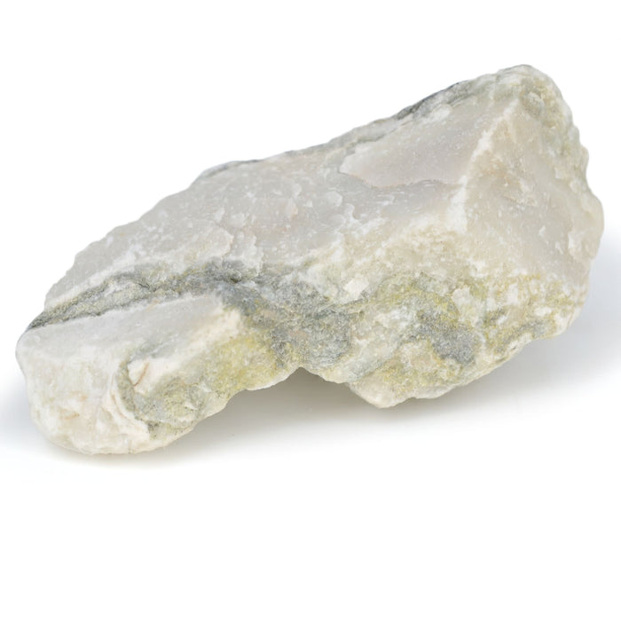

# Marble (Dimension & Ornamental Stone)

> **Group:** Industrial / non-metallic · **Material:** metamorphosed limestone/dolomite (calcite/dolomite)
> **Quick ID:** **Fizzes with acid** (still carbonate) but is **harder and coarser** than limestone; takes a **polish**; white to grey, pink, or green.

## At a glance

| Property | Value |
|---|---|
| Colour | White to grey, pink, or green (impurities) |
| Acid test | **Fizzes** with acid (carbonate) |
| Texture | Crystalline, interlocking; takes a polish |
| Hardness | Harder and coarser than limestone |
| Key test | Fizz + polishability + crystalline texture |

## What it is
**Marble** — metamorphosed **limestone** or dolomite, recrystallized into interlocking calcite/dolomite grains. Prized as an **ornamental and dimension stone**.

## Chemistry & mineralogy
**Marble** — metamorphosed **calcite (CaCO₃)** or **dolomite** (CaMg(CO₃)₂). Heat and pressure recrystallize limestone into interlocking calcite/dolomite grains, giving marble its crystalline, polishable texture.

## Crystal habit
**Crystalline, interlocking** texture — coarse, interlocking calcite/dolomite grains (no fossils, unlike limestone). Banding/veining from impurities adds ornamental value.

## Physical properties
- **Fizzes with acid** (it's still carbonate), but is **harder and coarser** than limestone.
- Takes a **polish**; white to grey, pink, or green (impurities).
- Crystalline, interlocking texture.

## How to identify in the field
1. **Acid:** fizzes (it's carbonate).
2. **Texture:** crystalline, interlocking, coarse (not fine/fossiliferous).
3. **Polish:** takes a high polish (limestone does not).
4. **Hardness:** harder than limestone.
5. **Context:** metamorphic (contact/regional) limestone.

## Lookalikes & how to distinguish

| Looks like | How to tell it apart |
|---|---|
| **Limestone** | Limestone is softer, finer, often fossiliferous, and does not polish; marble is coarse, hard, and polishable. |
| **Quartzite** | Quartzite does **not** fizz; marble fizzes. |
| **Dolomite** | Dolomite fizzes only weakly; marble (from limestone) fizzes vigorously. |

## Occurrence

*Figure III.B.7 — White marble: recrystallized calcite. Source: [eiscolabs.com](https://www.eiscolabs.com/products/esng0058).*

Found in metamorphosed limestone bodies (see [Marble rock](../../02-rocks-of-nigeria/metamorphic/marble-calc-silicate.md)).

## Genesis
**Metamorphism of limestone/dolomite** — heat and pressure recrystallize limestone into marble (contact or regional metamorphism). Marble forms at limestone contacts with igneous intrusions and in regional metamorphic belts.

## States / localities
Classic marbles: **Igbeti (Oyo), Jakura (Kogi), Mega/Mure (Kwara)**, plus limestone lenses in the Basement.

## Associated minerals & host rocks
Calcite, dolomite, quartz, tremolite; hosted by **metamorphosed limestone/dolomite** (see [Limestone](limestone.md), [Dolomite](dolomite.md)).

## Mining, uses & market
- **Dimension & ornamental stone** — tiles, slabs, sculpture, countertops.
- **Lime and cement**; **calcium carbonate** filler.
- Prized for its polish and veining.

## Exploration notes
- Confirm by **acid fizz + hardness/polishability** (vs. softer limestone).
- Assess **colour, banding, and purity** — these drive ornamental value.
- Classic Nigerian marbles: Igbeti, Jakura, Mega/Mure.

## Field checklist
- [ ] Fizzes with acid?
- [ ] Crystalline, interlocking, coarse?
- [ ] Takes a polish?
- [ ] Harder than limestone?
- [ ] Metamorphosed limestone setting?

## Facts
- Marble is **metamorphosed limestone** — recrystallized calcite.
- It still **fizzes** with acid (it's carbonate).
- It takes a high **polish** — prized for sculpture and countertops.
- Classic Nigerian marbles: **Igbeti (Oyo), Jakura (Kogi), Mega/Mure (Kwara)**.

## Related
- [Marble (rock)](../../02-rocks-of-nigeria/metamorphic/marble-calc-silicate.md) · [Limestone](limestone.md) · [Granite](granite.md) · [Calcite](calcite.md) · [Dimension stone](dimension-stone.md)
