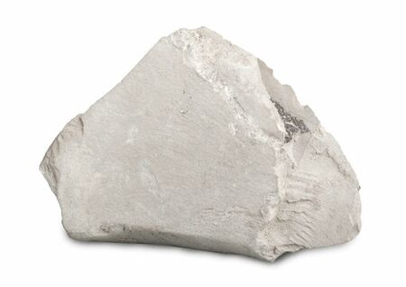

# Marl (Calcareous Mud)

## Chemistry & mineralogy
A **calcareous clay/mud** — a mix of clay minerals with roughly **35–65% calcium
carbonate (calcite)**; transitional between clay and limestone.

## Crystal habit
Massive, soft, blocky, and earthy.

## Physical properties & how to test
- **Hardness:** soft and earthy.
- **Colour:** grey, green, or buff.
- **Signature:** **fizzes** (from its calcite content) yet still behaves as a soft mud —
  intermediate between [Clay](clay.md) and [Limestone](limestone.md).

## Occurrence
**Hand specimen**

*Figure III.B.29 — Marl, a calcareous mudstone. Source: [wiki.terraindex.com](https://wiki.terraindex.com/bin/view/Environmental%20Surveys/Rock%20types/Sedimentary%20rocks/Marl/).*

*(Bulk material — a single representative image; pure ≈ in-rock.)*

## Genesis
Lacustrine and marine muds with admixed carbonate — a transitional clay–limestone
facies common in sedimentary basins.

## States / localities
**Sokoto, Borno** — and other basin settings with calcareous muds.

## Mining, uses & market
- **Uses:** **cement raw material** (blended with limestone), **soil amendment/lime**,
  water treatment.
- **Market:** valuable as a self-fluxing cement feedstock and agricultural lime.

## Exploration notes
- Assay **CaCO₃** content to grade for cement blending or agricultural use.
- Commonly interbedded with limestone and clay in the basins.
- Related to [Calcite](calcite.md), [Limestone](limestone.md), and [Clay](clay.md).

## Related
- [Calcite](calcite.md) · [Limestone](limestone.md) · [Clay](clay.md) · [State-by-state table](../../04-geological-provinces/04-09-state-by-state-table.md)
