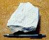
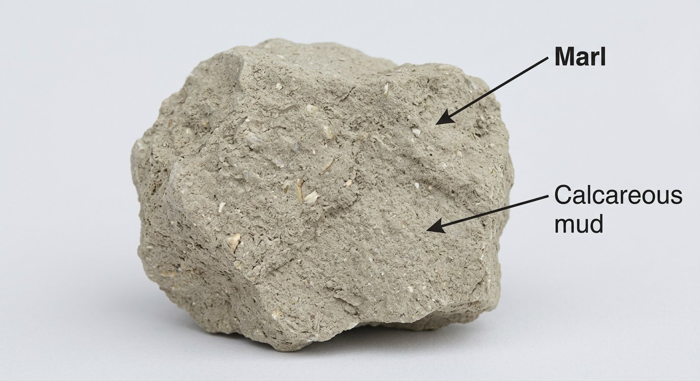
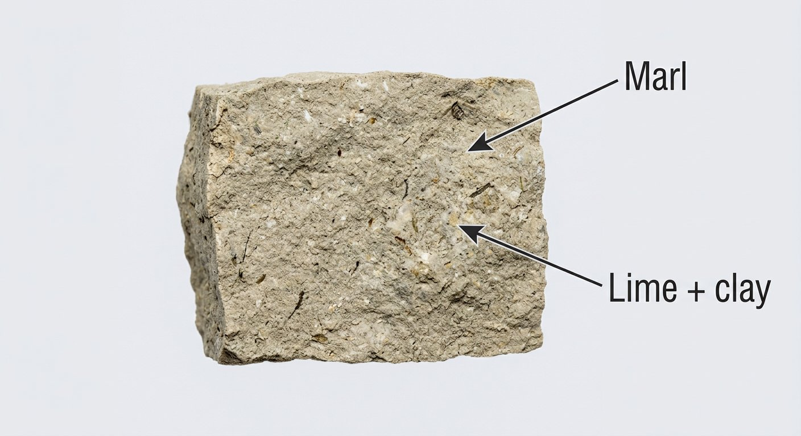

# Marl (Calcareous Mud)

> **Group:** Industrial / non-metallic · **Material:** calcareous clay/mud (35–65% CaCO₃)
> **Quick ID:** Soft, earthy, grey/green/buff; **fizzes** (partial calcite) yet behaves as a soft mud — intermediate between clay and limestone.

## At a glance

| Property | Value |
|---|---|
| Colour | Grey, green, or buff |
| Texture | Soft, blocky, earthy |
| Hardness | Soft and earthy |
| Acid test | **Fizzes** (partial CaCO₃ content) |
| CaCO₃ content | ~35–65% |
| Key test | Fizzes partially + soft mud (clay–limestone intermediate) |

## Chemistry & mineralogy
A **calcareous clay/mud** — a mix of clay minerals with roughly **35–65% calcium carbonate (calcite)**; transitional between clay and limestone. Its carbonate content gives it a partial acid fizz.

## Crystal habit
Massive, soft, blocky, and earthy — identified as a soft calcareous mud, not by crystals.

## Physical properties
- **Hardness:** soft and earthy.
- **Colour:** grey, green, or buff.
- **Signature:** **fizzes** (from its calcite content) yet still behaves as a soft mud — intermediate between [Clay](clay.md) and [Limestone](limestone.md).

## How to identify in the field
1. **Acid:** **fizzes partially** (calcite content) — but weaker than pure limestone.
2. **Texture:** soft, earthy, blocky — behaves as mud.
3. **Colour:** grey, green, or buff.
4. **Context:** lacustrine/marine basin sediments.
5. **Position:** transitional between clay and limestone beds.

## Lookalikes & how to distinguish

| Looks like | How to tell it apart |
|---|---|
| **Clay** | Pure clay does **not** fizz; marl fizzes (carbonate content). |
| **Limestone** | Limestone fizzes **vigorously** and is harder; marl fizzes weakly and is soft/muddy. |

## Occurrence

**Hand specimen**

*Figure III.B.29 — Marl, a calcareous mudstone. Source: [wiki.terraindex.com](https://wiki.terraindex.com/bin/view/Environmental%20Surveys/Rock%20types/Sedimentary%20rocks/Marl/).*

*Figure III.B.29b — Marl is a calcareous, lime-rich mudstone; shown: fine-grained mudstone. Source: [Geological Specimen Supply](https://geologicalspecimensupply.com/products/mudstone-teaching-hand-speccimen-of-diatomaceous-mudstone-from-the-sisquoc-formation-santa-barbara-county-calif).*

*Figure III.B.29c — Mudstone (marl's parent lithology). Source: [Geological Specimen Supply](https://geologicalspecimensupply.com/products/mudstone-teaching-hand-speccimen-of-diatomaceous-mudstone-from-the-sisquoc-formation-santa-barbara-county-calif).*

*Figure III.B.29d — Labeled illustration: marl calcareous mudstone. Original diagram prepared for this guide.*

*Figure III.B.29e — Labeled illustration: marl lime-rich mudstone. Original diagram prepared for this guide.*

*(Bulk material — a single representative image; pure ≈ in-rock.)*

## Genesis
Lacustrine and marine muds with admixed carbonate — a transitional clay–limestone facies common in sedimentary basins. Marl marks environments where mud and carbonate accumulate together.

## States / localities
**Sokoto, Borno** — and other basin settings with calcareous muds.

## Associated minerals & host rocks
Clay minerals, calcite, quartz; hosted by **lacustrine/marine basin sediments** (see [Limestone](limestone.md), [Clay](clay.md)).

## Mining, uses & market
- **Uses:** **cement raw material** (blended with limestone), **soil amendment/lime**, water treatment.
- **Market:** valuable as a self-fluxing cement feedstock and agricultural lime.

## Exploration notes
- Assay **CaCO₃** content to grade for cement blending or agricultural use.
- Commonly interbedded with limestone and clay in the basins.
- Related to [Calcite](calcite.md), [Limestone](limestone.md), and [Clay](clay.md).

## Field checklist
- [ ] Soft, earthy, blocky?
- [ ] Fizzes partially (carbonate content)?
- [ ] Grey/green/buff?
- [ ] Between clay and limestone beds?
- [ ] Basin (lacustrine/marine) setting?

## Facts
- Marl is **intermediate between clay and limestone** (35–65% CaCO₃).
- It **fizzes partially** with acid — weaker than pure limestone.
- It is a valuable **self-fluxing cement** feedstock.
- Marl marks **lacustrine/marine** mud-carbonate facies.

## Related
- [Calcite](calcite.md) · [Limestone](limestone.md) · [Clay](clay.md) · [State-by-state table](../../04-geological-provinces/04-09-state-by-state-table.md)
