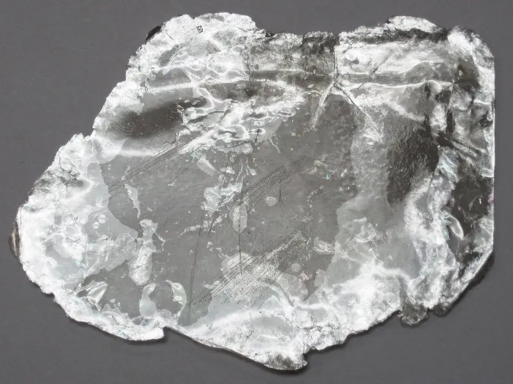
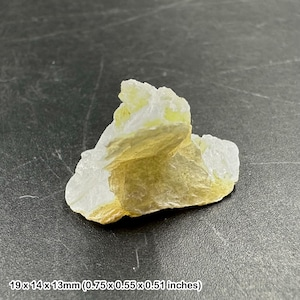
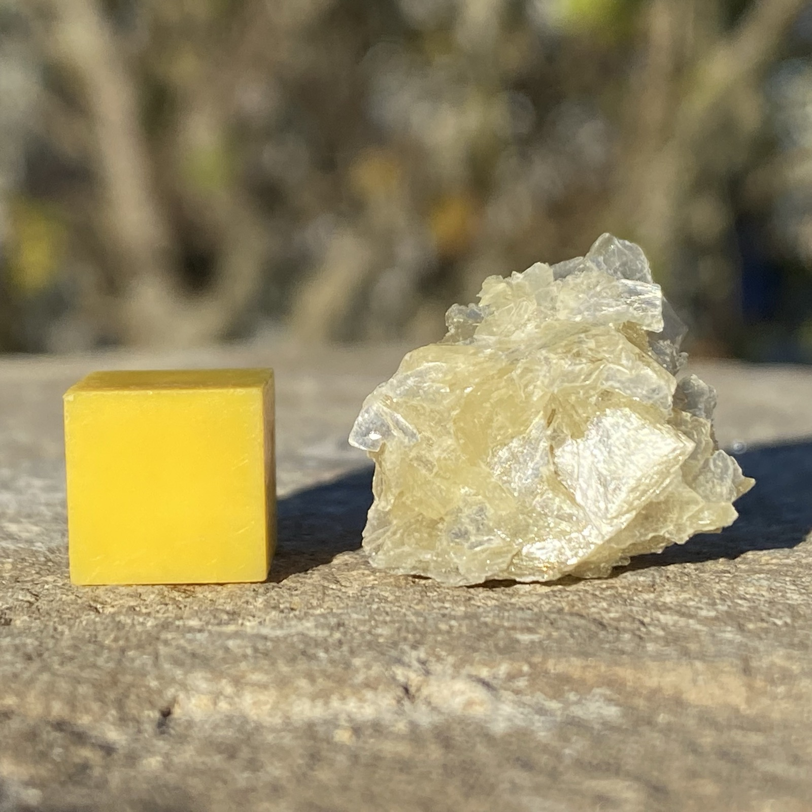
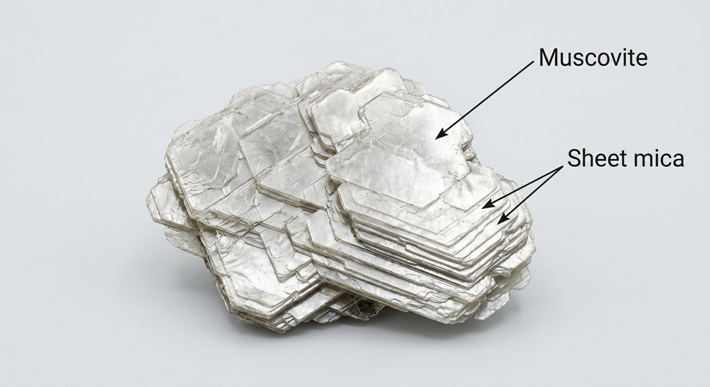
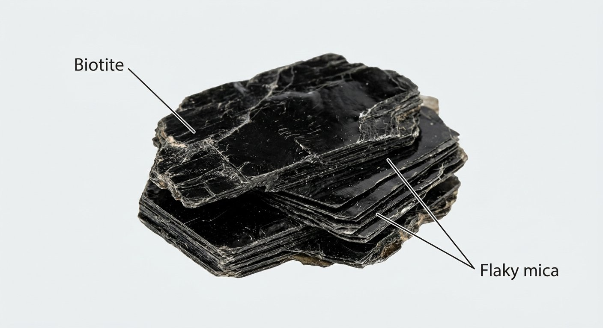

# Mica (Muscovite / Biotite / Lepidolite)

> **Group:** Industrial / non-metallic · **Minerals:** muscovite, biotite, lepidolite (phyllosilicates)
> **Quick ID:** Perfect basal cleavage — splits into thin, **elastic** sheets; soft (2–3), pearly; muscovite pale/silvery, biotite black.

## At a glance

| Property | Value |
|---|---|
| Colour | Muscovite pale/silvery; biotite black; lepidolite lilac |
| Hardness | 2–2½ (muscovite); 2½–3 (biotite) |
| Cleavage | **Perfect basal** (thin elastic sheets) |
| Lustre | Pearly to vitreous |
| Key test | Peels into thin **elastic** sheets |

## Chemistry & mineralogy
A group of **phyllosilicate** sheet minerals:
- **Muscovite** KAl₂(AlSi₃O₁₀)(OH)₂ — pale/silvery, transparent.
- **Biotite** K(Mg,Fe)₃(AlSi₃O₁₀)(OH)₂ — black.
- **Lepidolite** — lithium-bearing mica (see [Lithium](../metallic/lithium.md)).

All share a layered structure that gives them perfect cleavage into sheets.

## Crystal habit
**Platy / foliated** — forms "books" of stacked sheets with **perfect one-direction (basal) cleavage**. Mica books (stacked sheets) are the classic form.

## Physical properties
- **Hardness:** soft (2–2½ muscovite; 2½–3 biotite).
- **Cleavage:** perfect basal — splits into thin, **elastic** flexible sheets.
- **Lustre:** pearly to vitreous; muscovite is transparent/silvery, biotite black.
- Peeling sheets with a fingernail is the giveaway.

## How to identify in the field
1. **Cleavage:** peels into thin, **elastic** (springy) sheets with a fingernail.
2. **Colour:** pale/silvery (muscovite) or black (biotite).
3. **Hardness:** soft (2–3).
4. **Lustre:** pearly/vitreous.
5. **Context:** granite/pegmatite (muscovite) or schist (biotite/muscovite).

## Lookalikes & how to distinguish

| Looks like | How to tell it apart |
|---|---|
| **Talc** | Talc is softer (1) with **non-elastic** sheets; mica has **elastic** sheets. |
| **Graphite** | Graphite is greasy and stains fingers grey; mica does not stain. |
| **Chlorite** | Chlorite is green with non-elastic sheets; mica is elastic. |

## Occurrence

**Pure / hand specimen**

*Figure III.B.18 — Muscovite mica showing stacked, platy cleavage sheets. Source: [Geoscopy](https://geoscopy.com/rock/muscovite).*

**In rock / ore**

*Figure III.B.19 — Mica schist: aligned mica flakes in a metamorphic rock. Source: [eBay (Eisco Labs)](https://www.ebay.com/shop/mica-schist?_nkw=mica+schist).*

*Figure III.B.19b — Muscovite mica (sheet silicate). Source: [Etsy](https://www.etsy.com/market/muscovite_sheet).*

*Figure III.B.19c — Muscovite mica specimen. Source: [UKGE](https://ukge.com/product/muscovite/).*

*Figure III.B.19d — Labeled illustration: muscovite sheet mica. Original diagram prepared for this guide.*

*Figure III.B.19e — Labeled illustration: biotite flaky mica. Original diagram prepared for this guide.*

## Genesis
Grows in **granites & pegmatites** (muscovite, lepidolite) and **metamorphic schists** (biotite, muscovite). Lepidolite marks lithium-rich pegmatites (see [Pegmatite](../../02-rocks-of-nigeria/igneous/pegmatite.md)).

## States / localities
**Kogi, Nasarawa, Kaduna, Bauchi, Niger, Plateau, Kwara** — sheet mica in pegmatites; biotite/muscovite in schist belts.

## Associated minerals & host rocks
Quartz, feldspar (granite/pegmatite); muscovite/biotite/quartz/garnet (schist); hosted by **granite, pegmatite, and schist** (see [Mica schist & Phyllite](../../02-rocks-of-nigeria/metamorphic/mica-schist-phyllite.md)).

## Mining, uses & market
- **Uses:** electrical/thermal insulation, electronics, paint, cosmetics, drilling mud, wallpaper, lubricants.
- **Market:** sheet mica (large clean books) is most valuable; scrap/ground mica for fillers.

## Exploration notes
- Search **pegmatites** for large, clean muscovite "books" and **schist belts** for flake mica.
- Lepidolite + spodumene in pegmatites signal **lithium** potential (see [Lithium](../metallic/lithium.md)).
- Confirm with the elastic-sheet cleavage test (see [Hand-specimen tests](../../05-field-identification/05-02-hand-specimen-tests.md)).

## Field checklist
- [ ] Peels into thin elastic sheets?
- [ ] Soft (2–3), pearly?
- [ ] Pale (muscovite) or black (biotite)?
- [ ] In granite/pegmatite or schist?
- [ ] Lilac (lepidolite → lithium)?

## Facts
- Mica's **perfect basal cleavage** lets it peel into thin **elastic** sheets.
- **Muscovite** (pale) vs **biotite** (black) are the two common micas.
- Sheet mica is prized for **electrical and thermal insulation**.
- **Lepidolite** (lilac mica) is a **lithium** ore in pegmatites.

## Related
- [Pegmatite](../../02-rocks-of-nigeria/igneous/pegmatite.md) · [Mica schist & Phyllite](../../02-rocks-of-nigeria/metamorphic/mica-schist-phyllite.md) · [Lithium](../metallic/lithium.md) · [Feldspar](../industrial/feldspar.md) · [Talc](talc.md)
