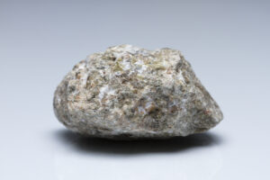
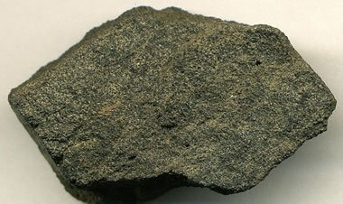
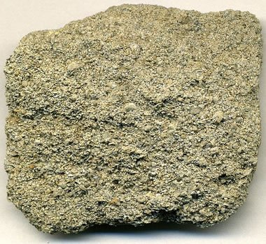
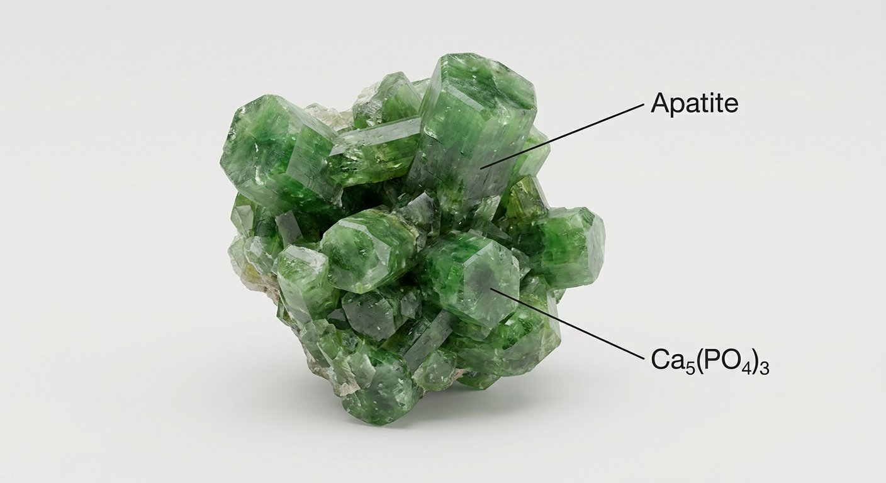
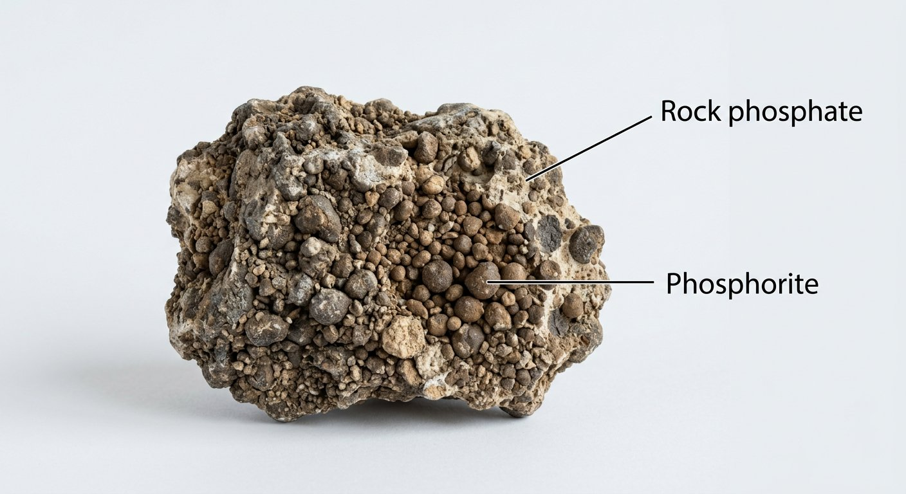

# Phosphate

> **Group:** Industrial / non-metallic · **Mineral:** apatite Ca₅(PO₄)₃(F,Cl,OH)
> **Quick ID:** Hardness 5, green/brown/grey, vitreous to resinous; often **granular or nodular** in sedimentary phosphate beds.

## At a glance

| Property | Value |
|---|---|
| Colour | Green, brown, or grey |
| Hardness | 5 (apatite) |
| Lustre | Vitreous to resinous |
| Habit | Prismatic hexagonal; often granular/nodular beds |
| Key test | Hardness 5 + granular/nodular sedimentary beds |

## What it is
**Phosphate rock** — chiefly the mineral **apatite**, a calcium phosphate. A vital **fertilizer** raw material (source of phosphorus for plant growth). Phosphorus is essential to life and to global food security.

## Chemistry & mineralogy
**Apatite** — Ca₅(PO₄)₃(F,Cl,OH), a calcium phosphate (fluor-, chlor-, or hydroxyl-apatite). Sedimentary phosphate rock is mostly cryptocrystalline apatite (collophane) in nodules, pellets, or beds.

## Crystal habit
**Prismatic hexagonal** crystals (in igneous rocks), but in sedimentary phosphate deposits it is usually **granular or nodular** (pellets, nodules, ooliths). Nodular phosphate beds are the main economic form.

## Physical properties
- **Hardness 5** (apatite); green, brown, or grey; vitreous to resinous.
- Often **granular or nodular** in sedimentary phosphate beds.
- Massive phosphate rock is dull and earthy; individual apatite crystals are vitreous.

## How to identify in the field
1. **Hardness:** 5 (apatite) — scratches glass, scratched by a knife.
2. **Habit:** granular or **nodular** in sedimentary beds.
3. **Colour:** green, brown, or grey.
4. **Lustre:** vitreous (crystals) to resinous.
5. **Context:** marine sedimentary phosphate beds.

## Lookalikes & how to distinguish

| Looks like | How to tell it apart |
|---|---|
| **Limestone** | Limestone **fizzes** with acid; phosphate does not. |
| **Chert/flint** | Chert is harder (6.5–7) and glassy; phosphate is softer (5) and often nodular. |
| **Glauconite (green grains)** | Glauconite is very soft and green; phosphate nodules are harder (5). |

## Occurrence

*Figure III.B.10 — Apatite: a phosphate mineral (fertilizer source). Source: [Mauritius Images](https://www.mauritius-images.com/en/asset/ME-PI-8885182_mauritius_images_bildnummer_09355381_apatite-specimen-apatite-is-a-phosphate-mineral-apatite-is-defined-to-have-hardness-of-5-in-the-mohs-scale).*

*Figure III.B.10b — Phosphate rock (peloidal phosphorite). Source: [Geology.com](https://geology.com/minerals/apatite.shtml).*

*Figure III.B.10c — Fossiliferous phosphate rock. Source: [Geology.com](https://geology.com/minerals/apatite.shtml).*

*Figure III.B.10d — Labeled illustration: apatite phosphate crystal. Original diagram prepared for this guide.*

*Figure III.B.10e — Labeled illustration: rock phosphate (phosphorite). Original diagram prepared for this guide.*

Found in sedimentary basins (see [The sedimentary basins](../../01-general-geology/01-04-sedimentary-basins.md)).

## Genesis
**Sedimentary (marine)** — phosphate precipitates chemically or accumulates biologically in upwelling marine settings, forming nodular phosphate beds. Also occurs in igneous apatite deposits.

## States / localities
Sedimentary phosphate in the **Sokoto (Iullemmeden) Basin** — **Sokoto (Dange/Awwal)**, and occurrences in **Ogun (Ijebu-Ode)** and other sedimentary basins.

## Associated minerals & host rocks
Calcite, quartz, glauconite, gypsum; hosted by **marine sedimentary phosphate beds** (see [Limestone](limestone.md), [Gypsum](gypsum.md)).

## Mining, uses & market
- **FERTILIZER** — by far the main use (phosphoric acid, NPK fertilizers).
- **Animal feed** supplements and **chemicals** (detergents, food).
- Phosphorus is essential to food security, so phosphate is strategically important.

## Exploration notes
- Assess **P₂O₅ grade** and **bed thickness** for fertilizer viability.
- Phosphorus is essential to food security, so phosphate is strategically important.
- Check marine sedimentary sequences (e.g. the Sokoto/Iullemmeden Basin).

## Field checklist
- [ ] Hardness 5 (apatite)?
- [ ] Granular/nodular sedimentary beds?
- [ ] Green/brown/grey?
- [ ] No acid fizz?
- [ ] Marine sedimentary basin setting?

## Facts
- **Apatite** is hardness 5 — it defines the middle of the Mohs scale.
- Phosphate is the key **fertilizer** mineral — essential to global food security.
- Sedimentary phosphate forms in **marine upwelling** settings as nodules/pellets.
- Nigeria's main phosphate is in the **Sokoto (Iullemmeden) Basin**.

## Related
- [The sedimentary basins](../../01-general-geology/01-04-sedimentary-basins.md) · [Limestone](limestone.md) · [Calcite](calcite.md) · [Gypsum](gypsum.md)
