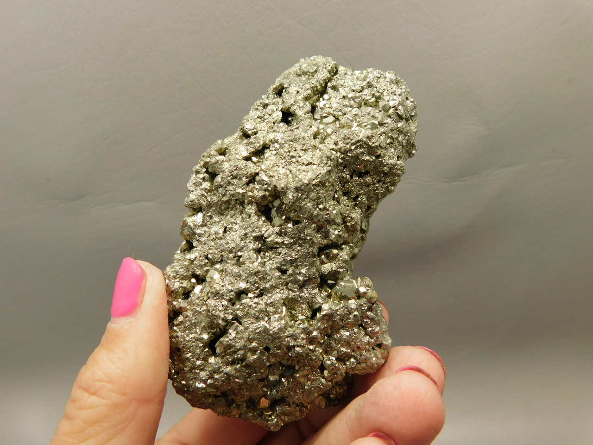
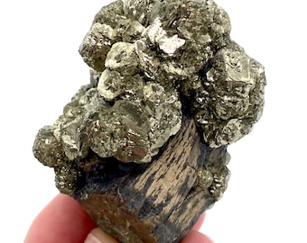

# Pyrite, Marcasite & Pyrrhotite (Iron Sulfides)

> **Group:** Industrial / non-metallic (sulfides) · **Formulas:** Pyrite & marcasite FeS₂ · Pyrrhotite Fe₁₋ₓS
> **Quick ID:** Pyrite = brassy-yellow, hardness 6–6½, **brittle** ("fool's gold"); **pyrrhotite is strongly magnetic** (a magnet sticks) — the key test from pyrite.

## At a glance

| Property | Pyrite | Marcasite | Pyrrhotite |
|---|---|---|---|
| Colour | Pale brassy-yellow | Paler/yellower | Bronze to brassy |
| Hardness | 6–6½ | 3½–6 | 3½–4 |
| Streak | Greenish-black | Pale | Dark grey-black |
| Magnetism | Not magnetic | Not magnetic | **Strongly magnetic** |
| Key test | Brassy + brittle | Tarnishes | **Magnetic** |

## Chemistry & mineralogy
**Iron sulfides:**
- **Pyrite** — FeS₂ (cubic).
- **Marcasite** — FeS₂ (orthorhombic; less stable).
- **Pyrrhotite** — Fe₁₋ₓS (non-stoichiometric; **magnetic**).

Pyrite and marcasite share the same chemistry (FeS₂) but different crystal structures.

## Crystal habit
- **Pyrite:** cubes, pyritohedra, striated faces, massive.
- **Marcasite:** spear-shaped/radiating twins, earthy.
- **Pyrrhotite:** massive, tabular, or anhedral grains.

## Physical properties
- **Pyrite:** hardness 6–6½, pale **brassy-yellow**, greenish-black streak, **brittle**, sparks on steel.
- **Marcasite:** paler/yellower, tarnishes, lower hardness (3½–6), brittle.
- **Pyrrhotite:** hardness 3½–4, **bronze to brassy**, **strongly magnetic** (a hand magnet sticks!) — the key distinguishing test from pyrite.

## How to identify in the field
1. **Pyrite:** brassy-yellow, hard, but **brittle** (crushes to powder — not gold).
2. **Streak:** pyrite gives a greenish-black streak (gold gives golden).
3. **Pyrrhotite:** **magnetic** — a magnet sticks (pyrite does not).
4. **Marcasite:** paler, tarnishes, spear-shaped twins.
5. **Context:** veins, sedimentary, mafic rocks.

## Lookalikes & how to distinguish

| Looks like | How to tell it apart |
|---|---|
| **Gold** | Gold is golden, malleable, and very heavy; pyrite is brassy, brittle, and lighter. |
| **Chalcopyrite** | Chalcopyrite is greener and softer (3.5–4); pyrite is paler and harder (6–6.5). |
| **Pyrrhotite vs pyrite** | Pyrrhotite is **magnetic**; pyrite is not. |

## Occurrence

**Pyrite (pure / hand specimen)**

*Figure III.B.35 — Pyrite (FeS₂), brassy-yellow cubic crystals — "fool's gold." Source: [cementl.com](https://www.cementl.com/what-is-pyrite-the-fools-gold-when-nature-wears-golds-disguise/).*

**Pyrrhotite (pure / hand specimen)**

*Figure III.B.36 — Pyrrhotite, bronze and magnetic. Source: [livingrockstudios.org](https://www.livingrockstudios.org/pyrrhotite/).*

**In rock / ore**

*Figure III.B.37 — Iron sulfides within a mineralized ore matrix. Source: [eBay](https://www.ebay.com/b/Pyrite-Crystals/3225/bn_55192064).*

*Figure III.B.37b — Pyrite (fool's gold) crystal. Source: [OakRocks](https://www.oakrocks.net/pyrite-crystal-natural-mineral-specimen-fools-gold-peru-o8/).*

*Figure III.B.37c — Marcasite specimen. Source: [Etsy](https://etsy.com/listing/1891273709/marcasite-specimen-25g-unique-mineral).*

## Genesis
Ubiquitous — **hydrothermal veins**, sedimentary (marcasite, pyrrhotite), metamorphic, and magmatic (pyrrhotite in mafic rocks, often with nickel). Iron sulfides form in almost every geological setting.

## States / localities
**Ebonyi, Benue, Plateau, Nasarawa** — in schist belts and with Pb–Zn mineralization; marcasite in the Benue/Ebonyi sedimentary hosts; pyrrhotite in mafic/ultramafic settings.

## Associated minerals & host rocks
Gold, copper, galena, sphalerite, nickel sulfides; hosted by **hydrothermal veins, sedimentary, and mafic/ultramafic rocks** (see [Gold](../metallic/gold.md), [Galena & Sphalerite](../metallic/galena-sphalerite.md)).

## Mining, uses & market
- **Uses:** **sulfuric acid** (if processed), sulfur, iron oxide; often a **gangue/waste** mineral. Marcasite is avoided in jewellery (it crumbles).
- **Market:** sulfuric-acid feedstock; historically the classic "fool's gold."

## Exploration notes
- These sulfides are **pathfinders**: assay associated **Au, Cu, Pb, Zn, Ag, Ni**.
- **Pyrrhotite's magnetism** helps spot it in the field and can flag mafic/ultramafic (nickel) targets (see [Hand-specimen tests](../../05-field-identification/05-02-hand-specimen-tests.md)).
- Never mistake pyrite for gold — test hardness, brittleness, and streak.

## Field checklist
- [ ] Brassy/bronze colour?
- [ ] Brittle (pyrite) vs malleable (gold)?
- [ ] Magnetic (pyrrhotite)?
- [ ] Greenish-black streak (pyrite)?
- [ ] Vein / sedimentary / mafic setting?

## Facts
- Pyrite is "**fool's gold**" — brassy but **brittle** (gold is malleable).
- **Pyrrhotite is magnetic** — a magnet sticks (the key test from pyrite).
- Pyrite gives a **greenish-black streak** (gold gives a golden streak).
- Marcasite **crumbles/tarnishes** — avoided in jewellery.

## Related
- [Gold](../metallic/gold.md) · [Copper](../metallic/copper.md) · [Galena & Sphalerite](../metallic/galena-sphalerite.md) · [Ore deposits 101](../../00-fundamentals/00-07-ore-deposits-101.md)
