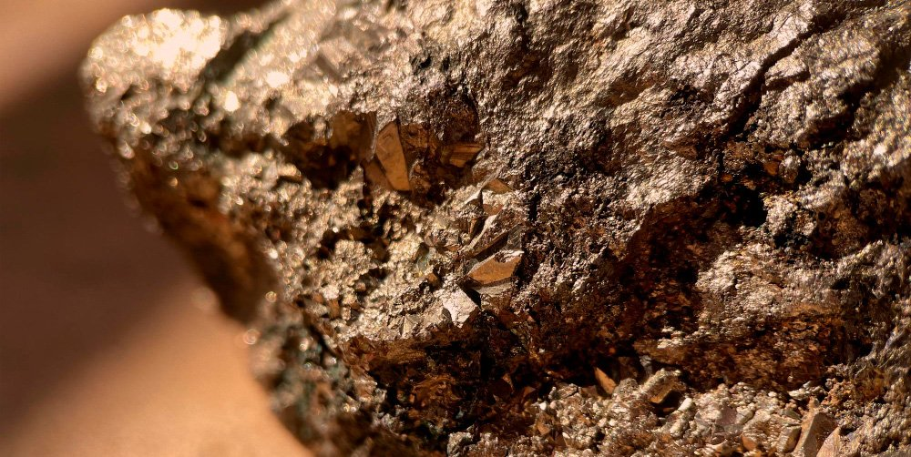
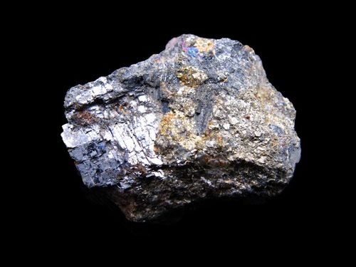
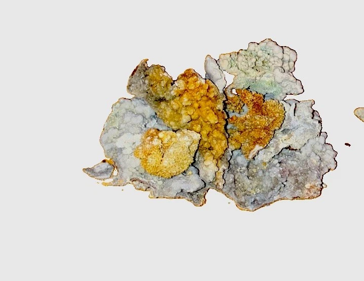

# Pyrite, Marcasite & Pyrrhotite (Iron Sulfides)

## Chemistry & mineralogy
**Iron sulfides:**
- **Pyrite** — FeS₂ (cubic).
- **Marcasite** — FeS₂ (orthorhombic; less stable).
- **Pyrrhotite** — Fe₁₋ₓS (non-stoichiometric; **magnetic**).

## Crystal habit
- **Pyrite:** cubes, pyritohedra, striated faces, massive.
- **Marcasite:** spear-shaped/radiating twins, earthy.
- **Pyrrhotite:** massive, tabular, or anhedral grains.

## Physical properties & how to test
- **Pyrite:** hardness 6–6½, pale **brassy-yellow**, greenish-black streak, **brittle**,
  sparks on steel.
- **Marcasite:** paler/yellower, tarnishes, lower hardness (3½–6), brittle.
- **Pyrrhotite:** hardness 3½–4, **bronze to brassy**, **strongly magnetic**
  (a hand magnet sticks!) — the key distinguishing test from pyrite.

## Occurrence
**Pyrite (pure / hand specimen)**

*Figure III.B.35 — Pyrite (FeS₂), brassy-yellow cubic crystals — "fool's gold." Source: [cementl.com](https://www.cementl.com/what-is-pyrite-the-fools-gold-when-nature-wears-golds-disguise/).*

**Pyrrhotite (pure / hand specimen)**

*Figure III.B.36 — Pyrrhotite, bronze and magnetic. Source: [livingrockstudios.org](https://www.livingrockstudios.org/pyrrhotite/).*

**In rock / ore**

*Figure III.B.37 — Iron sulfides within a mineralized ore matrix. Source: [eBay](https://www.ebay.com/b/Pyrite-Crystals/3225/bn_55192064).*

## Genesis
Ubiquitous — **hydrothermal veins**, sedimentary (marcasite, pyrrhotite), metamorphic,
and magmatic (pyrrhotite in mafic rocks, often with nickel).

## States / localities
**Ebonyi, Benue, Plateau, Nasarawa** — in schist belts and with Pb–Zn mineralization;
marcasite in the Benue/Ebonyi sedimentary hosts; pyrrhotite in mafic/ultramafic settings.

## Mining, uses & market
- **Uses:** **sulfuric acid** (if processed), sulfur, iron oxide; often a **gangue/waste**
  mineral. Marcasite is avoided in jewellery (it crumbles).
- **Market:** sulfuric-acid feedstock; historically the classic "fool's gold."

## Exploration notes
- These sulfides are **pathfinders**: assay associated **Au, Cu, Pb, Zn, Ag, Ni**.
- **Pyrrhotite's magnetism** helps spot it in the field and can flag mafic/ultramafic
  (nickel) targets (see [Hand-specimen tests](../../05-field-identification/05-02-hand-specimen-tests.md)).
- Never mistake pyrite for gold — test hardness, brittleness, and streak.

## Related
- [Gold](../metallic/gold.md) · [Copper](../metallic/copper.md) · [Galena & Sphalerite](../metallic/galena-sphalerite.md) · [Ore deposits 101](../../00-fundamentals/00-07-ore-deposits-101.md)
