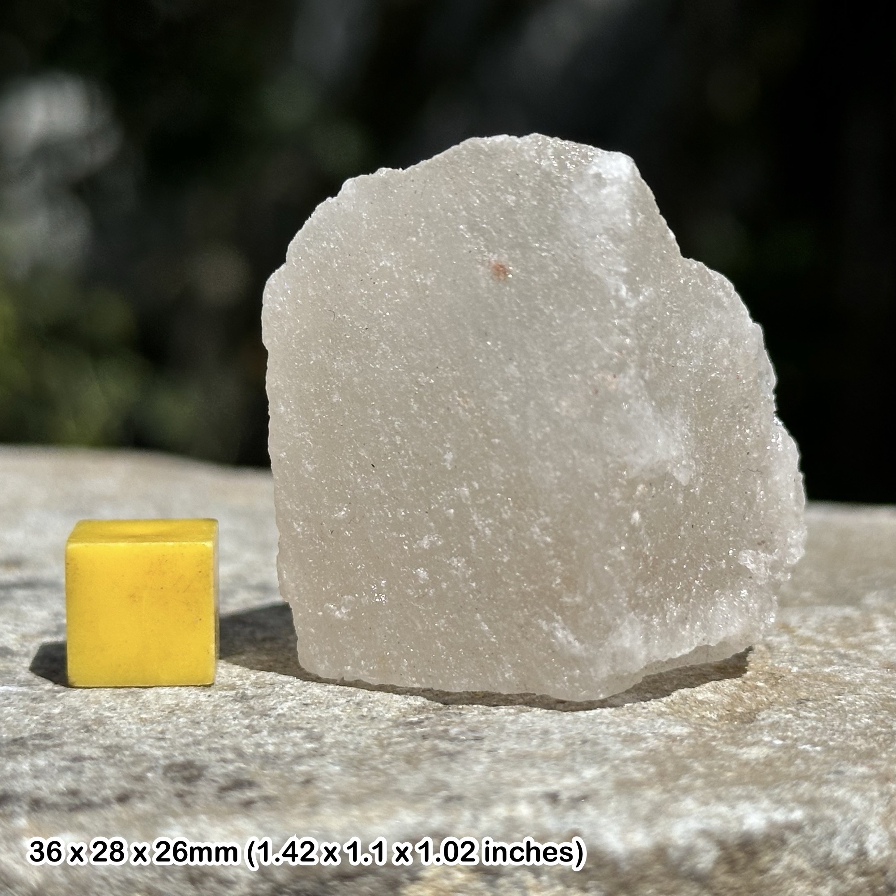

# Salt (Halite)

> **Group:** Industrial / non-metallic · **Formula:** NaCl

## What it is
**Rock salt** — the mineral **halite** (sodium chloride), an **evaporite** deposited
from dried-up seas and lakes.

## Properties & how to recognize
- **Salty taste** (taste a fresh surface) — the definitive test.
- **Soft** (hardness ~2.5) with **cubic cleavage**; dissolves in water.
- Clear, white, grey, or pink.

## Occurrence

*Figure III.B.12 — Halite (rock salt) crystals. Source: [MyLostGems](https://mylostgems.com/product/halite-natural-rock-salt-crystal-genuine-healing-mineral-stone-certificated/).*

## Where in Nigeria (states)
- **Lake Chad (Borno)** — traditional salt production.
- **Awe (Nasarawa)** — rock salt.
- **Ijero (Ekiti)** — rock salt.

## Uses
- **Edible salt** (dietary), **chlor-alkali chemicals** (chlorine, caustic soda),
  **water treatment**, and **de-icing**.

## Exploration / notes
- **Salty taste + cubic break + dissolves** = halite.
- Assess **purity** (low impurities) for edible/industrial grades.

## Related
- [Rock salt (rock)](../../02-rocks-of-nigeria/sedimentary/rock-salt.md) · [Gypsum](gypsum.md)
