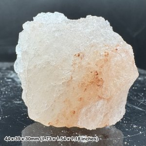
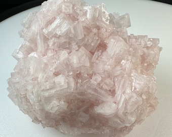

# Salt (Halite)

> **Group:** Industrial / non-metallic (halide) · **Formula:** NaCl
> **Quick ID:** **Salty taste** (the definitive test); soft (~2.5) with **cubic cleavage**; dissolves in water; clear/white/grey/pink.

## At a glance

| Property | Value |
|---|---|
| Colour | Clear, white, grey, or pink |
| Hardness | ~2.5 (soft) |
| Cleavage | **Cubic** |
| Taste | **Salty** (definitive test) |
| Solubility | Dissolves in water |
| Key test | Salty taste + cubic + dissolves |

## What it is
**Rock salt** — the mineral **halite** (sodium chloride), an **evaporite** deposited from dried-up seas and lakes.

## Chemistry & mineralogy
**Halite** — NaCl (sodium chloride). An evaporite mineral that precipitates as seawater or lake water evaporates and becomes saturated with salt. Chemically identical to table salt.

## Crystal habit
**Cubic** crystals (perfect cubes) or massive/bedded. Halite commonly forms clear, well-developed cubic crystals and thick evaporite beds.

## Physical properties
- **Salty taste** (taste a fresh surface) — the definitive test.
- **Soft** (hardness ~2.5) with **cubic cleavage**; dissolves in water.
- Clear, white, grey, or pink.

## How to identify in the field
1. **Taste:** distinctly **salty** (taste a fresh surface) — the definitive test.
2. **Cleavage:** breaks into **cubes**.
3. **Hardness:** soft (~2.5).
4. **Solubility:** dissolves readily in water.
5. **Context:** evaporite beds with gypsum.

## Lookalikes & how to distinguish

| Looks like | How to tell it apart |
|---|---|
| **Sylvite (KCl)** | Sylvite tastes **bitter/salty** (more bitter) and is softer; halite is purely salty. |
| **Gypsum** | Gypsum is not salty and does not dissolve as readily; halite is salty and dissolves. |
| **Calcite** | Calcite **fizzes** with acid; halite tastes salty and dissolves. |

## Occurrence

*Figure III.B.12 — Halite (rock salt) crystals. Source: [MyLostGems](https://mylostgems.com/product/halite-natural-rock-salt-crystal-genuine-healing-mineral-stone-certificated/).*

*Figure III.B.12b — Halite (rock salt) crystal. Source: [MyLostGems](https://mylostgems.com/product/halite-natural-rock-salt-rock-crystal-power-mineral-authentic).*

*Figure III.B.12c — Halite (rock salt) specimen. Source: [Etsy](https://www.etsy.com/listing/680980943/halite-natural-rock-salt-crystal-genuine).*

Found in evaporite deposits (see [Rock salt rock](../../02-rocks-of-nigeria/sedimentary/rock-salt.md)).

## Genesis
**Evaporite** — deposited by the evaporation of restricted seas and lakes, often interbedded with **gypsum** and **anhydrite**. Salt beds form as brine concentrates and halite crystallizes out.

## States / localities
- **Lake Chad (Borno)** — traditional salt production.
- **Awe (Nasarawa)** — rock salt.
- **Ijero (Ekiti)** — rock salt.

## Associated minerals & host rocks
Gypsum, anhydrite, trona, sylvite; hosted by **evaporite sequences** (see [Gypsum](gypsum.md), [Trona](trona.md), [Brine](brine.md)).

## Mining, uses & market
- **Edible salt** (dietary), **chlor-alkali chemicals** (chlorine, caustic soda), **water treatment**, and **de-icing**.
- Essential to food, chemicals, and industry.

## Exploration notes
- **Salty taste + cubic break + dissolves** = halite.
- Assess **purity** (low impurities) for edible/industrial grades.
- Often interbedded with **gypsum** and associated with **brine**.

## Field checklist
- [ ] Salty taste?
- [ ] Cubic cleavage?
- [ ] Soft (~2.5)?
- [ ] Dissolves in water?
- [ ] Evaporite bed with gypsum?

## Facts
- Halite's **salty taste** is the definitive field test.
- It breaks into perfect **cubes** and dissolves in water.
- It is an **evaporite** — deposited from dried-up seas and lakes.
- **Lake Chad (Borno)** is a traditional Nigerian salt-producing area.

## Related
- [Rock salt (rock)](../../02-rocks-of-nigeria/sedimentary/rock-salt.md) · [Gypsum](gypsum.md) · [Brine](brine.md) · [Trona](trona.md)
