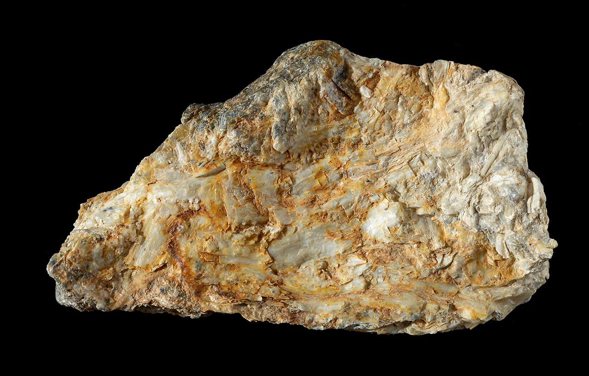
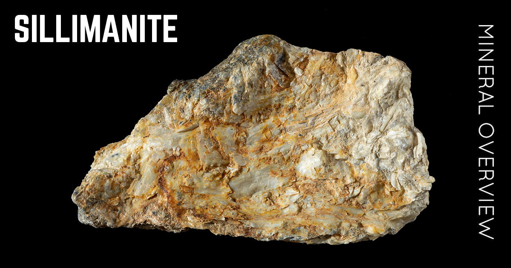

# Sillimanite (Aluminosilicate)

> **Group:** Industrial / non-metallic (nesosilicate) · **Formula:** Al₂SiO₅
> **Quick ID:** Hard (6½–7½), vitreous to **silky** (fibrolite), colourless/grey/brown/green; **very refractory**; tough, needle-like fibres.

## At a glance

| Property | Value |
|---|---|
| Colour | Colourless, grey, brown, or pale green |
| Hardness | **6½–7½** (hard) |
| Lustre | Vitreous to **silky** (fibrous fibrolite) |
| Habit | Fibrous (fibrolite), prismatic, massive |
| Key test | Hardness 6½–7½ + silky fibres + refractory |

## Chemistry & mineralogy
**Al₂SiO₅** — an aluminium silicate, a **polymorph** of kyanite and andalusite (same chemistry, different crystal structure & formation conditions). The fibrous variety is called **fibrolite**. All three (kyanite, andalusite, sillimanite) are Al₂SiO₅.

## Crystal habit
**Fibrous** (fibrolite), prismatic, or massive aggregates in metamorphic rocks. Fibrolite forms tough, needle-like fibres in a silky aggregate.

## Physical properties
- **Hardness:** 6½–7½ (hard).
- **Lustre:** vitreous to **silky** (in the fibrous variety).
- **Colour:** colourless, grey, brown, or pale green.
- **Signature:** very **refractory** (high heat resistance); tough, needle-like fibres.

## How to identify in the field
1. **Hardness:** 6½–7½ (hard).
2. **Lustre/habit:** silky, fibrous (fibrolite) or prismatic.
3. **Refractoriness:** resists very high heat.
4. **Colour:** colourless, grey, brown, pale green.
5. **Context:** high-grade metamorphic (metapelite) rocks.

## Lookalikes & how to distinguish

| Looks like | How to tell it apart |
|---|---|
| **Kyanite** | Kyanite is bladed with **directional hardness** (4–7); sillimanite is fibrous/silky and uniformly hard. |
| **Andalusite** | Andalusite forms blocky/prismatic crystals; sillimanite is typically fibrous (fibrolite). |
| **Tremolite** | Tremolite is also silky-fibrous but is softer (5–6) and in different rocks. |

## Occurrence

**Pure / hand specimen**

*Figure III.B.20 — Fibrous sillimanite (fibrolite) aggregate. Source: [MineralExpert](https://mineralexpert.org/article/sillimanite-aluminosilicate-mineral-overview).*

**In rock / ore**

*Figure III.B.21 — Sillimanite in its host rock. Source: [MineralExpert](https://mineralexpert.org/article/andalusite-aluminosilicate-mineral-overview).*

## Genesis
**High-grade metamorphism** of alumina-rich (pelitic) rocks — the "sillimanite zone" of regional metamorphism; also contact metamorphism (see [Mica schist & Phyllite](../../02-rocks-of-nigeria/metamorphic/mica-schist-phyllite.md)). Sillimanite marks higher grade than kyanite.

## States / localities
**Plateau, Kogi, Oyo** — reported in high-grade metapelites; associated with **kyanite** (see [Kyanite](../gemstones/kyanite.md)).

## Associated minerals & host rocks
Kyanite, andalusite, quartz, feldspar, garnet; hosted by **high-grade metapelites and kyanite–sillimanite schists** (see [Banded gneiss](../../02-rocks-of-nigeria/metamorphic/banded-gneiss.md)).

## Mining, uses & market
- **Uses:** high-alumina **refractories** (furnace linings), ceramics, spark plugs, abrasives, high-temperature insulation.
- **Market:** grouped with **kyanite/andalusite** as refractory minerals.

## Exploration notes
- Target **high-grade metapelites / kyanite–sillimanite schists**.
- Confirm hardness (6½–7½) and silky/fibrous habit; **assay Al₂O₃** and low impurities.
- Often associated with [Kyanite](../gemstones/kyanite.md) and [Gneiss](../../02-rocks-of-nigeria/metamorphic/banded-gneiss.md).

## Field checklist
- [ ] Hardness 6½–7½?
- [ ] Silky/fibrous (fibrolite) or prismatic?
- [ ] Refractory (resists heat)?
- [ ] Colourless/grey/brown/green?
- [ ] High-grade metapelite setting?

## Facts
- Sillimanite is a **polymorph** of kyanite and andalusite (all Al₂SiO₅).
- Its fibrous form, **fibrolite**, has a silky lustre.
- It is **very refractory** — used in high-alumina furnace linings.
- The "**sillimanite zone**" marks high-grade regional metamorphism.

## Related
- [Kyanite](../gemstones/kyanite.md) · [Mica schist & Phyllite](../../02-rocks-of-nigeria/metamorphic/mica-schist-phyllite.md) · [Banded gneiss](../../02-rocks-of-nigeria/metamorphic/banded-gneiss.md) · [State-by-state table](../../04-geological-provinces/04-09-state-by-state-table.md)
