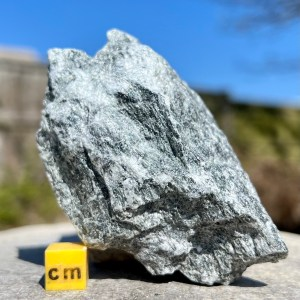

# Talc (Soapstone)

> **Group:** Industrial / non-metallic · **Mineral:** talc Mg₃Si₄O₁₀(OH)₂
> **Quick ID:** The **softest mineral on Earth (hardness 1)** — scratched by a fingernail; **soapy, greasy feel**; white/grey/green, pearly.

## At a glance

| Property | Value |
|---|---|
| Colour | White, grey, or green |
| Hardness | **1** — the softest mineral (fingernail scratches) |
| Feel | **Soapy, greasy** |
| Lustre | Pearly |
| Cleavage | Perfect basal (flexible sheets) |
| Key test | Soapy feel + extreme softness |

## What it is
**Talc** — the **softest mineral** on Earth (hardness 1) — a hydrated magnesium silicate. In massive form it is called **soapstone** or **steatite**.

## Chemistry & mineralogy
**Talc** — Mg₃Si₄O₁₀(OH)₂, a hydrated magnesium silicate (2:1 phyllosilicate). It forms by the alteration of magnesium-rich (ultramafic) rocks. Being the softest mineral (hardness 1 on the Mohs scale), talc is instantly recognizable by its soapy feel.

## Crystal habit
**Platy / foliated** — splits into flexible (but not elastic) sheets. In **massive** form it is **soapstone/steatite** (used for carving). Individual crystals are microscopic; talc is identified by its softness and soapy feel.

## Physical properties
- **Hardness 1** — the softest mineral; easily scratched by a fingernail.
- **Soapy, greasy feel** — hence "soapstone."
- White, grey, or **green**; pearly lustre; splits into flexible sheets.

## How to identify in the field
1. **Feel:** distinctly **soapy/greasy** to the touch.
2. **Hardness:** scratched by a fingernail (1) — softest mineral.
3. **Colour:** white, grey, or green.
4. **Cleavage:** splits into flexible (non-elastic) sheets.
5. **Context:** altered ultramafic (serpentinite) zones.

## Lookalikes & how to distinguish

| Looks like | How to tell it apart |
|---|---|
| **Mica** | Mica peels into **elastic** sheets and is harder (2–3); talc has **non-elastic** sheets and is softer (1). |
| **Clay / kaolin** | Clay is not soapy and is less pearly; talc has a distinctly soapy feel. |
| **Chlorite** | Chlorite is green and slightly harder; talc is soapier and softer. |

## Occurrence

*Figure III.B.6 — Soapstone: soft, greasy talc rock. Source: [MyLostGems](https://mylostgems.com/product/soapstone-2/).*

Found in altered **ultramafic zones** of the Basement (see [Talc/Chlorite schist rock](../../02-rocks-of-nigeria/metamorphic/talc-chlorite-schist.md)).

## Genesis
Forms by the **alteration (serpentinization / talc alteration) of ultramafic rocks** — magnesium-rich mantle rocks alter to talc (with chlorite and serpentine) in the presence of water. Talc marks zones of hydrothermal/metamorphic alteration.

## States / localities
In altered **ultramafic zones** of the Basement: reported in **Kwara, Oyo, Kaduna, Plateau**, and some schist belts.

## Associated minerals & host rocks
Chlorite, serpentine, magnesite, magnetite; hosted by **altered ultramafic (serpentinite) rocks** (see [Talc/Chlorite schist](../../02-rocks-of-nigeria/metamorphic/talc-chlorite-schist.md)).

## Mining, uses & market
- **COSMETICS** (talcum powder), **ceramics, paper, paint, and plastics**.
- **Soapstone** for carving, countertops, and stove liners.
- Industrial lubricant and filler.

## Exploration notes
- The **soapy feel + extreme softness** is unmistakable.
- Associated with **chlorite/serpentine** alteration of ultramafic rocks (see [Talc/Chlorite schist](../../02-rocks-of-nigeria/metamorphic/talc-chlorite-schist.md)).
- Massive **soapstone** bodies are the quarrying target.

## Field checklist
- [ ] Soapy/greasy feel?
- [ ] Scratched by a fingernail (hardness 1)?
- [ ] White/grey/green, pearly?
- [ ] Flexible (non-elastic) sheets?
- [ ] In altered ultramafic rock?

## Facts
- Talc is the **softest mineral** on Earth (hardness 1 on the Mohs scale).
- Its **soapy feel** gives "soapstone" and "talcum powder" their names.
- It forms by alteration of **ultramafic (mantle) rocks**.
- **Soapstone** (massive talc) is carved into bowls, countertops, and stove liners.

## Related
- [Talc/Chlorite schist (rock)](../../02-rocks-of-nigeria/metamorphic/talc-chlorite-schist.md) · [Kaolin](kaolin.md) · [Serpentinite](../../02-rocks-of-nigeria/metamorphic/serpentinite.md) · [Mica](mica.md)
