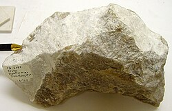
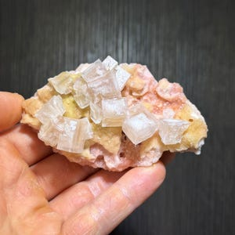

# Trona (Natural Soda Ash)

## Chemistry & mineralogy
**Na₃(CO₃)(HCO₃)·2H₂O** — sodium sesquicarbonate, a natural form of **soda ash**.
Heating converts it to sodium carbonate (Na₂CO₃) and sodium bicarbonate (NaHCO₃).

## Crystal habit
Tabular to prismatic crystals, fibrous, or massive **evaporite beds**.

## Physical properties & how to test
- **Hardness:** 2½–3 (soft).
- **Lustre:** vitreous; white, grey, or yellow.
- **Taste:** salty-alkaline; **soluble in water**; becomes powdery (efflorescent) in dry air.

## Occurrence
**Pure / hand specimen**

*Figure III.B.30 — Trona mineral specimen. Source: [Wikipedia — Trona (Mineral)](https://de.wikipedia.org/wiki/Trona_(Mineral)).*

**In rock / ore**

*Figure III.B.31 — Trona crystals in matrix. Source: [Etsy](https://www.etsy.com/market/trona_crystals).*

## Genesis
**Evaporite deposits of alkaline saline lakes** — the same setting as the Lake Chad
(Borno) evaporite belt (see [Salt](salt.md), [Brine](brine.md)).

## States / localities
**Borno, Yobe** — the Lake Chad/NE Nigeria evaporite province.

## Mining, uses & market
- **Uses:** **soda ash** (glass, detergents, chemicals), **baking soda**, water
  softening, pH control, metallurgy.
- **Market:** a valuable alternative soda-ash source; often co-mined with halite.

## Exploration notes
- Look in **alkaline evaporite basins/lakes**, associated with halite, gypsum, and
  natron (see [Salt](salt.md), [Gypsum](gypsum.md)).
- Assay **Na₂CO₃ / NaHCO₃** content; assess solubility and processing route.

## Related
- [Salt (halite)](salt.md) · [Brine](brine.md) · [Gypsum](gypsum.md) · [State-by-state table](../../04-geological-provinces/04-09-state-by-state-table.md)
