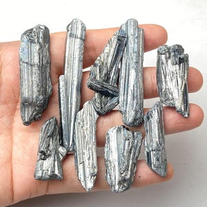
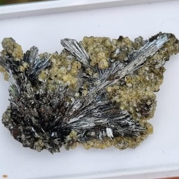
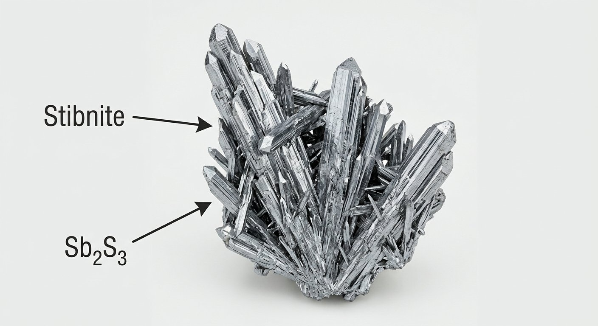
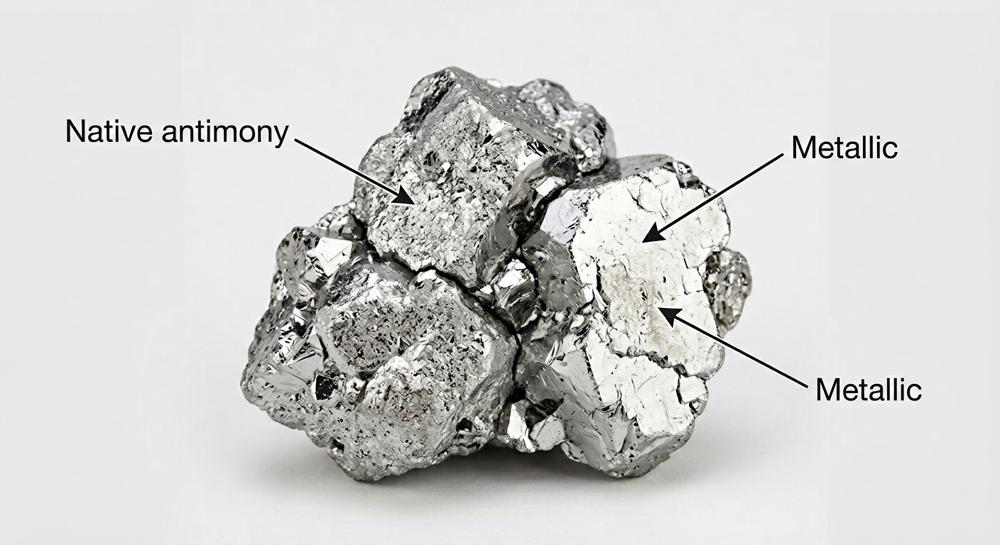

# Antimony (Stibnite)

> **Group:** Metallic (sulfide) · **Mineral:** Stibnite Sb₂S₃ · **Element:** Antimony (Sb)
> **Quick ID:** Soft (hardness 2), **bladed/needle-like**, lead-grey to steel-grey, one perfect cleavage; **melts easily in a flame**.

## At a glance

| Property | Value |
|---|---|
| Colour | Lead-grey to steel-grey (tarnishes black/iridescent) |
| Streak | Lead-grey |
| Lustre | Metallic |
| Hardness | **2** (very soft; sectile) |
| Cleavage | Perfect in one direction (bladed) |
| Habit | Bladed, acicular, radiating |
| Key test | Soft + bladed + melts in a flame |

## Chemistry & mineralogy
**Antimony trisulfide** — Sb₂S₃, the mineral **stibnite**. By far the main ore of antimony. Antimony is a metalloid used widely in flame retardants.

## Crystal habit
**Bladed, acicular, or radiating** aggregates; often striking columnar or needle-like groups. The radiating, needle-like crystal groups are distinctive and collectable.

## Physical properties
- **Hardness 2** — very soft; **sectile** (can be cut with a knife).
- **Colour:** lead-grey to steel-grey; metallic; often tarnishes black/iridescent.
- **Perfect cleavage** in one direction (bladed).
- Melts easily in a candle flame (a classic test — low melting point).

## How to identify in the field
1. **Hardness:** very soft (2) — easily cut/scratched.
2. **Habit:** **bladed/needle-like** or radiating crystals.
3. **Colour:** lead-grey to steel-grey, metallic.
4. **Cleavage:** perfect one-direction (flexible-looking blades).
5. **Melting test:** melts easily in a flame (low melting point) — confirmatory.

## Lookalikes & how to distinguish

| Looks like | How to tell it apart |
|---|---|
| **Galena** | Galena is cubic (cubic cleavage) and heavier (SG ~7.5); stibnite is bladed, softer, and melts in a flame. |
| **Molybdenite** | Molybdenite is bladed and soft but gives a blue-grey streak and feels greasy; stibnite is lead-grey. |
| **Arsenic** | Arsenic is tin-white and tarnishes grey; stibnite is lead-grey and bladed. |

## Occurrence

**Pure specimen** (bladed stibnite):

*Figure III.A.13 — Stibnite: bladed antimony sulfide. Source: [iRocks](https://www.irocks.com/minerals/specimen/46164).*

*Figure III.A.13b — Stibnite (antimony ore) specimen. Source: [Etsy](https://www.etsy.com/market/stibnite_mineral).*

*Figure III.A.13c — Stibnite (antimony sulfide) crystals. Source: [Etsy](https://www.etsy.com/market/antimonite).*

*Figure III.A.13d — Labeled illustration: stibnite blade-like antimony sulfide crystals. Original diagram prepared for this guide.*

*Figure III.A.13e — Labeled illustration: native antimony (tin-white metallic). Original diagram prepared for this guide.*

**In rock:** low-temperature **hydrothermal veins**, often with **galena, sphalerite, and tungsten** minerals (see [Galena & Sphalerite](galena-sphalerite.md)).

## Genesis
**Low-temperature hydrothermal** fluids depositing Sb in veins and fissures. Stibnite forms in the cooler, late stages of hydrothermal systems, often the last mineral to crystallize in a vein.

## States / localities
Minor occurrences reported in **Plateau, Nasarawa**, and some schist-belt areas. Antimony is not a major Nigerian resource but occurs with other vein minerals.

## Associated minerals & host rocks
Galena, sphalerite, wolframite, cinnabar (Hg), quartz, calcite; hosted by **low-temperature hydrothermal veins** (see [Ore deposits 101](../../00-fundamentals/00-07-ore-deposits-101.md)).

## Mining, uses & market
Used in **flame retardants**, **lead-acid battery** grids (hardening lead), alloys, and (historically) cosmetics (*kohl*). Antimony is on many **critical-minerals lists** — strategically important.

## Exploration notes
- Look for **soft, bladed, lead-grey** mineral in **veins**.
- Often associated with **Pb–Zn–W** — sample alongside those.
- The **low melting point** (melts in a flame) is a distinctive confirmatory test.

## Field checklist
- [ ] Very soft (cut with a knife)?
- [ ] Bladed / needle-like habit?
- [ ] Lead-grey, metallic, one perfect cleavage?
- [ ] Melts in a flame?
- [ ] In a vein with galena/wolframite?

## Facts
- **Stibnite melts easily** in a candle flame — a classic, memorable field test.
- Antimony is mainly used in **flame retardants** (it stops fire spreading).
- It is on many **critical-minerals lists** — strategically important.
- Its radiating, needle-like crystals are prized by mineral collectors.

## Related
- [Galena & Sphalerite](galena-sphalerite.md) · [Wolframite & Scheelite](wolframite-scheelite.md) · [Ore deposits 101](../../00-fundamentals/00-07-ore-deposits-101.md)
