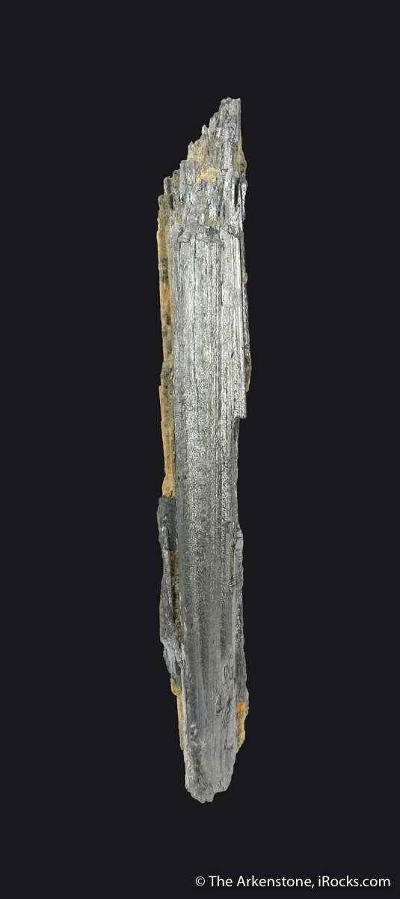

# Antimony (Stibnite)

> **Group:** Metallic (sulfide) · **Mineral:** Stibnite Sb₂S₃ · **Element:** Antimony (Sb)

## Chemistry & mineralogy
**Antimony trisulfide** — Sb₂S₃, the mineral **stibnite**. By far the main ore of
antimony.

## Crystal habit
**Bladed, acicular, or radiating** aggregates; often striking columnar or needle-like
groups.

## Physical properties & how to test
- **Hardness 2** — very soft; **sectile** (can be cut with a knife).
- **Color:** lead-grey to steel-grey; metallic; often tarnishes black/iridescent.
- **Perfect cleavage** in one direction (bladed).
- Melts easily in a candle flame (a classic test — low melting point).

## Occurrence

**Pure specimen** (bladed stibnite):

*Figure III.A.13 — Stibnite: bladed antimony sulfide. Source: [iRocks](https://www.irocks.com/minerals/specimen/46164).*

**In rock:** low-temperature **hydrothermal veins**, often with **galena, sphalerite,
and tungsten** minerals.

## Genesis
**Low-temperature hydrothermal** fluids depositing Sb in veins and fissures.

## States / localities
Minor occurrences reported in **Plateau, Nasarawa**, and some schist-belt areas.
Antimony is not a major Nigerian resource but occurs with other vein minerals.

## Mining, uses & market
Used in **flame retardants**, **lead-acid battery** grids (hardening lead), alloys,
and (historically) cosmetics (*kohl*). Antimony is on many critical-minerals lists.

## Exploration notes
- Look for **soft, bladed, lead-grey** mineral in **veins**.
- Often associated with **Pb–Zn–W** — sample alongside those.
- The **low melting point** (melts in a flame) is a distinctive confirmatory test.

## Related
- [Galena & Sphalerite](galena-sphalerite.md) · [Wolframite & Scheelite](wolframite-scheelite.md) · [Ore deposits 101](../../00-fundamentals/00-07-ore-deposits-101.md)
