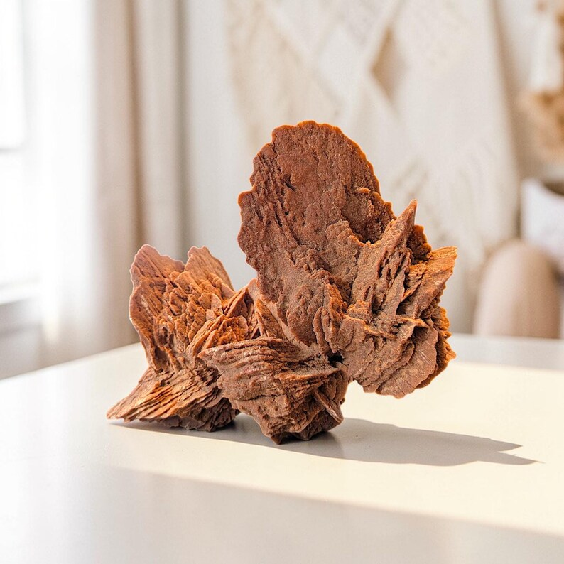

# Barite (Baryte)

> **Group:** Industrial/metallic (sulfate) · **Formula:** BaSO₄ · **Element:** Barium (Ba)
> **Quick ID:** Very **heavy for a pale mineral** (SG ~4.5), hardness 3–3.5, perfect one-direction cleavage, **no acid fizz**.

## At a glance

| Property | Value |
|---|---|
| Colour | White, pale; also yellow, blue, grey |
| Streak | White |
| Lustre | Vitreous to pearly |
| Hardness | 3–3.5 (scratched by steel) |
| Specific gravity | **~4.5** (heavy for a pale mineral) |
| Cleavage | Perfect in one direction (flat plates) |
| Acid test | **No fizz** (unlike calcite) |
| Key test | Heavy + pale + platy + no fizz |

## Chemistry & mineralogy
**Barium sulfate** — BaSO₄. A dense, pale mineral that is easy to recognize by its unusual weight for a light-coloured mineral. Barium is a heavy element, giving barite its high density.

## Crystal habit
**Tabular** crystals, rosette "**desert roses**," fibrous, or **massive/granular**. The "desert rose" (intergrown tabular crystals) is a popular collector form.

## Physical properties
- **Hardness 3–3.5** (scratched by steel).
- **White to pale** (also yellow, blue, grey); vitreous to pearly.
- **Perfect cleavage** in one direction (flat plates).
- **Very heavy for a pale mineral** — specific gravity ~4.5.
- **Does not fizz** with acid (unlike calcite).

## How to identify in the field
1. **Weight:** surprisingly **heavy for a pale mineral** (SG ~4.5) — the key clue.
2. **Hardness:** 3–3.5 — a steel knife scratches it.
3. **Cleavage:** perfect flat plates in one direction.
4. **Acid:** **no fizz** (distinguishes from calcite).
5. **Setting:** hydrothermal veins, often with galena/sphalerite.

## Lookalikes & how to distinguish

| Looks like | How to tell it apart |
|---|---|
| **Calcite** | Calcite fizzes with acid and is lighter (SG ~2.7); barite does not fizz and is much heavier (SG ~4.5). |
| **Gypsum** | Gypsum is softer (hardness 2) and lighter (SG ~2.3); barite is harder and much heavier. |
| **Celestite** | Celestite is also a pale sulfate but slightly lighter and often bluish; barite is heavier. |

## Occurrence

**Pure specimen** (desert-rose habit):

*Figure III.A.11 — Barite (desert-rose habit): heavy barium sulfate. Source: [Etsy](https://www.etsy.com/listing/4337130780/huge-rare-desert-rose-barite-gypsum).*

**In rock:** hydrothermal **veins** and **replacements**, often with **galena–sphalerite** in the Benue limestones and shales (see [Limestone](../../02-rocks-of-nigeria/sedimentary/limestone.md), [Galena & Sphalerite](galena-sphalerite.md)).

## Genesis
**Hydrothermal** — deposited from barium-rich fluids in veins and fissures, commonly associated with lead–zinc mineralization. Barite often fills the last, coolest stages of hydrothermal systems.

## States / localities
The **Benue Trough** and adjacent areas: **Nasarawa, Plateau, Benue, Taraba, Cross River, Kaduna**, and parts of the Basement.

## Associated minerals & host rocks
Galena, sphalerite, quartz, calcite, fluorite; hosted by **limestone and shale** of the Benue Trough (see [The Benue Trough](../../01-general-geology/01-04-sedimentary-basins.md)).

## Mining, uses & market
The main use is as **weighting agent in oil/gas drilling mud**; also a filler in paint, rubber, and plastics, and in chemicals and **radiation shielding**. Demand tracks drilling activity — a major industrial mineral for the oil industry.

## Exploration notes
- Look for **heavy, pale, platy** mineral in **veins**, especially near **lead–zinc** ground.
- The **high specific gravity** (feels surprisingly heavy) is the key field clue.
- Often a **by-product** of Pb–Zn exploration.

## Field checklist
- [ ] Surprisingly heavy for a pale mineral?
- [ ] Hardness 3–3.5 (steel scratches)?
- [ ] Perfect platy cleavage?
- [ ] No acid fizz?
- [ ] In a vein with galena/sphalerite?

## Facts
- Barite's **specific gravity (~4.5)** is remarkably high for such a pale mineral — it feels heavy.
- Its main use is as **weighting agent in oil-drilling mud** (to control pressure).
- "**Desert roses**" are rosettes of intergrown barite crystals.
- Barite is used in **radiation shielding** (concrete) because barium absorbs radiation.

## Related
- [Galena & Sphalerite](galena-sphalerite.md) · [The Benue Trough](../../01-general-geology/01-04-sedimentary-basins.md) · [Ore deposits 101](../../00-fundamentals/00-07-ore-deposits-101.md) · [Fluorite](../industrial/fluorite.md)
