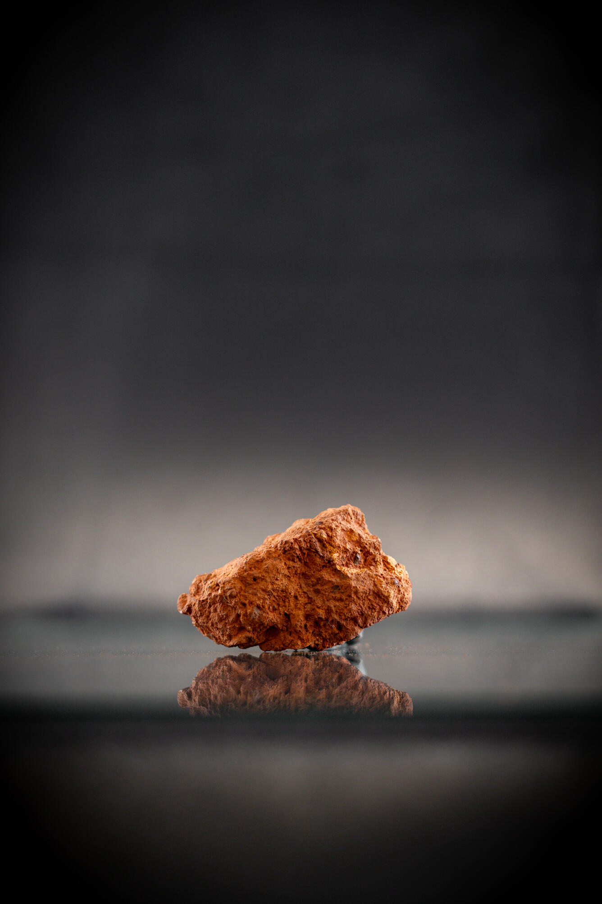
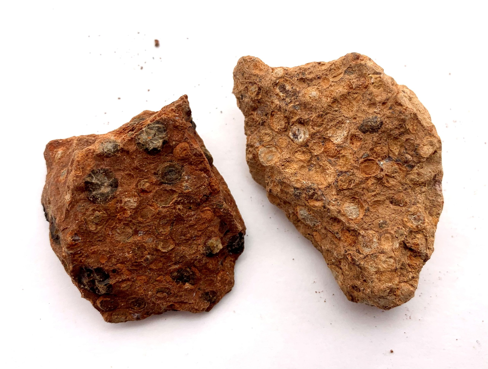

# Bauxite (Aluminium Ore)

## Chemistry & mineralogy
Not a single mineral but an **ore mixture**: aluminium hydroxides — **gibbsite**
Al(OH)₃, **boehmite** & **diaspore** AlO(OH) — with iron oxides (hematite/goethite),
kaolinite, and quartz. Rich bauxite carries ~35–60% Al₂O₃.

## Crystal habit
**Pisolitic / oolitic** (pea-sized concretions), massive, or earthy. Often shows a
distinctive pisolitic (berry-like) texture.

## Physical properties & how to test
- **Colour:** red-brown (iron-rich) to white/grey (high-alumina).
- **Hardness:** soft (1–3 for gibbsite; up to 6–7 for diaspore).
- **Texture:** porous, pisolitic, earthy — breaks into pea-like grains.
- **Heft:** surprisingly light for a rock; no reaction to acid; not magnetic.

## Occurrence
**Pure / hand specimen**

*Figure III.A.15 — Bauxite ore (pisolitic aluminium ore). Source: [USGS](https://usgs.gov/media/images/bauxite-aluminum-ore).*

**In rock / ore**

*Figure III.A.16 — Bauxite aluminium ore showing pisolitic texture. Source: [beakersworld.com](https://beakersworld.com/product/bauxite-aluminum-ore-2-pieces-of-rock-unpolished-mineral-specimen).*

## Genesis
Forms by intense **tropical lateritic weathering** of alumina-rich rocks — silica is
leached away, leaving aluminium (and iron) concentrated near the surface
(see [Regolith & laterite](../../01-general-geology/01-07-regolith-and-laterite.md)).

## States / localities
**Ekiti, Ondo, Adamawa, Plateau, Oyo** — typically on laterite plateaus. Largely
**underexploited** (Nigeria imports much of its alumina).

## Mining, uses & market
- **Uses:** aluminium metal (Bayer + Hall–Héroult), refractories, cement, abrasives.
- **Market:** aluminium is strategic & high-value; low-silica bauxite commands a premium.

## Exploration notes
- Look for thick, **low-silica, high-Al₂O₃ laterite/bauxite** on plateaus.
- **Drill + assay** Al₂O₃, reactive SiO₂, Fe₂O₃; thickness and overburden matter.
- Associated with [Laterite](../../02-rocks-of-nigeria/sedimentary/laterite-ferricrete.md) and [Kaolin](../../03-mineral-resources/industrial/kaolin.md).

## Related
- [Regolith & laterite](../../01-general-geology/01-07-regolith-and-laterite.md) · [Laterite rock](../../02-rocks-of-nigeria/sedimentary/laterite-ferricrete.md) · [Kaolin](../industrial/kaolin.md) · [State-by-state table](../../04-geological-provinces/04-09-state-by-state-table.md)
