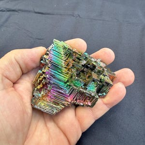
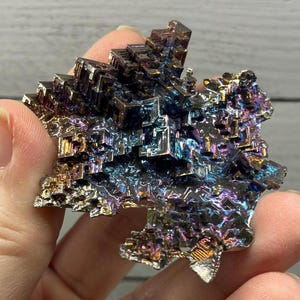
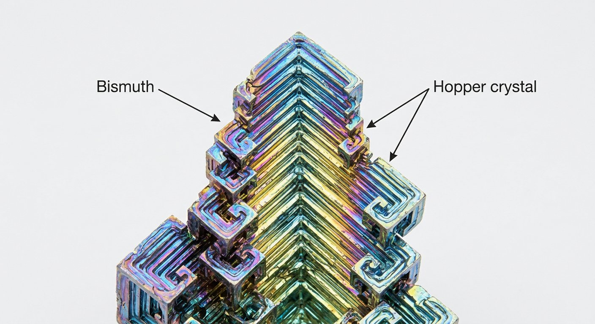
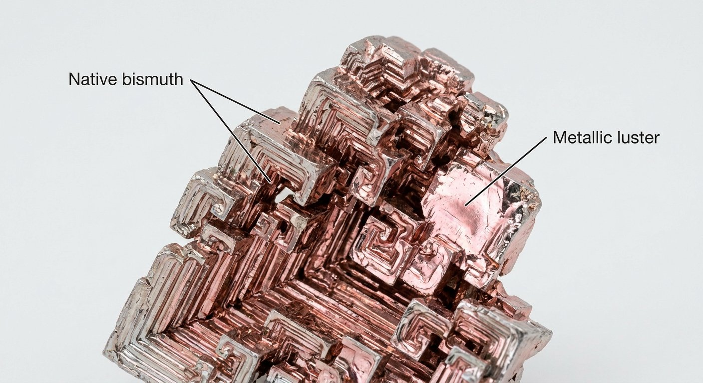

# Bismuth (Bi)

> **Group:** Metallic (native element / sulfide) · **Minerals:** Native Bi · Bismuthinite Bi₂S₃ · **Element:** Bismuth (Bi)
> **Quick ID:** Silvery-white with a pink/iridescent tarnish, hardness 2–2½, brittle, heavy; **diamagnetic** (repelled by a magnet) and melts at a low ~271 °C.

## At a glance

| Property | Value |
|---|---|
| Colour | Silvery-white with pink/iridescent tarnish |
| Streak | Lead-grey |
| Lustre | Metallic |
| Hardness | 2–2½ (soft but brittle) |
| Specific gravity | High (heavy for its size) |
| Magnetism | **Diamagnetic** (repelled by a magnet) |
| Melting point | Low (~271 °C) |
| Key test | Silvery + brittle + diamagnetic + low melting |

## Chemistry & mineralogy
**Native bismuth** (Bi) — a brittle, crystalline metalloid — and the sulfide **bismuthinite** (Bi₂S₃). Often carries traces of As, S, Te. Bismuth is the most diamagnetic of metals and the heaviest non-radioactive element that is not toxic.

## Crystal habit
**Hoppered (skeletal) cubic crystals**, dendritic, or massive. *Note:* the vivid rainbow "hopper" bismuth is usually **lab-grown**; natural bismuth is rarer and duller. The geometric, stair-stepped "hopper" form is a hallmark (whether natural or synthetic).

## Physical properties
- **Colour:** silvery-white with pink/iridescent tarnish.
- **Hardness:** 2–2½ (soft but brittle).
- **Density:** very high (heavy for its size).
- **Signature:** **diamagnetic** (repelled by a magnet) and melts at a low ~271 °C.

## How to identify in the field
1. **Colour:** silvery-white with a pink/iridescent tarnish.
2. **Hardness:** soft (2–2½) but **brittle** (crumbles).
3. **Magnet:** **repelled** (diamagnetic) — unusual and distinctive.
4. **Melting:** melts at a low ~271 °C.
5. **Setting:** hydrothermal veins/pegmatites with Co–Ni–Ag–Pb–Sn–W.

## Lookalikes & how to distinguish

| Looks like | How to tell it apart |
|---|---|
| **Antimony / stibnite** | Antimony is lead-grey and bladed; bismuth is silvery-white with pink tarnish and diamagnetic. |
| **Arsenic** | Arsenic is tin-white, tarnishes grey, and is also diamagnetic; bismuth is heavier and pinker. |
| **Silver** | Silver is malleable (bismuth is brittle) and not diamagnetic. |

## Occurrence

**Pure / hand specimen**

*Figure III.A.21 — Bismuth hopper crystals (hopper form is commonly lab-grown). Source: [Etsy](https://www.etsy.com/market/bismuth_hopper_crystal).*

**In rock / ore**

*Figure III.A.22 — Bismuth specimen. Source: [Etsy](https://www.etsy.com/market/bismuth_hopper_crystal).*

*Figure III.A.21b — Bismuth hopper crystal (iridescent; hopper form commonly lab-grown). Source: [Etsy](https://www.etsy.com/market/bismuth_hopper_crystal).*

*Figure III.A.21c — Bismuth hopper crystal (specimen). Source: [Etsy](https://www.etsy.com/market/bismuth_hopper_crystal).*

*Figure III.A.21d — Labeled illustration: bismuth hopper crystal with iridescent oxide. Original diagram prepared for this guide.*

*Figure III.A.21e — Labeled illustration: native bismuth (silver-pink metallic). Original diagram prepared for this guide.*

## Genesis
Hydrothermal veins and pegmatites, commonly associated with **cobalt, nickel, silver, lead, tin and tungsten** ores (e.g. the Jos Plateau pegmatites). Bismuth is typically a minor, by-product-type element.

## States / localities
**Plateau, Nasarawa** — reported in pegmatite/hydrothermal systems; a **minor**, byproduct-type occurrence in Nigerian ground.

## Associated minerals & host rocks
Cobalt, nickel, silver, galena, cassiterite, wolframite; hosted by **hydrothermal veins and pegmatites** (see [Cassiterite](cassiterite.md), [Wolframite & Scheelite](wolframite-scheelite.md), [Lithium](lithium.md).

## Mining, uses & market
- **Uses:** low-melting **fusible alloys**, **pharmaceuticals** (bismuth subsalicylate), cosmetics, **fire-sprinkler** alloys, non-toxic lead substitute.
- **Market:** specialty metal; recovered as a byproduct of Pb–W–Sn processing.

## Exploration notes
- Look for it as a **trace byproduct** in polymetallic and pegmatite systems (see [Cassiterite](cassiterite.md), [Wolframite & Scheelite](wolframite-scheelite.md)).
- **Assay Bi** in multi-element geochemistry of granitic/pegmatite ground.

## Field checklist
- [ ] Silvery-white with pink tarnish?
- [ ] Soft but brittle?
- [ ] Repelled by a magnet (diamagnetic)?
- [ ] Melts at low temperature?
- [ ] In pegmatite / polymetallic vein?

## Facts
- Bismuth is strongly **diamagnetic** — it is **repelled** by a magnet (rare and distinctive).
- The vivid rainbow "**hopper**" bismuth is usually **lab-grown**; natural bismuth is duller.
- It is a **non-toxic** substitute for lead (used in shot, solder, and plumbing).
- Bismuth melts at a low ~**271 °C** — used in fire-sprinkler and fusible alloys.

## Related
- [Cassiterite](cassiterite.md) · [Wolframite & Scheelite](wolframite-scheelite.md) · [Lithium](lithium.md) · [State-by-state table](../../04-geological-provinces/04-09-state-by-state-table.md)
