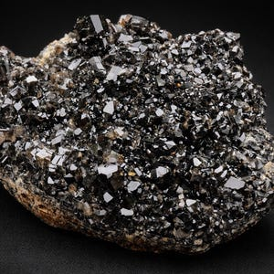
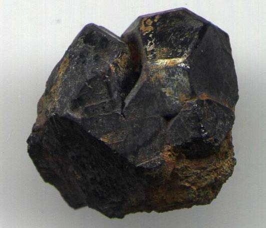
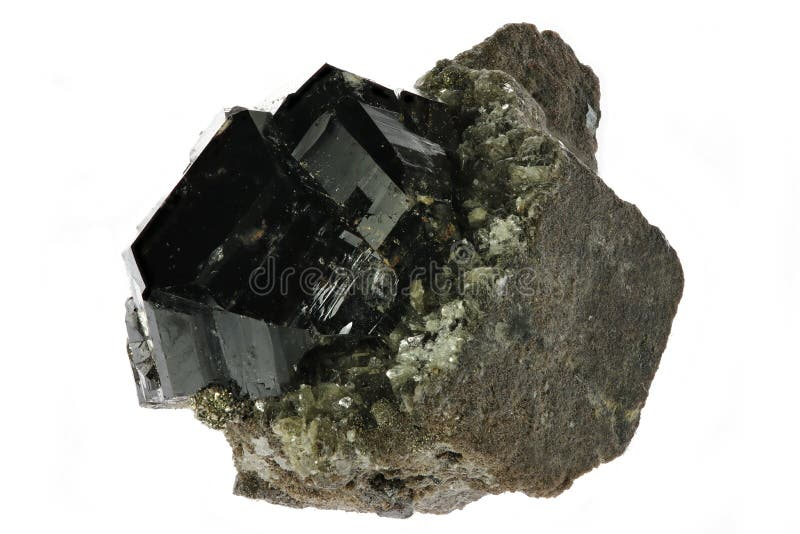
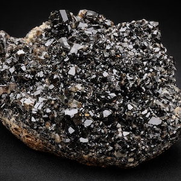

# Cassiterite (Tin Ore)

> **Group:** Metallic (oxide) · **Formula:** SnO₂ · **Element:** Tin (Sn)
> **Quick ID:** Black/brown, adamantine lustre, hardness 6–7, **very heavy (SG ~7)**, white-grey streak, no cleavage.

## At a glance

| Property | Value |
|---|---|
| Colour | Black to brown ("wood tin" banded) |
| Streak | White to greyish |
| Lustre | Adamantine (diamond-like) to metallic |
| Hardness | 6–7 (scratches glass) |
| Specific gravity | **~7** (very heavy) |
| Cleavage | None; subconchoidal fracture |
| Crystal system | Tetragonal |
| Key test | Heavy + hard + adamantine black grains |

## Chemistry & mineralogy
**Tin oxide** — SnO₂. The world's main **ore of tin**. Often carries traces of Fe, Ta, Nb. Chemically resistant, which is why it survives weathering and concentrates in placers.

## Crystal habit
**Tetragonal** — short prismatic to pyramidal crystals, twins ("**elbow twins**"), or massive/botryoidal ("**wood tin**"). The elbow (knee) twin is a classic, recognizable habit.

## Physical properties
- **Hardness 6–7** — scratches glass.
- **Lustre:** adamantine (diamond-like) to metallic.
- **Colour:** black to brown; **streak white to greyish**.
- **Heavy** — high specific gravity (~7); feels dense for its size.
- **No cleavage**; subconchoidal fracture.

## How to identify in the field
1. **Weight:** very heavy (SG ~7) — dense black grains in a pan stand out.
2. **Hardness:** scratches glass (6–7).
3. **Lustre:** adamantine/diamond-like sparkle on crystal faces.
4. **Streak:** white-grey (distinguishes from black magnetite/hematite).
5. **Setting:** in pegmatite/greisen veins near granite, or as placer grains.

## Lookalikes & how to distinguish

| Looks like | How to tell it apart |
|---|---|
| **Magnetite** | Magnetite is **magnetic** with a black streak; cassiterite is non-magnetic with a white-grey streak. |
| **Hematite** | Hematite has a red-brown streak; cassiterite is white-grey. |
| **Tourmaline (schorl)** | Tourmaline is striated, less heavy, and has different streak; cassiterite is heavier and adamantine. |

## Occurrence

**Pure specimen:**

*Figure III.A.1a — Cassiterite: black, lustrous, adamantine crystals. Source: [Etsy](https://www.etsy.com/market/natural_cassiterite).*

**In rock / ore** (in a quartz vein, colloform/botryoidal habit):

*Figure III.A.1b — Cassiterite ore: tin oxide infilling a quartz vein. Source: [gemheaven.org](https://gemheaven.org/article/cassiterite/).*

*Figure III.A.1c — Cassiterite ore in rock matrix. Source: [Dreamstime](https://www.dreamstime.com/rough-cassiterite-metallic-ore-tin-stuck-rock-natural-mineral-geological-has-many-uses-takes-high-polish-image253389262).*

*Figure III.A.1d — Cassiterite crystals (Viloco mine, Bolivia). Source: [Etsy](https://etsy.com/market/cassiterite_jewelry).*

## Genesis
**Hydrothermal** — deposited from hot fluids in and around tin-rich granites, forming **veins, pegmatites, and greisens**. Being dense and resistant, it also concentrates into **placers** (rivers, soils) — historically the easiest to mine.

## States / localities
The **Jos Plateau** tin fields — **Plateau State** (Jos, Bukuru, Ropp, Naraguta), plus **Bauchi, Kaduna, Nasarawa, Kogi, Oyo**. Nigeria was once a leading tin producer.

## Associated minerals & host rocks
Columbite–tantalite, wolframite, quartz, feldspar, mica, tourmaline; hosted by **pegmatites and greisens** of the Younger Granites (see [Pegmatite](../../02-rocks-of-nigeria/igneous/pegmatite.md)).

## Mining, uses & market
Mined from hard-rock veins and (historically) rich **alluvial placers**. Smelted to **tin metal** — used in **solder, tinplate, electronics, and bronze/pewter alloys**. Tin is a strategic, globally traded metal.

## Exploration notes
- **Pan/stream sediments** and heavy-mineral surveys around granites.
- Look for cassiterite with **columbite** in **pegmatites/greisens** near the Younger Granites (see [Pegmatite](../../02-rocks-of-nigeria/igneous/pegmatite.md)).
- Black, heavy, adamantine grains in a pan are a strong positive sign.

## Field checklist
- [ ] Very heavy black grains (SG ~7)?
- [ ] Scratches glass (hardness 6–7)?
- [ ] Adamantine/metallic lustre?
- [ ] White-grey streak (not black/red)?
- [ ] Pegmatite/greisen or placer setting?

## Facts
- Cassiterite has been the **main tin ore** since antiquity ("cassiterite" → "Cassiterides," the ancient tin islands).
- Its **high density (SG ~7)** lets it concentrate in river placers — how the Jos tin fields were first worked.
- The **"elbow twin"** is a classic, recognizable cassiterite crystal habit.
- Nigeria was once among the **world's leading tin exporters**.

## Related
- [Columbite–Tantalite](columbite-tantalite.md) · [The Younger Granites](../../01-general-geology/01-03-younger-granite-ring-complexes.md) · [Placers & alluvium](../../02-rocks-of-nigeria/sedimentary/placers-alluvium.md) · [Pegmatite](../../02-rocks-of-nigeria/igneous/pegmatite.md)
