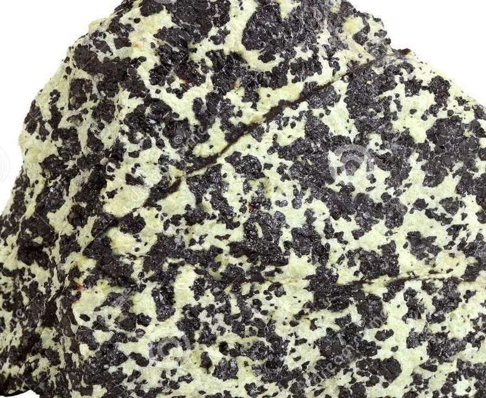
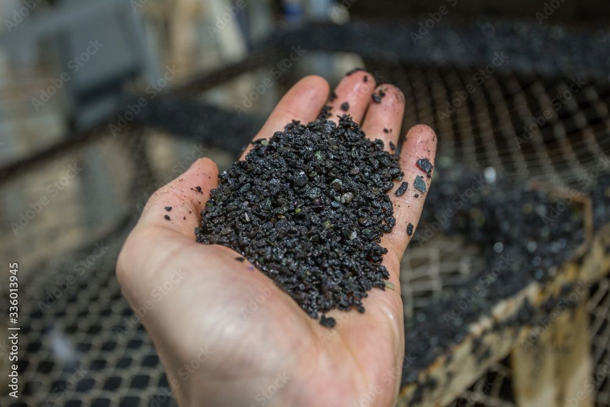
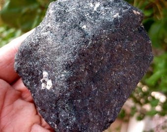

# Chromite

> **Group:** Metallic (oxide, spinel group) · **Formula:** FeCr₂O₄ · **Element:** Chromium (Cr)
> **Quick ID:** Black to brownish-black, hardness 5.5, **brown streak**, heavy, weakly magnetic; in greenish serpentinite.

## At a glance

| Property | Value |
|---|---|
| Colour | Black to brownish-black |
| Streak | **Brown** (diagnostic) |
| Lustre | Submetallic |
| Hardness | 5.5 |
| Specific gravity | ~4.5–5 (heavy) |
| Magnetism | Weakly magnetic |
| Habit | Usually massive/granular (crystals rare) |
| Key test | Brown streak + weakly magnetic, in serpentinite |

## Chemistry & mineralogy
**Chromium iron oxide** — FeCr₂O₄, a member of the **spinel** group. The only economically important **ore of chromium**. Magnesium can substitute for iron (magnesiochromite).

## Crystal habit
Usually **massive or granular**; rare octahedral crystals. Occurs as disseminated grains or concentrated layers in ultramafic rock. Well-formed chromite crystals are uncommon, so it is usually identified as dense black/brown grains in rock.

## Physical properties
- **Hardness 5.5.**
- **Colour:** black to brownish-black; submetallic.
- **Streak:** brown.
- **Heavy**; weakly magnetic.
- Distinguished from magnetite by its **brown streak** and lack of strong magnetism.

## How to identify in the field
1. **Streak:** **brown** streak (magnetite gives black; hematite red-brown).
2. **Magnetism:** only **weakly magnetic** (magnetite is strongly magnetic).
3. **Setting:** in greenish **serpentinite / ultramafic** rock.
4. **Appearance:** dense black/brown grains or masses.
5. **Association:** with olivine/serpentine, sometimes nickel.

## Lookalikes & how to distinguish

| Looks like | How to tell it apart |
|---|---|
| **Magnetite** | Magnetite is strongly magnetic with a black streak; chromite is weakly magnetic with a brown streak. |
| **Hematite** | Hematite has a red-brown streak; chromite has a brown streak and occurs in ultramafics. |
| **Ilmenite** | Ilmenite is black with a black streak; chromite is brown-streaked. |

## Occurrence

**In rock / ore** (chromite grains in serpentinite):

*Figure III.A.12 — Chromite: chromium ore in ultramafic rock. Source: [geologyscience.com](https://geologyscience.com/ore-minerals/chromium-cr-ore/).*

*Figure III.A.12b — Chromite ore specimen (in a geologist's hand). Source: [ABPosters](https://www.abposters.com/chromite-ore-specimen-sample-raw-mineral-in-miner-geologyst-hand-f336013945).*

*Figure III.A.12c — Chromite (chromium ore) specimen. Source: [Etsy](https://www.etsy.com/listing/4301321853/big-chromite-ore-raw-piece-from-mount).*

Found in **ultramafic rocks** — peridotite and its altered form **serpentinite** (see [Peridotite & Pyroxenite](../../02-rocks-of-nigeria/igneous/peridotite-pyroxenite.md), [Serpentinite](../../02-rocks-of-nigeria/metamorphic/serpentinite.md)). *Chromite rarely forms displayable crystals; it is typically massive/granular, so a single ore image is representative.*

## Genesis
**Magmatic concentration** of chromium in ultramafic (mantle-derived) rocks, often as layers or pods. Chromium is concentrated early during the crystallisation of mantle-derived magma, settling into chromite-rich layers.

## States / localities
Minor in Nigeria — occurs in **ultramafic/serpentinite bodies** within some Basement and schist-belt settings (e.g. parts of the southwest and central basement). Not a major producer, but worth recognizing.

## Associated minerals & host rocks
Olivine, serpentine, magnetite, nickel sulfides; hosted by **peridotite/dunite and serpentinite** (see [Talc/Chlorite schist](../../02-rocks-of-nigeria/metamorphic/talc-chlorite-schist.md)).

## Mining, uses & market
Smelted to **ferrochrome** for **stainless steel** and superalloys; also refractories and chrome chemicals. Chromium is a strategic metal — stainless steel cannot be made without it.

## Exploration notes
- Search **serpentinite/ultramafic bodies** for dense black chromite grains.
- **Geochemistry (Cr, Ni, Co)** and heavy-mineral studies are effective.
- Field clue: **brown-streaked black grains** in greenish serpentinite.

## Field checklist
- [ ] Black/brown grains in greenish serpentinite?
- [ ] Brown streak (not black/red)?
- [ ] Only weakly magnetic?
- [ ] Heavy for its size?
- [ ] Ultramafic/peridotite setting?

## Facts
- **Chromium** is essential for **stainless steel** — no chromite, no stainless steel.
- Chromite's **brown streak** distinguishes it from black-streaked magnetite.
- It concentrates in **ultramafic (mantle) rocks** as early magmatic layers.
- Nigerian chromite is minor, hosted in scattered **serpentinite** bodies.

## Related
- [Peridotite & Pyroxenite](../../02-rocks-of-nigeria/igneous/peridotite-pyroxenite.md) · [Serpentinite](../../02-rocks-of-nigeria/metamorphic/serpentinite.md) · [Talc/Chlorite schist](../../02-rocks-of-nigeria/metamorphic/talc-chlorite-schist.md)
